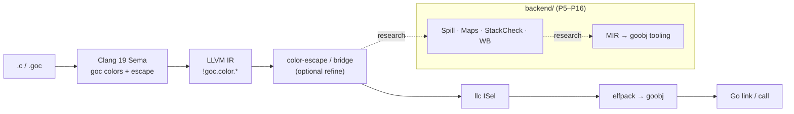

# goc

**Experimental** pointer-colored C dialect that targets **goroutine stacks**:
morestack, stackmaps, and write barriers — so C (and eventually engines like
QuickJS) can run on Go stacks without the usual cgo boundary tax.

> Status: **research / experimental**. Phase **P29** colors and builds all four
> QuickJS-ng translation units with `goc`, then runs the engine on a Go
> goroutine stack. Call-bearing functions may inline. The V8-v7 bench median
> is 791 (two runs, 2026-09-25). The exercised CLI includes std/os/bjson
> modules and workers; broader host compatibility, arbitrary ABI signatures,
> and GC/preemption safety remain incomplete.

[](LICENSE)
[](docs/status.md)

## What it is

`goc` extends a C11 subset with **pointer colors** (`cptr` / `sptr` / `uptr` /
`auto_ptr` / `gptr`) so the compiler can enforce stack-escape rules, emit Go
stackmaps, and lower to Go `goobj` objects callable from Go. The product
frontend is a patched **Clang 19.1.7** (in-tree Sema); an out-of-tree plugin
remains as a legacy fallback.

## Motivation

Embedding C runtimes (notably QuickJS) into Go today usually means cgo, OS
threads, and expensive stack transitions. `goc` explores compiling colored C
straight onto the **goroutine user stack**, sharing Go’s growth and GC
contracts instead of fighting them.

## Current status (honesty)

| Works today | Does **not** work yet |
|-------------|------------------------|
| In-tree Clang Sema colors; stack stores into heap/global `T *` promote to `uptr` (raw `sptr` returns still error) | Full upstream QuickJS host/thread compatibility |
| Out-of-tree Clang plugin fallback (P27) | Complete Go amd64 **ABIInternal** on arbitrary Clang IR |
| Real-body goobj path (Clang IR → llc ISel → elfpack; not P21 seed MIR) | Full Spill→Maps→StackCheck→WB on arbitrary MachineFunctions |
| Backend MIR passes + goobj encoder (P5–P16 research path) | AVX / x87 / EH on the Go-callable path |
| QuickJS-ng four-TU `goc build`, Go-stack interpreter and 115/116 selected upstream JS tests | Production GC/preemption guarantees across arbitrary JS programs |
| Curated goldens under `tests/` | Stable package API / releases |

See [docs/status.md](docs/status.md) and [docs/roadmap.md](docs/roadmap.md).

## Quick start

**Deps:** `clang-19`, `clang++-19`, `llc-19`, `llvm-config-19`, `cmake`, `ninja`,
Go 1.24+, `python3`, `rg` (ripgrep).

```bash
git clone https://github.com/LoyieKing/goc.git
cd goc
export GOC_ROOT="$(pwd)"

# 1) Fetch LLVM 19.1.7 and apply patches (see clang/README.md)
#    ./scripts/apply-patches.sh /path/to/llvm-project-19.1.7
#    … cmake + ninja clang …
export GOC_CLANG=/path/to/llvm-19.1.7-clang-build/bin/clang

# 2) Run P28 goldens (requires patched clang)
./cmd/goc test --p28

# 3) Compile a small example to goobj
./cmd/goc build examples/hello_colors.c -o /tmp/hello_colors.o
```

Without a patched clang, you can still build the **P27 plugin** and run
`./cmd/goc test --p27` against system `clang-19`.

## Architecture



Pipeline overview: [docs/architecture.md](docs/architecture.md).

## Pointer colors

| Color | Meaning |
|-------|---------|
| `cptr<T>` | Non-stack object pointer (C heap / global / arena). Not Go heap. |
| `sptr<T>` | Current goroutine stack object pointer. **Must not** be stored to heap. |
| `uptr<T>` | Encoded `cptr\|sptr` union; may live anywhere; decode before use. |
| `auto_ptr<T>` | Inferred color (`T *` ≡ `auto_ptr<T>`); escape-sensitive. |
| `gptr<T>` | Go heap pointer (separate rail; stackmap + write barrier). |

**No `dsptr`** — heap-stored stack references use `uptr`. Authoritative contract:
[docs/syntax-guide.md](docs/syntax-guide.md) (中文).

```c
#include "goc.h"

void fill(sptr(int) out) { *out = 42; }           /* OK: stack out-param */
/* void bad(cptr(int*) slot, sptr(int) p) { *slot = p; } */  /* Sema error */
```

## Repository layout

```
cmd/goc              Driver
include/goc.h        Public color attributes
clang/               Patches, Sema drop-in, out-of-tree plugin
backend/             goobj / MIR / realbody path
frontend/            color-escape, bridge, vertical (legacy helpers)
runtime/             uptr TLS / MSB helpers
tests/               Curated goldens
docs/                Architecture, status, syntax, phase summaries
third_party/         Fetch instructions only (no vendored LLVM/QJS blobs)
```

## Documentation

| Doc | Description |
|-----|-------------|
| [docs/architecture.md](docs/architecture.md) | Pipeline overview |
| [docs/syntax-guide.md](docs/syntax-guide.md) | Language contract (中文) |
| [docs/glossary.md](docs/glossary.md) | Terms |
| [docs/status.md](docs/status.md) | What works / what does not |
| [docs/roadmap.md](docs/roadmap.md) | P29 status and remaining gaps |
| [docs/phases/](docs/phases/) | Condensed phase reports |
| [clang/README.md](clang/README.md) | Build patched Clang |
| [CONTRIBUTING.md](CONTRIBUTING.md) | How to contribute |
| [SECURITY.md](SECURITY.md) | Vulnerability reporting |

## 中文简介

`goc` 是面向 **Go goroutine 用户栈** 的实验性 C 方言：用指针色
（`cptr`/`sptr`/`uptr`/`auto_ptr`/`gptr`）表达逃逸与写屏障合同，目标是把
QuickJS 一类 C 运行时跑在 Go 栈上、避开 cgo 税。当前进度到 **P29**：四个
QuickJS-ng TU 已经由 goc 着色、编译并在 Go 栈上运行，含调用的函数可以内联。
V8-v7 中位 791。已实测 std/os/bjson 宿主模块和 worker，完整宿主兼容性及
生产级 GC/抢占安全性仍未完成。语法合同见
[docs/syntax-guide.md](docs/syntax-guide.md)。

## License

MIT — Copyright (c) 2026 Loyie King. See [LICENSE](LICENSE) and [NOTICE](NOTICE).
