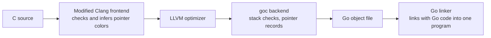

# GOC

English | [简体中文](README.zh-CN.md)

A C dialect that lets Go call C libraries efficiently.

[](LICENSE)

C code compiled by goc runs directly on the goroutine stack. Go calls it like an ordinary Go function, with no cgo in between. goc is experimental and currently supports linux/amd64 only.

## Background

The core reason Go and C cannot interoperate efficiently is Go's growable stack.

### Go's growable stacks

To support huge numbers of goroutines, Go gives each goroutine a very small initial stack (a few KB). Yet Go programs almost never overflow the stack, because every Go function checks on entry whether there is enough stack left. If not, the runtime allocates a larger stack, copies the old stack over, and carries on.

Because the stack can move, any pointer into the stack becomes a dangling pointer after the move. Go handles this in a few cases:

- **Pointers on the stack that point into the stack.** The compiler records which stack slots of each function hold pointers. When the stack moves, the runtime uses that record to rewrite every pointer into the old stack so it points into the new one. This requires every stack frame to have a size fixed at compile time, which is why Go has no variable-length arrays on the stack.
- **Pointers on the heap that point into the stack.** When the stack moves, the runtime only fixes pointers on the stack, not on the heap. So Go must guarantee that the heap never points into a stack. It does this with escape analysis: if the address of a variable might be stored on the heap or in a global, the compiler simply allocates that variable on the heap. For example:

  ```go
  var sink *int

  func f() {
      x := 42
      sink = &x // the compiler puts x on the heap, not on the stack
  }
  ```

- **Go calling non-Go code.** C code does not know the stack can move, does not check for stack space on entry, and the compiler has no pointer records for it. So C cannot run directly on a goroutine stack. Go instead switches to a large stack that never moves for every call. This is safe, but every call pays a fixed cost.

### Existing approaches

- **cgo** (official): every C call switches to the system thread's large stack and notifies the scheduler. Safe and general, but each call costs tens of nanoseconds, which becomes a bottleneck for C functions that are called often and return quickly.
- **[directcgo](https://github.com/maxpoletaev/directcgo)** (experimental community project): first grows the goroutine stack to a large size (64 KB), then calls C directly on the goroutine stack without switching. Calls drop to a few nanoseconds, but every goroutine holds a large chunk of stack memory, and a C function that uses more stack than reserved can corrupt memory. It only suits short functions whose stack usage is predictable.
- **syscall and friends** (e.g. purego): call prebuilt shared libraries without a C compiler. Under the hood they also switch to the system stack, so performance is in the same range as cgo. Code that instead runs foreign functions directly on the goroutine stack can hit stack overflows.

All of these work well for using C libraries that are already compiled. But if we can recompile the C library, we can go a step further: teach the C code itself about Go's stack.

### Our approach

A new C dialect, goc, which brings Go's growable-stack rules to C, so Go can call goc code directly without any stack risk.

Every function goc compiles behaves like a Go function: it checks for stack space on entry, the compiler records the pointers it keeps on the stack, and those pointers are fixed up correctly when the stack moves. So it can run directly on the goroutine stack, and Go does not need to switch stacks to call it.

#### Stack pointers

This is the heart of the design. C code is full of pointers, and when Go moves a stack it only fixes the pointers it knows about. For C to run safely on a movable stack, the compiler must know where every pointer can point and where it can be stored.

goc therefore gives C pointers a "color":

| Color | Meaning |
|---|---|
| `cptr` | Points to memory outside the stack (C heap, globals). Can be stored anywhere. |
| `sptr` | Points to an object on the stack. Lives only on the stack; fixed up by the runtime when the stack moves. |
| `uptr` | May or may not point into the stack. Can be stored anywhere; stack addresses are stored as relative positions, so they stay valid after a move. |
| `gptr` | Points to a Go heap object and follows Go's garbage-collection rules. |

Colors cannot be converted into each other freely. A plain `T *` is inferred to the right color from how the pointer is used, so existing C code such as QuickJS needs almost no rewriting. For example, storing a stack pointer into a global is allowed; the compiler turns that store into a `uptr` encoding automatically. Uses that cannot be fixed, such as returning a pointer to a local variable, are compile errors:

```c
#include "goc.h"

static int *g_slot;

void keep(sptr(int) p) {
  g_slot = p;       /* OK: stored as uptr, restored on load */
}

int *bad_return(void) {
  int local = 1;
  return &local;    /* compile error: cannot return a stack pointer */
}
```

The full rules are in [docs/syntax-guide.md](docs/syntax-guide.md) (Chinese).

#### Compilation

The goc compiler is a modified Clang/LLVM: the frontend checks and infers pointer colors, the backend emits machine code that follows Go's stack rules, and the output is an object file the Go toolchain links directly. goc therefore interoperates seamlessly with Go while the C code still gets LLVM's full optimizer, keeping production-grade C performance: on the V8 benchmark, goc-ng reaches about 92% of native QuickJS-ng and about 4.1× Goja, and goc-bellard reaches about 90% of the gcc Bellard build and about 4.7× Goja (see Benchmarks).

## Benchmarks

QuickJS is the showcase: goc compiles both QuickJS-ng and Fabrice Bellard's original QuickJS. The five JS engines below were measured on the same machine in the same session (2026-10-09, AMD Ryzen 9 7900X):

| Engine | Description |
|---|---|
| goc-ng | QuickJS-ng compiled with goc |
| goc-bellard | Bellard's QuickJS compiled with goc |
| native ng | QuickJS-ng, native build (clang) |
| native Bellard | Bellard's QuickJS, native build (gcc) |
| Goja | JS engine written in pure Go |


| Suite | goc-ng | goc-bellard | native ng | native Bellard | Goja | How to read |
|---|---:|---:|---:|---:|---:|---|
| V8-v7 total | 1534 | 1781 | 1662 | 1988 | 377 | score, higher is faster |
| SunSpider geomean (ms) | 11.18 | 9.39 | 10.99 | 8.24 | 61.49 | time, lower is faster |
| microbench geomean (ns) | 46.7 | 35.5 | 42.9 | 31.4 | 152.1 | time, lower is faster |
| Call microbenchmark (calls/ms) | 27907 | 27772 | 29096 | 31277 | 6828 | score, higher is faster |
| test262 sample passed | 1502/1526 | 1501/1526 | 1502/1526 | 1501/1526 | 1453/1526 | |
| QuickJS official tests | 73/77 | 77/77 | 73/77 | 77/77 | 58/77 | |

**Correctness:** both goc builds match their native counterparts test for test.


**V8-v7 sub-tests:**


| Test | goc-ng | goc-bellard | native ng | native Bellard | Goja |
|---|---:|---:|---:|---:|---:|
| Richards | 1034 | 1124 | 1088 | 1349 | 364 |
| DeltaBlue | 1022 | 1083 | 1096 | 1268 | 374 |
| Crypto | 987 | 1284 | 1049 | 1420 | 173 |
| RayTrace | 2423 | 2627 | 2776 | 2948 | 385 |
| EarleyBoyer | 2922 | 3059 | 3213 | 3574 | 653 |
| RegExp | 493 | 622 | 548 | 659 | 322 |
| Splay | 4307 | 4860 | 4889 | 5528 | 789 |
| NavierStokes | 1962 | 2646 | 1959 | 2702 | 267 |
| **Total** | **1534** | **1781** | **1662** | **1988** | **377** |

**SunSpider and microbench:**


**Call microbenchmark:**


**Memory** (peak RSS in MiB; the last row is the extra memory per additional JS runtime, in KiB):


| Workload | goc-ng | goc-bellard | native ng | native Bellard | Goja |
|---|---:|---:|---:|---:|---:|
| Empty script | 8.2 | 8.1 | 2.8 | 2.8 | 5.6 |
| Full V8-v7 | 164.4 | 155.8 | 155.6 | 146.9 | 1470.7 |
| SunSpider (max) | 14.6 | 15.4 | 8.0 | 7.4 | 23.0 |
| microbench | 10.7 | 10.5 | 4.5 | 4.3 | 567.3 |
| Per extra runtime (KiB) | 224 | 199 | 209 | 189 | 105 |


goc builds carry a fixed overhead of about 5.3 to 5.4 MiB over native when idle. On the full V8 suite the ratio falls to 1.06.

Where goc is slower than native, the cost comes mainly from the extra work needed to follow Go's stack rules: stack checks, pointer encoding and decoding, and pointer records on the stack. Against a clang -O2 build of the same Bellard source, goc-bellard reaches 95% of that build on V8, and is 2% slower on SunSpider and 8% slower on microbench. The 2026-09-27 mechanism study is in [docs/perf-gap.md](docs/perf-gap.md). Current scores, charts, and methodology are in [docs/benchmark.md](docs/benchmark.md) (both in Chinese).

## Architecture


```mermaid
flowchart LR
    A["C source"] --> B["Modified Clang frontend<br/>checks and infers pointer colors"]
    B --> C["LLVM optimizer"]
    C --> D["goc backend<br/>stack checks, pointer records"]
    D --> E["Go object file"]
    E --> F["Go linker<br/>links with Go code into one program"]
```

| Directory | Purpose |
|---|---|
| `cmd/goc` | Command-line entry point |
| `include/goc.h` | How to write pointer colors |
| `clang/` | Changes to the Clang frontend |
| `frontend/` | Pointer-color inference |
| `backend/` | Code generation that follows Go's stack rules, Go object files |
| `runtime/` | goc runtime support |
| `tests/` | Tests, including QuickJS |
| `scripts/` | Build and benchmark scripts |
| `docs/` | Documentation |

More detail in [docs/architecture.md](docs/architecture.md).

## Usage

**Requirements:** linux/amd64; the LLVM 19 toolchain (`clang-19`, `llc-19`, etc.), `cmake`, `ninja`, Go 1.24+, `python3`.

**1. Build the Clang used by goc** (tens of minutes; see [clang/README.md](clang/README.md)):

```bash
git clone https://github.com/LoyieKing/goc.git
cd goc
export GOC_ROOT="$(pwd)"

curl -L -o /tmp/llvmorg-19.1.7.tar.gz \
  https://github.com/llvm/llvm-project/archive/refs/tags/llvmorg-19.1.7.tar.gz
tar -C "$HOME/src" -xf /tmp/llvmorg-19.1.7.tar.gz
export LLVM_SRC="$HOME/src/llvm-project-llvmorg-19.1.7"
./scripts/apply-patches.sh "$LLVM_SRC"

cmake -G Ninja -DCMAKE_BUILD_TYPE=Release \
  -DCMAKE_C_COMPILER=clang-19 -DCMAKE_CXX_COMPILER=clang++-19 \
  -DLLVM_TARGETS_TO_BUILD=X86 -DLLVM_ENABLE_PROJECTS=clang \
  -DLLVM_INCLUDE_TESTS=OFF -DLLVM_ENABLE_ASSERTIONS=ON \
  -DCLANG_ENABLE_STATIC_ANALYZER=OFF -DCLANG_ENABLE_ARCMT=OFF \
  -S "$LLVM_SRC/llvm" -B "$GOC_ROOT/third_party/llvm-19.1.7-clang-build"
ninja -C "$GOC_ROOT/third_party/llvm-19.1.7-clang-build" -j"$(nproc)" clang
export GOC_CLANG="$GOC_ROOT/third_party/llvm-19.1.7-clang-build/bin/clang"
```

**2. Check that it works:**

```bash
./cmd/goc version
./cmd/goc test --p28
```

**3. Call goc from Go.** The complete example is `tests/goabi`, runnable with one command:

```bash
./scripts/test-p29-goabi.sh
```

Write a normal function in C and a body-less declaration in Go, and Go can call it directly:

```c
// goabi.c
int goabi_add2(int a, int b) { return a + b; }
```

```go
// main.go
func goabi_add2(a, b int32) int32
```

**4. Build QuickJS:**

```bash
git clone https://github.com/quickjs-ng/quickjs.git third_party/quickjs-ng
./scripts/qjs-cli-build.sh       # produces build/qjs/qjscli
```

For Bellard's QuickJS, put it in `third_party/quickjs-bellard` and run `QJS_FLAVOR=bellard ./scripts/qjs-cli-build.sh`. Benchmark scripts and methodology are in [docs/benchmark.md](docs/benchmark.md); step-by-step details and common pitfalls are in [docs/guide.md](docs/guide.md) (Chinese and English).

**Current limitations:**

- linux/amd64 only.
- Functions Go calls in goc may only use basic types, pointers and small structs in their signatures.
- A stack pointer may only be used on the goroutine that created it.
- goc calling Go still needs hand-written call code.

## Roadmap

See [docs/todo.md](docs/todo.md) (Chinese):

- **An out-of-the-box goc compiler:** ship a prebuilt toolchain you can download and use, with no need to build Clang or set environment variables.
- **Measure the cost of calls between goc and Go:** per-call cost of Go calling goc and goc calling Go, compared with Go calling Go and cgo.
- **linux/arm64 support.**
- **goc calling Go:** call Go with just a declaration, the same way Go calls goc.
- **Stack pointers across goroutines.**
- **Pointer-color visualization and editor support:** see in your editor which color each pointer was inferred to.
- **Keep closing the performance gap with native C.**

## Documentation

| Document | |
|---|---|
| [docs/guide.md](docs/guide.md) | User guide (Chinese / English) |
| [docs/syntax-guide.md](docs/syntax-guide.md) | Language rules (Chinese) |
| [docs/architecture.md](docs/architecture.md) | Compilation pipeline |
| [docs/benchmark.md](docs/benchmark.md) | Benchmarks (Chinese) |
| [docs/perf-gap.md](docs/perf-gap.md) | Performance gap analysis (Chinese) |
| [docs/todo.md](docs/todo.md) | Roadmap (Chinese) |
| [CONTRIBUTING.md](CONTRIBUTING.md) | Contributing |

## License

MIT — Copyright (c) 2026 Loyie King. See [LICENSE](LICENSE) and [NOTICE](NOTICE).
