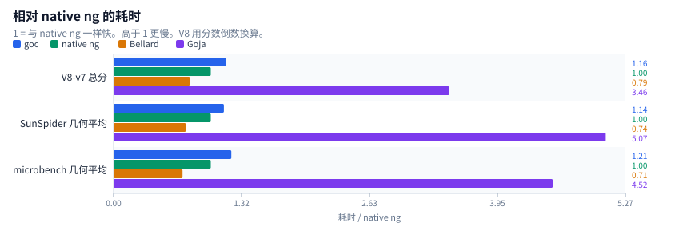
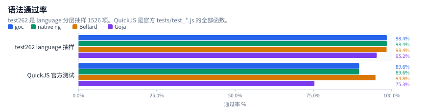
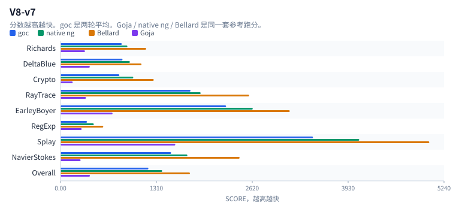
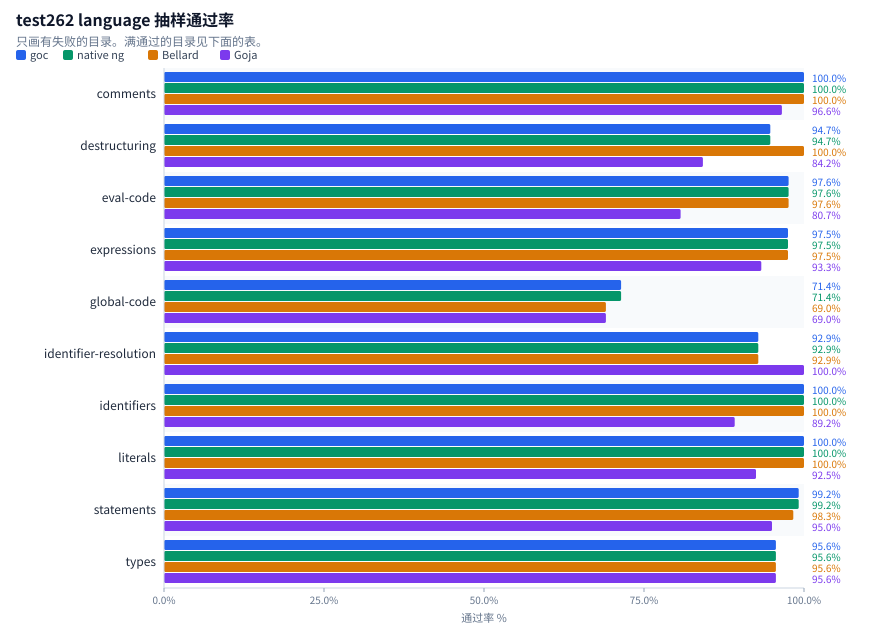
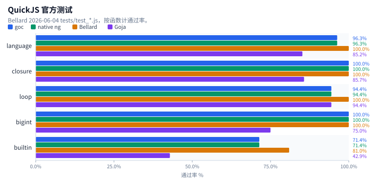
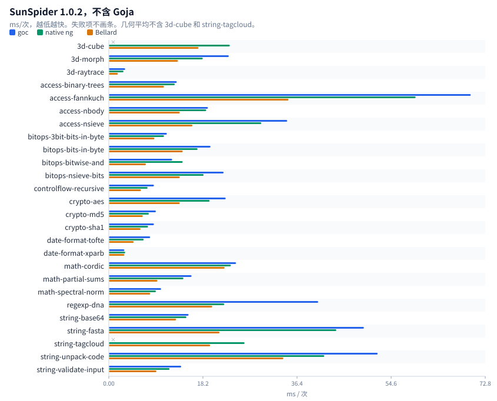
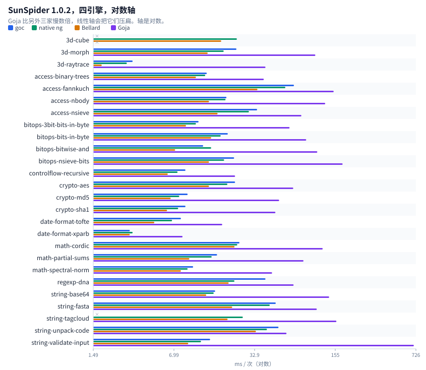
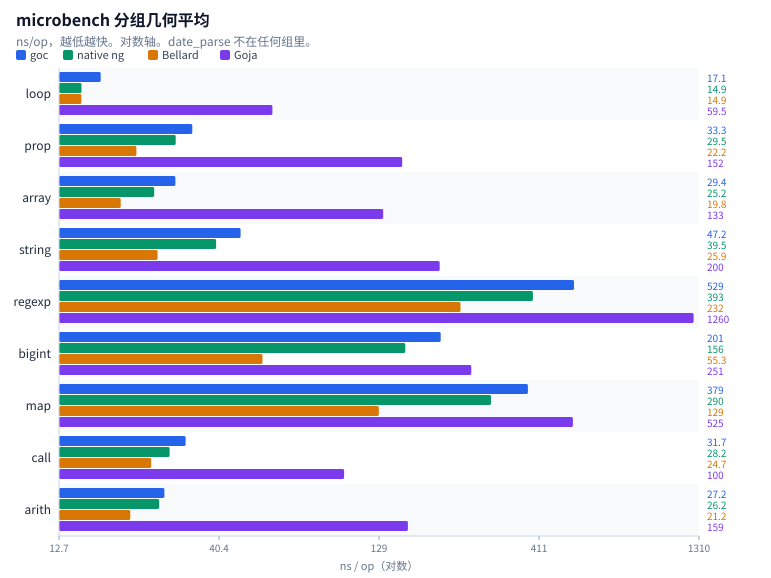
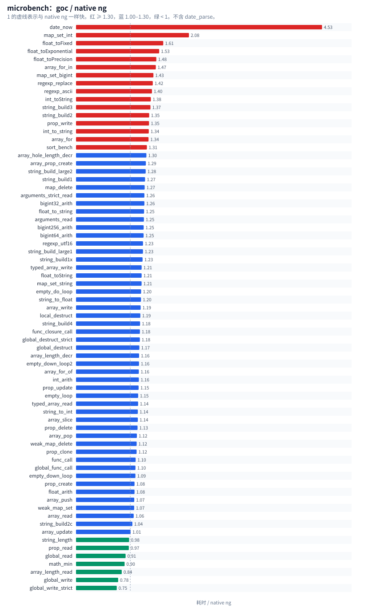

# 跑分

同一台机器，四个引擎。每节先看图，表是全部数字。原始输出在 [`docs/benchmark/data/`](benchmark/data/)。

浏览器打开 [`docs/benchmark/report.html`](benchmark/report.html) 时图会直接嵌在页里。

| 引擎 | 二进制 |
|------|--------|
| goc | `build/qjs/qjscli --stack-size 16384` |
| native ng | QuickJS-ng 0.17.0，`-C` 经典脚本 |
| Bellard | QuickJS 2026-06-04 |
| Goja | `cfe4039cb6d77b297d8b637182f774fa4a54b7d5` |

native ng 的构建：同一份 quickjs-ng 源码，CMake `Release`，编译器 `clang-19`，即 `-O2 -DNDEBUG -std=gnu11 -funsigned-char`（外加上游 CMakeLists 的 `-fvisibility=hidden` 和警告开关，宏 `-D_GNU_SOURCE -DQUICKJS_NG_BUILD`）。goc 侧 `scripts/qjs-build.sh` 也用 `-DNDEBUG`，O 级默认 `GOC_OPT_LEVEL=2`（与 O3 在 callgrind 指令数和墙钟上无可测差别）；它不加 `-funsigned-char`（shim 与 cli host 共用这组宏，改 char 符号会改变它们的语义）。

native ng 不加 `-C` 时会把这些文件当成模块，松散赋值直接 ReferenceError。下面的 ng 数字都是 `-C`。除 V8-v7 的 goc 两轮平均外，都是一轮。

## 总览

goc 和 native ng 在这批语法测试上是同一台引擎：test262 失败文件相同，官方测试逐函数相同。速度上 goc 比 native ng 慢一成多，比 Bellard 慢大约一半，比 Goja 快 3 到 5 倍。

| 套件 | goc | native ng | Bellard | Goja | 怎么读 |
|---|---:|---:|---:|---:|---:|
| V8-v7 总分 | 1200.5 | 1389 | 1768 | 402 | 越高越快 |
| SunSpider 几何平均 ms | 16.09 | 14.17 | 10.53 | 71.76 | 越低越快，24 项 |
| microbench 几何平均 ns | 58.7 | 48.5 | 34.4 | 219.1 | 越低越快，71 项 |
| test262 通过 | 1502/1526 | 1502/1526 | 1501/1526 | 1453/1526 | 抽样，不是全量 |
| QuickJS 官方测试 | 69/77 | 69/77 | 73/77 | 58/77 | 函数数 |

## V8-v7

`bench-v8.js`，`--stack-size 16384`。goc 两轮：SCORE 1198 / 37.95 s，SCORE 1203 / 39.73 s。另外三家是同一套参考跑分，不是这次重测。

| 套件 | goc | native ng | Bellard | Goja |
|---|---:|---:|---:|---:|
| Richards | 837.5 | 914 | 1170 | 334 |
| DeltaBlue | 846.5 | 948 | 1106 | 400 |
| Crypto | 804 | 994 | 1274 | 166 |
| RayTrace | 1776 | 1915 | 2576 | 348 |
| EarleyBoyer | 2262 | 2626 | 3132 | 711 |
| RegExp | 362 | 454 | 584 | 289 |
| Splay | 3449 | 4081 | 5038 | 1568 |
| NavierStokes | 1511 | 1733 | 2447 | 274 |
| **Overall** | 1200.5 | 1389 | 1768 | 402 |

| 引擎 | 墙钟 |
|------|------|
| goc | 37.95 s，39.73 s |
| native ng | 36.3 s |
| Bellard | 30.6 s |
| Goja | 87.7 s |

微调用 `scripts/microcall-bench.sh`，calls/ms，越高越快。goc 19556，native ng 23356，比值 1.19。depth4：goc 60 ms，native ng 45 ms，比值 1.33。

## test262

tc39/test262 `test/language`，每项一个新进程，`assert.js` + `sta.js`，直接 `eval`。跳过 `import` / `export` / `module-code`，以及 `module` / `async` / `raw` / `CanBlock`，还有 Atomics、SharedArrayBuffer、agent。每目录均匀抽取最多 80 个正例和 40 个反例。合格池 13898 正例 + 4252 反例，实跑 1526。不是官方全量 harness，也没有每项新 realm。

| 目录 | 合格正例 | 合格反例 | 实跑 | goc | native ng | Bellard | Goja |
|---|---:|---:|---:|---:|---:|---:|---:|
| arguments-object | 200 | 1 | 81 | 81/81 | 81/81 | 81/81 | 81/81 |
| asi | 67 | 35 | 102 | 102/102 | 102/102 | 102/102 | 102/102 |
| block-scope | 43 | 102 | 83 | 83/83 | 83/83 | 83/83 | 83/83 |
| comments | 21 | 8 | 29 | 29/29 | 29/29 | 29/29 | 28/29 |
| computed-property-names | 48 | 0 | 48 | 48/48 | 48/48 | 48/48 | 48/48 |
| destructuring | 19 | 0 | 19 | 18/19 | 18/19 | 19/19 | 16/19 |
| directive-prologue | 51 | 6 | 57 | 57/57 | 57/57 | 57/57 | 57/57 |
| eval-code | 292 | 3 | 83 | 81/83 | 81/83 | 81/83 | 67/83 |
| expressions | 6903 | 2015 | 120 | 117/120 | 117/120 | 117/120 | 112/120 |
| function-code | 217 | 0 | 80 | 80/80 | 80/80 | 80/80 | 80/80 |
| future-reserved-words | 29 | 26 | 55 | 55/55 | 55/55 | 55/55 | 55/55 |
| global-code | 27 | 15 | 42 | 30/42 | 30/42 | 29/42 | 29/42 |
| identifier-resolution | 12 | 2 | 14 | 13/14 | 13/14 | 13/14 | 14/14 |
| identifiers | 152 | 116 | 120 | 120/120 | 120/120 | 120/120 | 107/120 |
| keywords | 0 | 25 | 25 | 25/25 | 25/25 | 25/25 | 25/25 |
| line-terminators | 17 | 24 | 41 | 41/41 | 41/41 | 41/41 | 41/41 |
| literals | 215 | 321 | 120 | 120/120 | 120/120 | 120/120 | 111/120 |
| punctuators | 1 | 10 | 11 | 11/11 | 11/11 | 11/11 | 11/11 |
| reserved-words | 14 | 12 | 26 | 26/26 | 26/26 | 26/26 | 26/26 |
| rest-parameters | 10 | 1 | 11 | 11/11 | 11/11 | 11/11 | 11/11 |
| source-text | 1 | 0 | 1 | 1/1 | 1/1 | 1/1 | 1/1 |
| statementList | 80 | 0 | 80 | 80/80 | 80/80 | 80/80 | 80/80 |
| statements | 5316 | 1513 | 120 | 119/120 | 119/120 | 118/120 | 114/120 |
| types | 102 | 11 | 91 | 87/91 | 87/91 | 87/91 | 87/91 |
| white-space | 61 | 6 | 67 | 67/67 | 67/67 | 67/67 | 67/67 |

goc 与 native ng 的失败路径相同。共同缺口是旧式全局 `var` 属性、少量该抛未抛的早期错误、3 个 `$262.createRealm`、2 个模块片段、1 个 decorator。Bellard 多过一个 destructuring 求值顺序测试，另失败 `decl-lex-restricted-global` 和 `using/static-init-await-binding-valid`。Goja 多出来的主要是 async generator、class fields、regexp `v` flag。

失败清单：

| 引擎 | 路径 | 结果 |
|---|---|---|
| goc | destructuring/binding/keyed-destructuring-property-reference-target-evaluation-order-with-bindings.js | FAIL : Test262Error: Actual [binding::source, binding::sourceKey, sourceKey, get source, binding::defaultValue, binding::varTarget] and expe |
| goc | eval-code/indirect/lex-env-heritage.js | FAIL ReferenceError: ReferenceError: x is not defined |
| goc | eval-code/indirect/var-env-global-lex-non-strict.js | FAIL : Test262Error: Expected SameValue(«undefined», «undefined») to be false |
| goc | expressions/class/private-setter-brand-check-multiple-evaluations-of-class-realm-function-ctor.js | FAIL Error: Error: $262.createRealm |
| goc | expressions/dynamic-import/assignment-expression/module-code-other_FIXTURE.js | FAIL SyntaxError: SyntaxError: unsupported keyword: export |
| goc | expressions/dynamic-import/syntax/valid/nested-else-import-defer-script-code-valid.js | FAIL SyntaxError: SyntaxError: meta expected |
| goc | global-code/S10.4.1_A1_T1.js | FAIL : Test262Error: #2: variable x has property attribute DontDelete |
| goc | global-code/decl-func.js | FAIL : Test262Error: brandNew descriptor should not be configurable |
| goc | global-code/decl-var.js | FAIL : Test262Error: brandNew descriptor should not be configurable |
| goc | global-code/script-decl-func.js | FAIL : Test262Error: brandNew descriptor should not be configurable |
| goc | global-code/script-decl-lex-deletion.js | FAIL ReferenceError: ReferenceError: test262let is not defined |
| goc | global-code/script-decl-lex-lex.js | FAIL : Test262Error: `let` binding Expected a SyntaxError to be thrown but no exception was thrown at all |
| goc | global-code/script-decl-lex-restricted-global.js | FAIL : Test262Error: Expected a SyntaxError to be thrown but no exception was thrown at all |
| goc | global-code/script-decl-lex-var-declared-via-eval.js | FAIL : Test262Error: Expected SameValue(«undefined», «1») to be true |
| goc | global-code/script-decl-lex-var.js | FAIL : Test262Error: variable Expected a SyntaxError to be thrown but no exception was thrown at all |
| goc | global-code/script-decl-lex.js | FAIL ReferenceError: ReferenceError: test262let is not defined |
| goc | global-code/script-decl-var-collision.js | FAIL : Test262Error: `var` on `let` binding Expected a SyntaxError to be thrown but no exception was thrown at all |
| goc | global-code/script-decl-var.js | FAIL : Test262Error: brandNew descriptor should not be configurable |
| goc | identifier-resolution/assign-to-global-undefined.js | FAIL expected ReferenceError |
| goc | statements/class/decorator/syntax/valid/decorator-parenthesized-expr-identifier-reference.js | FAIL SyntaxError: SyntaxError: unexpected token in expression: '@' |
| goc | types/reference/S8.7.1_A2.js | FAIL : Test262Error: #1: y = 1; (delete y) === false. Actual: true |
| goc | types/reference/S8.7_A5_T1.js | FAIL : Test262Error: #3: obj = new Object(); var __ref = obj; delete __ref === false. Actual: true |
| goc | types/reference/get-value-prop-base-primitive-realm.js | FAIL Error: Error: $262.createRealm |
| goc | types/reference/put-value-prop-base-primitive-realm.js | FAIL Error: Error: $262.createRealm |
| ng | destructuring/binding/keyed-destructuring-property-reference-target-evaluation-order-with-bindings.js | FAIL : Test262Error: Actual [binding::source, binding::sourceKey, sourceKey, get source, binding::defaultValue, binding::varTarget] and expe |
| ng | eval-code/indirect/lex-env-heritage.js | FAIL ReferenceError: ReferenceError: x is not defined |
| ng | eval-code/indirect/var-env-global-lex-non-strict.js | FAIL : Test262Error: Expected SameValue(«undefined», «undefined») to be false |
| ng | expressions/class/private-setter-brand-check-multiple-evaluations-of-class-realm-function-ctor.js | FAIL Error: Error: $262.createRealm |
| ng | expressions/dynamic-import/assignment-expression/module-code-other_FIXTURE.js | FAIL SyntaxError: SyntaxError: unsupported keyword: export |
| ng | expressions/dynamic-import/syntax/valid/nested-else-import-defer-script-code-valid.js | FAIL SyntaxError: SyntaxError: meta expected |
| ng | global-code/S10.4.1_A1_T1.js | FAIL : Test262Error: #2: variable x has property attribute DontDelete |
| ng | global-code/decl-func.js | FAIL : Test262Error: brandNew descriptor should not be configurable |
| ng | global-code/decl-var.js | FAIL : Test262Error: brandNew descriptor should not be configurable |
| ng | global-code/script-decl-func.js | FAIL : Test262Error: brandNew descriptor should not be configurable |
| ng | global-code/script-decl-lex-deletion.js | FAIL ReferenceError: ReferenceError: test262let is not defined |
| ng | global-code/script-decl-lex-lex.js | FAIL : Test262Error: `let` binding Expected a SyntaxError to be thrown but no exception was thrown at all |
| ng | global-code/script-decl-lex-restricted-global.js | FAIL : Test262Error: Expected a SyntaxError to be thrown but no exception was thrown at all |
| ng | global-code/script-decl-lex-var-declared-via-eval.js | FAIL : Test262Error: Expected SameValue(«undefined», «1») to be true |
| ng | global-code/script-decl-lex-var.js | FAIL : Test262Error: variable Expected a SyntaxError to be thrown but no exception was thrown at all |
| ng | global-code/script-decl-lex.js | FAIL ReferenceError: ReferenceError: test262let is not defined |
| ng | global-code/script-decl-var-collision.js | FAIL : Test262Error: `var` on `let` binding Expected a SyntaxError to be thrown but no exception was thrown at all |
| ng | global-code/script-decl-var.js | FAIL : Test262Error: brandNew descriptor should not be configurable |
| ng | identifier-resolution/assign-to-global-undefined.js | FAIL expected ReferenceError |
| ng | statements/class/decorator/syntax/valid/decorator-parenthesized-expr-identifier-reference.js | FAIL SyntaxError: SyntaxError: unexpected token in expression: '@' |
| ng | types/reference/S8.7.1_A2.js | FAIL : Test262Error: #1: y = 1; (delete y) === false. Actual: true |
| ng | types/reference/S8.7_A5_T1.js | FAIL : Test262Error: #3: obj = new Object(); var __ref = obj; delete __ref === false. Actual: true |
| ng | types/reference/get-value-prop-base-primitive-realm.js | FAIL Error: Error: $262.createRealm |
| ng | types/reference/put-value-prop-base-primitive-realm.js | FAIL Error: Error: $262.createRealm |
| bellard | eval-code/indirect/lex-env-heritage.js | FAIL ReferenceError: ReferenceError: 'x' is not defined |
| bellard | eval-code/indirect/var-env-global-lex-non-strict.js | FAIL : Test262Error: Expected SameValue(«undefined», «undefined») to be false |
| bellard | expressions/class/private-setter-brand-check-multiple-evaluations-of-class-realm-function-ctor.js | FAIL Error: Error: $262.createRealm |
| bellard | expressions/dynamic-import/assignment-expression/module-code-other_FIXTURE.js | FAIL SyntaxError: SyntaxError: unsupported keyword: export |
| bellard | expressions/dynamic-import/syntax/valid/nested-else-import-defer-script-code-valid.js | FAIL SyntaxError: SyntaxError: meta expected |
| bellard | global-code/S10.4.1_A1_T1.js | FAIL : Test262Error: #2: variable x has property attribute DontDelete |
| bellard | global-code/decl-func.js | FAIL : Test262Error: brandNew descriptor should not be configurable |
| bellard | global-code/decl-var.js | FAIL : Test262Error: brandNew descriptor should not be configurable |
| bellard | global-code/script-decl-func.js | FAIL : Test262Error: brandNew descriptor should not be configurable |
| bellard | global-code/script-decl-lex-deletion.js | FAIL ReferenceError: ReferenceError: 'test262let' is not defined |
| bellard | global-code/script-decl-lex-lex.js | FAIL : Test262Error: `let` binding Expected a SyntaxError to be thrown but no exception was thrown at all |
| bellard | global-code/script-decl-lex-restricted-global.js | FAIL : Test262Error: Expected a SyntaxError to be thrown but no exception was thrown at all |
| bellard | global-code/script-decl-lex-var-declared-via-eval.js | FAIL : Test262Error: Expected SameValue(«undefined», «1») to be true |
| bellard | global-code/script-decl-lex-var.js | FAIL : Test262Error: variable Expected a SyntaxError to be thrown but no exception was thrown at all |
| bellard | global-code/script-decl-lex.js | FAIL ReferenceError: ReferenceError: 'test262let' is not defined |
| bellard | global-code/script-decl-var-collision.js | FAIL : Test262Error: `var` on `let` binding Expected a SyntaxError to be thrown but no exception was thrown at all |
| bellard | global-code/script-decl-var.js | FAIL : Test262Error: brandNew descriptor should not be configurable |
| bellard | global-code/decl-lex-restricted-global.js | FAIL expected SyntaxError |
| bellard | identifier-resolution/assign-to-global-undefined.js | FAIL expected ReferenceError |
| bellard | statements/class/decorator/syntax/valid/decorator-parenthesized-expr-identifier-reference.js | FAIL SyntaxError: SyntaxError: unexpected token in expression: '@' |
| bellard | statements/using/static-init-await-binding-valid.js | FAIL SyntaxError: SyntaxError: expecting ';' |
| bellard | types/reference/S8.7.1_A2.js | FAIL : Test262Error: #1: y = 1; (delete y) === false. Actual: true |
| bellard | types/reference/S8.7_A5_T1.js | FAIL : Test262Error: #3: obj = new Object(); var __ref = obj; delete __ref === false. Actual: true |
| bellard | types/reference/get-value-prop-base-primitive-realm.js | FAIL Error: Error: $262.createRealm |
| bellard | types/reference/put-value-prop-base-primitive-realm.js | FAIL Error: Error: $262.createRealm |
| goja | comments/hashbang/function-constructor.js | FAIL SyntaxError: SyntaxError: SyntaxError: Async generators are not supported yet at <eval>:16:33 |
| goja | destructuring/binding/syntax/destructuring-array-parameters-function-arguments-length.js | FAIL SyntaxError: SyntaxError: SyntaxError: Async generators are not supported yet at <eval>:34:19 |
| goja | destructuring/binding/syntax/destructuring-object-parameters-function-arguments-length.js | FAIL SyntaxError: SyntaxError: SyntaxError: Async generators are not supported yet at <eval>:34:19 |
| goja | destructuring/binding/typedarray-backed-by-resizable-buffer.js | FAIL TypeError: TypeError: Object has no member 'resize' |
| goja | eval-code/direct/async-gen-func-decl-a-preceding-parameter-is-named-arguments-declare-arguments.js | FAIL SyntaxError: SyntaxError: SyntaxError: Async generators are not supported yet at <eval>:12:1 |
| goja | eval-code/direct/async-gen-func-decl-fn-body-cntns-arguments-lex-bind-declare-arguments-and-assign.js | FAIL SyntaxError: SyntaxError: SyntaxError: Async generators are not supported yet at <eval>:12:1 |
| goja | eval-code/direct/async-gen-func-decl-no-pre-existing-arguments-bindings-are-present-declare-arguments-and-assign.js | FAIL SyntaxError: SyntaxError: SyntaxError: Async generators are not supported yet at <eval>:12:1 |
| goja | eval-code/direct/async-gen-func-expr-a-preceding-parameter-is-named-arguments-declare-arguments-and-assign.js | FAIL SyntaxError: SyntaxError: SyntaxError: Async generators are not supported yet at <eval>:12:9 |
| goja | eval-code/direct/async-gen-func-expr-fn-body-cntns-arguments-func-decl-declare-arguments.js | FAIL SyntaxError: SyntaxError: SyntaxError: Async generators are not supported yet at <eval>:12:9 |
| goja | eval-code/direct/async-gen-func-expr-fn-body-cntns-arguments-var-bind-declare-arguments.js | FAIL SyntaxError: SyntaxError: SyntaxError: Async generators are not supported yet at <eval>:12:9 |
| goja | eval-code/direct/async-gen-meth-a-following-parameter-is-named-arguments-declare-arguments.js | FAIL SyntaxError: SyntaxError: SyntaxError: <eval>: Line 12:18 Unexpected token * (and 9 more errors) |
| goja | eval-code/direct/async-gen-meth-fn-body-cntns-arguments-func-decl-declare-arguments.js | FAIL SyntaxError: SyntaxError: SyntaxError: <eval>: Line 12:18 Unexpected token * (and 12 more errors) |
| goja | eval-code/direct/async-gen-meth-fn-body-cntns-arguments-var-bind-declare-arguments-and-assign.js | FAIL SyntaxError: SyntaxError: SyntaxError: <eval>: Line 12:18 Unexpected token * (and 16 more errors) |
| goja | eval-code/direct/async-gen-named-func-expr-a-following-parameter-is-named-arguments-declare-arguments-and-assign.js | FAIL SyntaxError: SyntaxError: SyntaxError: Async generators are not supported yet at <eval>:12:9 |
| goja | eval-code/direct/async-gen-named-func-expr-fn-body-cntns-arguments-func-decl-declare-arguments-and-assign.js | FAIL SyntaxError: SyntaxError: SyntaxError: Async generators are not supported yet at <eval>:12:9 |
| goja | eval-code/direct/async-gen-named-func-expr-fn-body-cntns-arguments-lex-bind-declare-arguments.js | FAIL SyntaxError: SyntaxError: SyntaxError: Async generators are not supported yet at <eval>:12:9 |
| goja | eval-code/direct/async-gen-named-func-expr-no-pre-existing-arguments-bindings-are-present-declare-arguments.js | FAIL SyntaxError: SyntaxError: SyntaxError: Async generators are not supported yet at <eval>:12:9 |
| goja | eval-code/indirect/lex-env-heritage.js | FAIL ReferenceError: ReferenceError: x is not defined |
| goja | eval-code/indirect/var-env-global-lex-non-strict.js | FAIL : Test262Error: Expected SameValue(«undefined», «undefined») to be false |
| goja | eval-code/direct/var-env-global-lex-non-strict.js | FAIL expected SyntaxError |
| goja | expressions/async-generator/dstr/dflt-ary-ptrn-elision-step-err.js | FAIL SyntaxError: SyntaxError: SyntaxError: Async generators are not supported yet at <eval>:43:9 |
| goja | expressions/async-generator/named-dflt-params-ref-self.js | FAIL SyntaxError: SyntaxError: SyntaxError: Async generators are not supported yet at <eval>:35:5 |
| goja | expressions/class/dstr/async-gen-meth-obj-ptrn-prop-id-init-unresolvable.js | FAIL SyntaxError: SyntaxError: SyntaxError: Async generators are not supported yet at <eval>:62:3 |
| goja | expressions/class/private-setter-brand-check-multiple-evaluations-of-class-realm-function-ctor.js | FAIL Error: Error: $262.createRealm |
| goja | expressions/dynamic-import/assignment-expression/module-code-other_FIXTURE.js | FAIL SyntaxError: SyntaxError: SyntaxError: <eval>: Line 6:1 Unexpected reserved word (and 2 more errors) |
| goja | expressions/dynamic-import/syntax/valid/nested-async-arrow-function-await-nested-imports.js | FAIL SyntaxError: SyntaxError: SyntaxError: <eval>: Line 26:9 Unexpected reserved word (and 2 more errors) |
| goja | expressions/dynamic-import/syntax/valid/nested-else-import-defer-script-code-valid.js | FAIL SyntaxError: SyntaxError: SyntaxError: <eval>: Line 28:3 Unexpected reserved word (and 1 more errors) |
| goja | expressions/object/dstr/async-gen-meth-obj-init-undefined.js | FAIL SyntaxError: SyntaxError: SyntaxError: <eval>: Line 32:10 Unexpected token * (and 4 more errors) |
| goja | global-code/S10.4.1_A1_T1.js | FAIL : Test262Error: #2: variable x has property attribute DontDelete |
| goja | global-code/decl-func.js | FAIL : Test262Error: brandNew descriptor should not be configurable |
| goja | global-code/decl-var.js | FAIL : Test262Error: brandNew descriptor should not be configurable |
| goja | global-code/script-decl-func.js | FAIL : Test262Error: brandNew descriptor should not be configurable |
| goja | global-code/script-decl-lex-deletion.js | FAIL ReferenceError: ReferenceError: test262let is not defined |
| goja | global-code/script-decl-lex-lex.js | FAIL : Test262Error: `let` binding Expected a SyntaxError to be thrown but no exception was thrown at all |
| goja | global-code/script-decl-lex-restricted-global.js | FAIL : Test262Error: Expected a SyntaxError to be thrown but no exception was thrown at all |
| goja | global-code/script-decl-lex-var-declared-via-eval.js | FAIL : Test262Error: Expected SameValue(«undefined», «1») to be true |
| goja | global-code/script-decl-lex-var.js | FAIL : Test262Error: variable Expected a SyntaxError to be thrown but no exception was thrown at all |
| goja | global-code/script-decl-lex.js | FAIL ReferenceError: ReferenceError: test262let is not defined |
| goja | global-code/script-decl-var-collision.js | FAIL : Test262Error: `var` on `let` binding Expected a SyntaxError to be thrown but no exception was thrown at all |
| goja | global-code/script-decl-var.js | FAIL : Test262Error: brandNew descriptor should not be configurable |
| goja | global-code/decl-lex-restricted-global.js | FAIL expected SyntaxError |
| goja | identifiers/part-unicode-15.1.0-class-escaped.js | FAIL SyntaxError: SyntaxError: SyntaxError: <eval>: Line 19:22 Unexpected token ILLEGAL (and 1 more errors) |
| goja | identifiers/part-unicode-15.1.0-class.js | FAIL SyntaxError: SyntaxError: SyntaxError: <eval>: Line 16:11 Unexpected token ILLEGAL (and 4 more errors) |
| goja | identifiers/part-unicode-15.1.0.js | FAIL SyntaxError: SyntaxError: SyntaxError: <eval>: Line 14:12 Unexpected token ILLEGAL (and 3 more errors) |
| goja | identifiers/part-unicode-16.0.0-class.js | FAIL SyntaxError: SyntaxError: SyntaxError: <eval>: Line 16:5 Unexpected token ILLEGAL (and 133 more errors) |
| goja | identifiers/part-unicode-16.0.0.js | FAIL SyntaxError: SyntaxError: SyntaxError: <eval>: Line 14:6 Unexpected token ILLEGAL (and 132 more errors) |
| goja | identifiers/part-unicode-17.0.0-class.js | FAIL SyntaxError: SyntaxError: SyntaxError: <eval>: Line 16:5 Unexpected token ILLEGAL (and 54 more errors) |
| goja | identifiers/part-unicode-17.0.0.js | FAIL SyntaxError: SyntaxError: SyntaxError: <eval>: Line 14:6 Unexpected token ILLEGAL (and 53 more errors) |
| goja | identifiers/start-unicode-15.1.0-class.js | FAIL SyntaxError: SyntaxError: SyntaxError: <eval>: Line 16:4 Unexpected token ILLEGAL (and 1865 more errors) |
| goja | identifiers/start-unicode-15.1.0-escaped.js | FAIL SyntaxError: SyntaxError: SyntaxError: <eval>: Line 16:5 Unexpected token ILLEGAL (and 1242 more errors) |
| goja | identifiers/start-unicode-16.0.0-class-escaped.js | FAIL SyntaxError: SyntaxError: SyntaxError: <eval>: Line 19:9 Unexpected token ILLEGAL (and 9 more errors) |
| goja | identifiers/start-unicode-16.0.0-escaped.js | FAIL SyntaxError: SyntaxError: SyntaxError: <eval>: Line 16:5 Unexpected token ILLEGAL (and 8602 more errors) |
| goja | identifiers/start-unicode-17.0.0-class-escaped.js | FAIL SyntaxError: SyntaxError: SyntaxError: <eval>: Line 19:9 Unexpected token ILLEGAL (and 9 more errors) |
| goja | identifiers/start-unicode-17.0.0-escaped.js | FAIL SyntaxError: SyntaxError: SyntaxError: <eval>: Line 16:5 Unexpected token ILLEGAL (and 9292 more errors) |
| goja | literals/regexp/S7.8.5_A1.4_T2.js | FAIL : Test262Error: Code unit: d800 Expected SameValue(«"\\\\\\ud800"», «"\\\ud800"») to be true |
| goja | literals/regexp/S7.8.5_A2.1_T2.js | FAIL : Test262Error: Code unit: d800 Expected SameValue(«"nnnn\\ud800"», «"nnnn\ud800"») to be true |
| goja | literals/regexp/u-case-mapping.js | FAIL : Test262Error: Case mapping is not applied in the absence of the `u` flag Expected SameValue(«true», «false») to be true |
| goja | literals/string/legacy-octal-escape-sequence.js | FAIL : Test262Error: \400 Expected SameValue(«"Ā"», «" 0"») to be true |
| goja | literals/regexp/invalid-range-lookbehind.js | FAIL : Test262: This statement should not be evaluated. |
| goja | literals/regexp/u-invalid-range-lookahead.js | FAIL : Test262: This statement should not be evaluated. |
| goja | literals/string/S7.8.4_A4.3_T2.js | FAIL : Test262: This statement should not be evaluated. |
| goja | literals/string/legacy-non-octal-escape-sequence-2-strict-explicit-pragma.js | FAIL : Test262: This statement should not be evaluated. |
| goja | literals/string/legacy-non-octal-escape-sequence-9-strict-explicit-pragma.js | FAIL : Test262: This statement should not be evaluated. |
| goja | statements/class/decorator/syntax/valid/decorator-parenthesized-expr-identifier-reference.js | FAIL SyntaxError: SyntaxError: SyntaxError: <eval>: Line 54:1 Unexpected token ILLEGAL (and 7 more errors) |
| goja | statements/class/dstr/async-gen-meth-dflt-ary-ptrn-elem-id-iter-val-err.js | FAIL SyntaxError: SyntaxError: SyntaxError: Async generators are not supported yet at <eval>:74:3 |
| goja | statements/class/dstr/async-gen-meth-static-dflt-obj-ptrn-prop-id-init-throws.js | FAIL SyntaxError: SyntaxError: SyntaxError: Async generators are not supported yet at <eval>:57:10 |
| goja | statements/for-await-of/let-block-with-newline.js | FAIL SyntaxError: SyntaxError: SyntaxError: <eval>: Line 17:7 Unexpected token await (and 10 more errors) |
| goja | statements/let/global-closure-set-before-initialization.js | FAIL : Test262Error: Expected a ReferenceError to be thrown but no exception was thrown at all |
| goja | statements/using/static-init-await-binding-valid.js | FAIL SyntaxError: SyntaxError: SyntaxError: <eval>: Line 17:20 Unexpected token await (and 5 more errors) |
| goja | types/reference/S8.7.1_A2.js | FAIL : Test262Error: #1: y = 1; (delete y) === false. Actual: true |
| goja | types/reference/S8.7_A5_T1.js | FAIL : Test262Error: #3: obj = new Object(); var __ref = obj; delete __ref === false. Actual: true |
| goja | types/reference/get-value-prop-base-primitive-realm.js | FAIL Error: Error: $262.createRealm |
| goja | types/reference/put-value-prop-base-primitive-realm.js | FAIL Error: Error: $262.createRealm |

## QuickJS 官方测试

Bellard 2026-06-04 的 `tests/test_language.js`、`test_closure.js`、`test_loop.js`、`test_bigint.js`、`test_builtin.js`。每个函数单独进程。`std` / `os` 四家都没有，所以相关函数一起失败。

| 文件 | n | goc | native ng | Bellard | Goja |
|---|---:|---:|---:|---:|---:|
| test_language.js | 27 | 26 | 26 | 27 | 23 |
| test_closure.js | 7 | 7 | 7 | 7 | 6 |
| test_loop.js | 18 | 17 | 17 | 18 | 17 |
| test_bigint.js | 4 | 4 | 4 | 4 | 3 |
| test_builtin.js | 21 | 15 | 15 | 17 | 9 |

逐函数。`pass` 以外的格子是失败信息。

| 文件 | 函数 | goc | native ng | Bellard | Goja |
|---|---|---|---|---|---|
| test_language | test_op1 | pass | pass | pass | pass |
| test_language | test_cvt | pass | pass | pass | pass |
| test_language | test_eq | pass | pass | pass | pass |
| test_language | test_inc_dec | pass | pass | pass | pass |
| test_language | test_op2 | pass | pass | pass | pass |
| test_language | test_constructor | pass | pass | pass | Error: assertion failed: got /Value is not a constructor/, expected /G is not a  |
| test_language | test_delete | pass | pass | pass | pass |
| test_language | test_prototype | pass | pass | pass | pass |
| test_language | test_arguments | pass | pass | pass | pass |
| test_language | test_class | pass | pass | pass | SyntaxError: /tmp/goc-suites/results/qjs-fn/goja-test_language.js-test_class.js: |
| test_language | test_template | pass | pass | pass | pass |
| test_language | test_template_skip | pass | pass | pass | pass |
| test_language | test_object_literal | pass | pass | pass | pass |
| test_language | test_regexp_skip | pass | pass | pass | pass |
| test_language | test_labels | pass | pass | pass | pass |
| test_language | test_labels2 | pass | pass | pass | pass |
| test_language | test_destructuring | pass | pass | pass | pass |
| test_language | test_spread | pass | pass | pass | pass |
| test_language | test_function_length | pass | pass | pass | pass |
| test_language | test_argument_scope | pass | pass | pass | Error: assertion failed: got /undefined/, expected /12/ |
| test_language | test_function_expr_name | pass | pass | pass | pass |
| test_language | test_parse_semicolon | pass | pass | pass | pass |
| test_language | test_optional_chaining | pass | pass | pass | Error: assertion failed: got /{"b":{"c":2}}/, expected /{"b":{}}/ (optional chai |
| test_language | test_parse_arrow_function | pass | pass | pass | pass |
| test_language | test_unicode_ident | qjscli:runtime: /tmp/goc-suites/results/qjs-fn/goc-test_language.js-test_unicode | Error: assertion failed: got /number/, expected /undefined/ | pass | pass |
| test_language | test_global_var_opt | pass | pass | pass | pass |
| test_language | test_number_literals | pass | pass | pass | pass |
| test_closure | test_closure1 | pass | pass | pass | pass |
| test_closure | test_closure2 | pass | pass | pass | pass |
| test_closure | test_closure3 | pass | pass | pass | pass |
| test_closure | test_arrow_function | pass | pass | pass | Error: assertion failed: got /4/, expected /2/ |
| test_closure | test_with | pass | pass | pass | pass |
| test_closure | test_eval_closure | pass | pass | pass | pass |
| test_closure | test_eval_const | pass | pass | pass | pass |
| test_loop | test_while | pass | pass | pass | pass |
| test_loop | test_while_break | pass | pass | pass | pass |
| test_loop | test_do_while | pass | pass | pass | pass |
| test_loop | test_for | pass | pass | pass | pass |
| test_loop | test_for_break | pass | pass | pass | pass |
| test_loop | test_switch1 | pass | pass | pass | pass |
| test_loop | test_switch2 | pass | pass | pass | pass |
| test_loop | test_for_in | pass | pass | pass | SyntaxError: /tmp/goc-suites/results/qjs-fn/goja-test_loop.js-test_for_in.js: Li |
| test_loop | test_for_in2 | pass | pass | pass | pass |
| test_loop | test_for_in_proxy | qjscli:runtime: /tmp/goc-suites/results/qjs-fn/goc-test_loop.js-test_for_in_prox | Error: assertion failed: got /false/, expected /true/ | pass | pass |
| test_loop | test_try_catch1 | pass | pass | pass | pass |
| test_loop | test_try_catch2 | pass | pass | pass | pass |
| test_loop | test_try_catch3 | pass | pass | pass | pass |
| test_loop | test_try_catch4 | pass | pass | pass | pass |
| test_loop | test_try_catch5 | pass | pass | pass | pass |
| test_loop | test_try_catch6 | pass | pass | pass | pass |
| test_loop | test_try_catch7 | pass | pass | pass | pass |
| test_loop | test_try_catch8 | pass | pass | pass | pass |
| test_bigint | test_bigint1 | pass | pass | pass | pass |
| test_bigint | test_bigint2 | pass | pass | pass | pass |
| test_bigint | test_bigint3 | pass | pass | pass | Error: assertion failed: got /-1/, expected /18446744073709552000/ |
| test_bigint | test_pi | pass | pass | pass | pass |
| test_builtin | test | pass | pass | pass | pass |
| test_builtin | test_function | pass | pass | pass | pass |
| test_builtin | test_enum | pass | pass | pass | pass |
| test_builtin | test_array | pass | pass | pass | pass |
| test_builtin | test_string | pass | pass | pass | panic: unexpected unicode length while parsing '\u{10ffff}' [recovered] |
| test_builtin | test_math | pass | pass | pass | TypeError: Object has no member 'sumPrecise' |
| test_builtin | test_number | pass | pass | pass | pass |
| test_builtin | test_eval | pass | pass | pass | TypeError: Cannot read property 'length' of undefined |
| test_builtin | test_typed_array | pass | pass | pass | ReferenceError: Float16Array is not defined |
| test_builtin | test_json | qjscli:runtime: /tmp/goc-suites/results/qjs-fn/goc-test_builtin.js-test_json.js: | Error: unexpected line or column number. error=Bad escaped character in JSON at  | pass | Error: unexpected line or column number. error=invalid character 'x' in string e |
| test_builtin | test_date | pass | pass | pass | Error: assertion failed: got number:/29256/, expected number:/29312/ (order of o |
| test_builtin | test_regexp | pass | pass | pass | SyntaxError: Invalid flags supplied to RegExp constructor 'gvi' at /tmp/goc-suit |
| test_builtin | test_symbol | pass | pass | pass | pass |
| test_builtin | test_map | pass | pass | pass | pass |
| test_builtin | test_generator | pass | pass | pass | pass |
| test_builtin | test_rope | pass | pass | pass | pass |
| test_builtin | test_line_column_numbers | qjscli:runtime: /tmp/goc-suites/results/qjs-fn/goc-test_builtin.js-test_line_col | Error: unexpected line or column number. error=hello.got /    at <eval> (<input> | pass | Error: unexpected line or column number. error=SyntaxError: <eval>: Line 2:6 Une |
| test_builtin | test_weak_map | qjscli:runtime: /tmp/goc-suites/results/qjs-fn/goc-test_builtin.js-test_weak_map | ReferenceError: std is not defined | ReferenceError: 'std' is not defined | TypeError: Value is not an object: x1 |
| test_builtin | test_weak_map_cycles | qjscli:runtime: /tmp/goc-suites/results/qjs-fn/goc-test_builtin.js-test_weak_map | ReferenceError: std is not defined | ReferenceError: 'std' is not defined | ReferenceError: std is not defined |
| test_builtin | test_weak_ref | qjscli:runtime: /tmp/goc-suites/results/qjs-fn/goc-test_builtin.js-test_weak_ref | ReferenceError: std is not defined | ReferenceError: 'std' is not defined | ReferenceError: WeakRef is not defined |
| test_builtin | test_finalization_registry | qjscli:runtime: /tmp/goc-suites/results/qjs-fn/goc-test_builtin.js-test_finaliza | ReferenceError: os is not defined | ReferenceError: 'os' is not defined | ReferenceError: FinalizationRegistry is not defined |

## SunSpider 1.0.2

WebKit `sunspider-1.0.2`。每个文件包进函数，重复到大约 80 ms，`Date.now` 计时。`document.write` 打了桩。ms/次，越低越快。几何平均是四家都跑完的 24 项。`3d-cube` 和 `string-tagcloud` 在这轮计时之后修好了，现在与 native ng 一样通过，所以没有填这轮的 ms。

| 测试 | goc | native ng | Bellard | Goja | goc/ng |
|---|---:|---:|---:|---:|---:|
| 3d-cube | pass | 23.40 | 17.33 | Error: bad vector sum fo |  |
| 3d-morph | 23.20 | 18.17 | 13.38 | 105.50 | 1.28 |
| 3d-raytrace | 3.17 | 2.83 | 1.75 | 40.50 | 1.12 |
| access-binary-trees | 13.14 | 12.75 | 10.67 | 39.25 | 1.03 |
| access-fannkuch | 70.00 | 59.33 | 34.75 | 150.00 | 1.18 |
| access-nbody | 19.17 | 18.83 | 13.71 | 127.50 | 1.02 |
| access-nsieve | 34.50 | 29.50 | 16.17 | 80.67 | 1.17 |
| bitops-3bit-bits-in-byte | 11.22 | 10.67 | 8.82 | 64.33 | 1.05 |
| bitops-bits-in-byte | 19.67 | 17.17 | 14.29 | 88.50 | 1.15 |
| bitops-bitwise-and | 12.25 | 14.29 | 7.17 | 109.50 | 0.86 |
| bitops-nsieve-bits | 22.20 | 18.33 | 13.71 | 178.00 | 1.21 |
| controlflow-recursive | 8.73 | 7.50 | 6.21 | 22.60 | 1.16 |
| crypto-aes | 22.60 | 19.50 | 13.71 | 69.00 | 1.16 |
| crypto-md5 | 9.10 | 7.75 | 6.57 | 52.67 | 1.17 |
| crypto-sha1 | 8.73 | 7.58 | 6.13 | 49.00 | 1.15 |
| date-format-tofte | 8.00 | 6.75 | 4.80 | 17.67 | 1.19 |
| date-format-xparb | 3.00 | 3.17 | 3.00 | 8.25 | 0.95 |
| math-cordic | 24.60 | 23.60 | 22.40 | 121.50 | 1.04 |
| math-partial-sums | 16.00 | 14.43 | 9.40 | 84.00 | 1.11 |
| math-spectral-norm | 10.11 | 9.10 | 8.00 | 46.00 | 1.11 |
| regexp-dna | 40.50 | 22.33 | 20.00 | 69.50 | 1.81 |
| string-base64 | 15.43 | 15.00 | 13.00 | 137.50 | 1.03 |
| string-fasta | 49.33 | 44.00 | 21.40 | 108.50 | 1.12 |
| string-tagcloud | pass | 26.25 | 19.60 | 158.00 |  |
| string-unpack-code | 52.00 | 41.67 | 33.75 | 60.67 | 1.25 |
| string-validate-input | 14.00 | 11.75 | 9.20 | 698.50 | 1.19 |
| **几何平均 24 项** | **16.09** | **14.17** | **10.53** | **71.76** | **1.14** |

`3d-cube`：计时那轮 goc 得到 `2889.0000000000086`，期望 `2889.0000000000045`。原因是数学桥走了 Go `math`，和 glibc 的 `sin`/`cos` 差 1 ulp。现在改走 glibc，goc 与 native ng 一样通过。Goja 仍失败。

`string-tagcloud`：计时那轮包进函数后 SIGILL。正则执行栈存在调用方栈上，颜色分析把它当成 `uptr` 返回，Go 拒绝这个返回值。解码改成整数，栈链恢复不再经过颜色分析。现在裸文件和包进函数的版本都通过。

| 引擎 | 整组墙钟 |
|------|----------|
| goc | 5.43 s |
| native ng | 5.48 s |
| Bellard | 5.1 s |
| Goja | 12.38 s |

## microbench

Bellard 树的 `tests/microbench.js`。TIME 列，ns/op，越低越快。没有参考文件，SCORE 列是空的。Goja 把 `Date.prototype.toGMTString` 指到 `toUTCString` 才跑完，否则停在 `date_parse`。计时那轮 goc 的 `Date.parse` 自检失败（`Date.parse error for 0`），所以表里是 `—`，几何平均不含它。原因是 `localtime` 把 `tm_zone` 写成了 Go 堆上的 zone 名。现在改成调用方提供的缓冲区，`Date.parse(new Date(0).toString())` 回到 0，和 native ng 一致。这一轮没有重测时间。

|  | goc | native ng | Bellard | Goja |
|---|---:|---:|---:|---:|
| TIME 总和 | 14202 | 10188 | 4593 | 44315 |
| 几何平均 71 项 | 58.7 | 48.5 | 34.4 | 219.1 |

| 组 | goc | native ng | Bellard | Goja | goc/ng |
|---|---:|---:|---:|---:|---:|
| loop | 17.1 | 14.9 | 14.9 | 59.5 | 1.15 |
| prop | 33.3 | 29.5 | 22.2 | 152.3 | 1.13 |
| array | 29.4 | 25.2 | 19.8 | 132.7 | 1.17 |
| string | 47.2 | 39.5 | 25.9 | 200.0 | 1.19 |
| regexp | 529.4 | 393.0 | 232.4 | 1259.9 | 1.35 |
| bigint | 201.3 | 155.7 | 55.3 | 251.5 | 1.29 |
| map | 378.9 | 290.0 | 128.5 | 525.3 | 1.31 |
| call | 31.7 | 28.2 | 24.7 | 100.0 | 1.12 |
| arith | 27.2 | 26.2 | 21.2 | 158.7 | 1.04 |

最慢的几项，goc / native ng：

| 测试 | goc/ng |
|---|---:|
| date_now | 4.53 |
| map_set_int | 2.08 |
| float_toFixed | 1.61 |
| float_toExponential | 1.53 |
| float_toPrecision | 1.48 |
| array_for_in | 1.47 |
| map_set_bigint | 1.43 |
| regexp_replace | 1.42 |

全部 TIME。`—` 是没出分。

| 测试 | goc | native ng | Bellard | Goja | goc/ng |
|---|---:|---:|---:|---:|---:|
| empty_loop | 14.90 | 13.01 | 11.15 | 50.00 | 1.15 |
| empty_down_loop | 16.68 | 15.24 | 15.32 | 50.00 | 1.09 |
| empty_down_loop2 | 21.71 | 18.70 | 19.15 | 100.00 | 1.16 |
| empty_do_loop | 15.89 | 13.25 | 15.00 | 50.00 | 1.20 |
| date_now | 258.92 | 57.12 | 46.93 | 200.00 | 4.53 |
| date_parse | — | 521.12 | 486.98 | 666.67 | — |
| prop_read | 12.72 | 13.06 | 10.03 | 100.00 | 0.97 |
| prop_write | 16.79 | 12.48 | 7.63 | 50.00 | 1.35 |
| prop_update | 18.40 | 15.95 | 11.38 | 100.00 | 1.15 |
| prop_create | 66.09 | 61.28 | 41.83 | 200.00 | 1.08 |
| prop_clone | 55.86 | 50.00 | 44.75 | 250.00 | 1.12 |
| prop_delete | 93.41 | 82.35 | 72.90 | 500.00 | 1.13 |
| array_read | 13.82 | 13.00 | 7.70 | 50.00 | 1.06 |
| array_write | 31.52 | 26.46 | 7.68 | 40.00 | 1.19 |
| array_update | 19.51 | 19.38 | 11.13 | 100.00 | 1.01 |
| array_prop_create | 38.53 | 29.94 | 15.01 | 200.00 | 1.29 |
| array_slice | 16.32 | 14.33 | 16.33 | 100.00 | 1.14 |
| array_length_read | 12.38 | 14.69 | 9.06 | 50.00 | 0.84 |
| array_length_decr | 45.20 | 38.88 | 40.17 | 200.00 | 1.16 |
| array_hole_length_decr | 61.31 | 47.26 | 41.17 | 200.00 | 1.30 |
| array_push | 43.28 | 40.32 | 34.51 | 200.00 | 1.07 |
| array_pop | 81.00 | 72.22 | 69.82 | 200.00 | 1.12 |
| typed_array_read | 15.74 | 13.75 | 12.05 | 50.00 | 1.14 |
| typed_array_write | 36.09 | 29.84 | 11.98 | 50.00 | 1.21 |
| arguments_read | 198.69 | 158.79 | 125.31 | 1250.00 | 1.25 |
| arguments_strict_read | 157.27 | 124.76 | 97.40 | 1000.00 | 1.26 |
| global_read | 11.08 | 12.13 | 7.84 | 50.00 | 0.91 |
| global_write | 11.07 | 14.24 | 7.53 | 100.00 | 0.78 |
| global_write_strict | 10.84 | 14.43 | 7.53 | 100.00 | 0.75 |
| local_destruct | 33.43 | 28.19 | 24.46 | 333.33 | 1.19 |
| global_destruct | 47.70 | 40.84 | 33.20 | 500.00 | 1.17 |
| global_destruct_strict | 46.66 | 39.65 | 33.36 | 500.00 | 1.18 |
| global_func_call | 36.34 | 33.16 | 26.41 | 100.00 | 1.10 |
| func_call | 29.30 | 26.67 | 23.38 | 100.00 | 1.10 |
| func_closure_call | 29.88 | 25.37 | 24.37 | 100.00 | 1.18 |
| int_arith | 19.23 | 16.61 | 15.67 | 100.00 | 1.16 |
| float_arith | 27.96 | 25.93 | 20.16 | 200.00 | 1.08 |
| map_set_string | 234.50 | 194.02 | 181.88 | 500.00 | 1.21 |
| map_set_int | 3366.72 | 1617.81 | 98.87 | 400.00 | 2.08 |
| map_set_bigint | 3627.80 | 2543.23 | 131.75 | 500.00 | 1.43 |
| map_delete | 249.77 | 197.40 | 178.02 | 500.00 | 1.27 |
| weak_map_set | 135.73 | 126.65 | 66.31 | 400.00 | 1.07 |
| weak_map_delete | 291.96 | 261.29 | 165.23 | 1000.00 | 1.12 |
| array_for | 20.22 | 15.13 | 18.23 | 100.00 | 1.34 |
| array_for_in | 72.09 | 49.01 | 46.86 | 400.00 | 1.47 |
| array_for_of | 23.26 | 20.09 | 21.00 | 400.00 | 1.16 |
| math_min | 37.25 | 41.57 | 30.22 | 200.00 | 0.90 |
| regexp_ascii | 275.79 | 197.08 | 150.60 | 1000.00 | 1.40 |
| regexp_utf16 | 282.52 | 228.84 | 154.83 | 2000.00 | 1.23 |
| regexp_replace | 1904.63 | 1345.93 | 538.25 | 1000.00 | 1.42 |
| string_length | 13.78 | 14.08 | 12.26 | 100.00 | 0.98 |
| string_build1 | 54.44 | 42.78 | 20.85 | 200.00 | 1.27 |
| string_build1x | 53.05 | 43.26 | 20.73 | 200.00 | 1.23 |
| string_build2c | 59.23 | 57.04 | 24.77 | 400.00 | 1.04 |
| string_build2 | 61.55 | 45.64 | 39.13 | 200.00 | 1.35 |
| string_build3 | 61.62 | 44.92 | 36.81 | 200.00 | 1.37 |
| string_build4 | 58.32 | 49.40 | 40.85 | 200.00 | 1.18 |
| string_build_large1 | 71.89 | 58.24 | 44.35 | 11150.00 | 1.23 |
| string_build_large2 | 72.49 | 56.47 | 44.88 | 11750.00 | 1.28 |
| int_to_string | 48.62 | 36.24 | 28.82 | 133.33 | 1.34 |
| int_toString | 67.28 | 48.79 | 38.96 | 133.33 | 1.38 |
| float_to_string | 224.21 | 178.75 | 175.29 | 333.33 | 1.25 |
| float_toString | 239.65 | 198.18 | 190.43 | 333.33 | 1.21 |
| float_toFixed | 149.31 | 92.89 | 82.06 | 666.67 | 1.61 |
| float_toPrecision | 156.41 | 105.71 | 93.23 | 333.33 | 1.48 |
| float_toExponential | 166.08 | 108.33 | 93.33 | 333.33 | 1.53 |
| string_to_int | 81.55 | 71.59 | 67.94 | 200.00 | 1.14 |
| string_to_float | 108.70 | 90.77 | 92.91 | 200.00 | 1.20 |
| bigint32_arith | 50.35 | 39.96 | 24.62 | 200.00 | 1.26 |
| bigint64_arith | 70.14 | 56.31 | 34.02 | 200.00 | 1.25 |
| bigint256_arith | 128.23 | 102.82 | 84.78 | 200.00 | 1.25 |
| sort_bench | 16.93 | 12.96 | 13.58 | 58.00 | 1.31 |

## 原始文件

| 文件 | 内容 |
|------|------|
| [data/all.json](benchmark/data/all.json) | 归一化后的全部数字 |
| [data/sunspider.json](benchmark/data/sunspider.json) | SunSpider 原始计时 |
| [data/micro-goc.txt](benchmark/data/micro-goc.txt) | goc microbench 原文 |
| [data/micro-ng.txt](benchmark/data/micro-ng.txt) | native ng microbench 原文 |
| [data/micro-bellard.txt](benchmark/data/micro-bellard.txt) | Bellard microbench 原文 |
| [data/micro-goja.txt](benchmark/data/micro-goja.txt) | Goja microbench 原文 |
| [data/test262.json](benchmark/data/test262.json) | 分目录计数和全部失败 |
| [data/test262-meta.json](benchmark/data/test262-meta.json) | 抽样覆盖 |
| [data/qjs-tests.json](benchmark/data/qjs-tests.json) | 官方测试逐函数结果 |

