# 跑分

同一台机器，五个引擎，2026-10-09。每节先看图，表是全部数字。原始输出在 [`docs/benchmark/data/raw/`](benchmark/data/raw/)，汇总在 [`docs/benchmark/data/all.json`](benchmark/data/all.json)。机器是 AMD Ryzen 9 7900X（24 个逻辑 CPU，Linux 6.8.0-49-generic）。

浏览器打开 [`docs/benchmark/report.html`](benchmark/report.html) 时图会直接嵌在页里（用的是同名的 SVG）。图里的标题、坐标轴和图例都用英文，正文仍是中文。每张性能图都包含全部五个引擎；Goja 的数字比其他几家大几倍的图用对数轴。

goc 编译两份 QuickJS：QuickJS-ng（goc-ng）和 Fabrice Bellard 的原版 QuickJS（goc-bellard，移植细节见“Bellard QuickJS 移植”一节）。每个 goc 构建都和用同一份源码编译的原生构建对照：goc-ng 对 native ng，goc-bellard 对 native Bellard。

| 引擎 | 二进制 |
|------|--------|
| goc-ng | `build/qjs/qjscli --stack-size 16384 --script`，commit `fb30848` 用 `scripts/qjs-cli-build.sh` 构建，默认 O3 + `-DNDEBUG` |
| goc-bellard | `build/qjs-bellard/qjscli --stack-size 16384 --script`，同一 commit 用 `QJS_FLAVOR=bellard scripts/qjs-cli-build.sh` 构建，源码是 Bellard QuickJS 2026-06-04，O3 + `-DNDEBUG` |
| native ng | QuickJS-ng 0.17.0，`qjs -C --stack-size 16384`（`-C` 是经典脚本），clang-19 `-O2 -DNDEBUG` |
| native Bellard | QuickJS 2026-06-04，上游 Makefile 默认构建（本机 gcc 11.4.0 `-O2`，断言开着），`qjs --stack-size 16M` |
| Goja | `cfe4039cb6d77b297d8b637182f774fa4a54b7d5`，用 [`scripts/gojacli`](../scripts/gojacli/main.go) 运行 |

native ng 的构建：同一份未打 goc 补丁的 quickjs-ng 0.17.0，CMake `Release`，编译器 `clang-19`（19.1.7），即 `-O2 -DNDEBUG -std=gnu11 -funsigned-char`（外加上游 CMakeLists 的 `-fvisibility=hidden` 和警告开关，宏 `-D_GNU_SOURCE -DQUICKJS_NG_BUILD`）。goc 侧 `scripts/qjs-build.sh` 也用 `-DNDEBUG`，O 级见 `GOC_OPT_LEVEL`；它不加 `-funsigned-char`（shim 与 cli host 共用这组宏，改 char 符号会改变它们的语义）。native Bellard 用的是上游 Makefile 的默认参数：gcc 11.4.0 `-O2 -g -funsigned-char -fwrapv`，没有 `-DNDEBUG`。goc-bellard 的前端是 goc 自带的 Clang，所以 goc-bellard 对 native Bellard 的比值里同时含有 goc 本身的开销和 clang 与 gcc 的差别。为了把两者分开，另测了一个用 clang-19 编译的 native Bellard 作参考，见“参考：clang 编译的 native Bellard”一节。

qjscli 现在和 quickjs-ng 一样，用 `JS_DetectModule` 判断文件：能作为模块编译的源码就按模块跑。这些基准都是经典脚本，所以 goc 的命令带 `--script`，和 native ng 的 `-C` 同一作用。native ng 不加 `-C` 时会把这些文件当成模块，松散赋值直接 ReferenceError。

## 怎么测的

整套流程在 `scripts/bench-all.sh` 里，可以直接重跑。`scripts/bench-summarize.py` 把原始输出汇总成 `all.json`，`scripts/bench-charts.py` 画图，`scripts/bench-tables.py` 生成本页的表，`scripts/bench-report-html.py` 生成 `report.html`。内存部分由 `scripts/bench-mem.sh` 单独测量，结果同样汇总进 `all.json`。

- 计时的套件都用 `taskset -c 3` 固定在同一个核上。每一轮五个引擎各跑一次，下一轮换一个起始引擎，这样五家交替运行、处在同一时段。
- V8-v7：每个引擎 5 轮，总分和每个子项都取中位数。
- SunSpider：每个引擎 3 轮，每项取中位数。
- microbench：每个引擎 3 轮，每项取中位数。
- 微调用（`scripts/microcall-bench.sh`）：五个引擎，5 轮，取中位数。
- 内存：峰值 RSS 每个引擎 3 轮取中位数，多实例每个点 3 次取中位数，细节见“内存占用”一节。
- test262 抽样和 QuickJS 官方测试只看对错，不计时。两个脚本的默认进程数等于 `nproc`，这次是 24。官方测试对 `test_builtin.js` 加 `--std`（gojacli 没有这个参数，不加）。
- 几何平均只算五家都跑出结果的项，各列覆盖的是同一批测试。

所有计时套件（V8-v7、SunSpider、microbench、微调用）都在同一个时段一次跑完：2026-10-08 23:19–23:58（CST）。clang 版 Bellard 的参考测量紧接着单独跑（23:59–00:16，已进入 10 月 9 日，`env.txt` 在 `raw/bellard-clang/` 里）。内存从 00:19 测到约 01:02。机器时钟就是 CST，和北京时间一致。V8 总分的五轮极差大约是中位数的 ±2%（goc-ng 1515–1555，native Bellard 1969–2036），每轮的数字都列在各节里。

## 总览

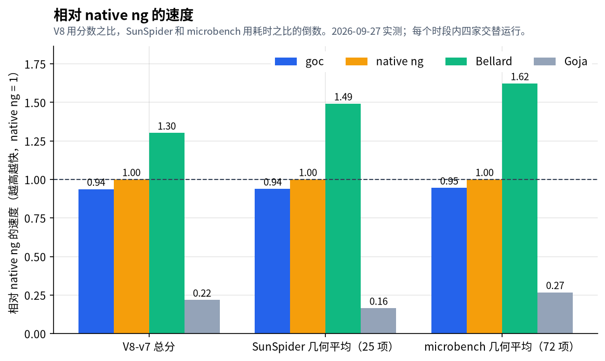

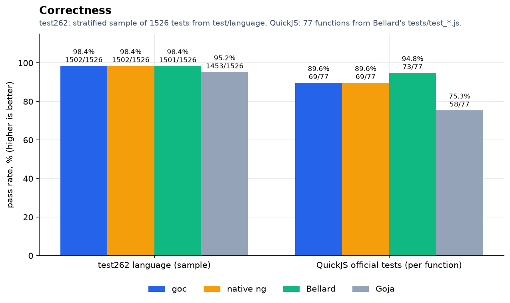

正确性上，两个 goc 构建都和各自的原生构建完全一致：goc-ng 与 native ng、goc-bellard 与 native Bellard，在 test262 抽样上失败的文件相同，在官方测试上逐函数相同（见下面的“正确性对照”表）。

速度上，goc-ng 的 V8 总分是 native ng 的 0.923 倍，SunSpider 几何平均慢 1.7%，microbench 慢 8.8%，微调用是 0.959 倍。goc-bellard 相对 gcc 版 native Bellard：V8 是 0.896 倍，SunSpider 慢 14%，microbench 慢 13%，微调用是 0.888 倍。同一份 Bellard 源码改用 clang-19 `-O2` 之后，参考时段里 V8 从 2008 降到 1883（0.938 倍），goc-bellard 相对这个 clang 版是 0.952 倍；SunSpider 和 microbench 上相对 clang 版只慢 2.0% 和 8.3%（详见下一节）。

五家横着比：gcc 版 native Bellard 最快。goc-bellard 在 V8、SunSpider、microbench 上都快于 native ng（V8 1781 对 1662，SunSpider 9.39 ms 对 10.99 ms，microbench 35.5 ns 对 42.9 ns），微调用略慢（27772 对 29096）。Goja 的 V8 总分是 goc-ng 的 0.25 倍（goc-ng 约 4.1 倍），SunSpider 慢 5.5 倍，microbench 慢 3.3 倍，微调用是 0.24 倍。

内存上，空载时 goc-ng 8.2 MiB、goc-bellard 8.1 MiB，两份原生构建都是 2.8 MiB，固定多出来约 5.3 到 5.4 MiB。整套 V8 的峰值比值降到 1.06。一个进程里每多一个存活的 runtime，goc-ng 要 224 KiB（native ng 209 KiB），goc-bellard 要 199 KiB（native Bellard 189 KiB）。Goja 空闲 runtime 最省（105 KiB），但跑负载时峰值最高，整套 V8 达到 native ng 的 9.5 倍。

| 套件 | goc-ng | goc-bellard | native ng | native Bellard | Goja | goc-ng/ng | goc-bellard/Bellard | 怎么读 |
|---|---:|---:|---:|---:|---:|---:|---:|---|
| V8-v7 总分（5 轮中位数） | 1534 | 1781 | 1662 | 1988 | 377 | 0.923 | 0.896 | 分数比，越高越快 |
| SunSpider 几何平均 ms（25 项） | 11.18 | 9.39 | 10.99 | 8.24 | 61.49 | 1.017 | 1.139 | 时间比，越低越快 |
| microbench 几何平均 ns（72 项） | 46.7 | 35.5 | 42.9 | 31.4 | 152.1 | 1.088 | 1.129 | 时间比，越低越快 |
| microcall score（calls/ms） | 27907 | 27772 | 29096 | 31277 | 6828 | 0.959 | 0.888 | 分数比，越高越快 |
| test262 通过 | 1502/1526 | 1501/1526 | 1502/1526 | 1501/1526 | 1453/1526 | | | 抽样，不是全量 |
| QuickJS 官方测试 | 73/77 | 77/77 | 73/77 | 77/77 | 58/77 | | | 按函数计 |

表中 goc-ng/ng 一列是 goc-ng 除以 native ng，goc-bellard/Bellard 一列是 goc-bellard 除以 native Bellard。内存那几行放在“内存占用”一节的表里（按负载分列）；这里摘几个数：空载峰值 RSS goc-ng 8.2 / goc-bellard 8.1 / native ng 2.8 / native Bellard 2.8 / Goja 5.6 MiB；整套 V8 峰值 164.4 / 155.8 / 155.6 / 146.9 / 1470.7 MiB；每多一个 runtime 224 / 199 / 209 / 189 / 105 KiB。

### 正确性对照

| goc 构建 | 对照的原生构建 | test262 通过（goc / 原生） | test262 结果不同的文件 | 官方测试通过（goc / 原生） | 官方测试结果不同的函数 |
|---|---|---:|---:|---:|---:|
| goc-ng | native ng | 1502 / 1502 | 0 | 73 / 73 | 0 |
| goc-bellard | native Bellard | 1501 / 1501 | 0 | 77 / 77 | 0 |

上面的官方测试是 Bellard 的 `tests/test_*.js`，按函数拆开跑，`test_builtin.js` 加了 `--std`。goc-ng 和 native ng 都是 73/77，差的 4 个函数相同：`test_unicode_ident`、`test_for_in_proxy`、`test_json`、`test_line_column_numbers`。goc-bellard 和 native Bellard 都是 77/77。ng 自己的 `tests.conf` 套件（`scripts/qjs-cli-tests.sh`）是另一套，在这个 commit 上是 116/116，不在这张五引擎表里。

## 参考：clang 编译的 native Bellard

goc-bellard 对 gcc 版 native Bellard 的 V8 比值（0.896）比 goc-ng 对 native ng（0.923）低一截。两组对照有一个不对称的地方：native ng 是 clang-19 编译的，native Bellard 按上游 Makefile 用的是 gcc，而 goc 的前端和后端都是 LLVM。为了看清这部分，用同一份 Bellard 2026-06-04 源码、同一个上游 Makefile，只换成 `make CONFIG_CLANG=y CC=clang-19`（`-O2`，其余参数不变，也没有 `-DNDEBUG`）。然后在主测试之后另跑一个短时段，按同样的方法（`taskset -c 3`、轮换顺序、V8 5 轮、SunSpider 3 轮、microbench 3 轮，取中位数）把 gcc 版、clang 版和 goc-bellard 三家放在一起测。这一时段的原始数据在 `data/raw/bellard-clang/`，数字只在这一节里用，不和上面主时段的表混用。这一节的 gcc 版 V8 中位数是 2008，主时段是 1988，差在时段之间。

| 指标 | native Bellard（gcc -O2） | native Bellard（clang-19 -O2） | clang/gcc | goc-bellard | goc-bellard / clang 版 | 怎么读 |
|---|---:|---:|---:|---:|---:|---|
| V8-v7 总分（5 轮中位数） | 2008 | 1883 | 0.938 | 1793 | 0.952 | 分数比，越高越快 |
| SunSpider 几何平均 ms（25 项） | 8.40 | 9.22 | 1.098 | 9.40 | 1.020 | 时间比，越低越快 |
| microbench 几何平均 ns（72 项） | 31.2 | 33.0 | 1.058 | 35.7 | 1.083 | 时间比，越低越快 |

同一份源码，clang 版的 V8 总分是 gcc 版的 0.938 倍，SunSpider 慢 9.8%，microbench 慢 5.8%。这一时段里 goc-bellard 相对 clang 版是 V8 0.952 倍、SunSpider 1.020 倍、microbench 1.083 倍。两个因子乘起来，V8 是 0.938 × 0.952 = 0.893，和主时段的 0.896 差在时段之间。goc 的默认构建打开了分发块尾复制（`-tail-dup-pred-size=1000 -tail-dup-succ-size=1000`），这一节的 clang 参照没有加这组参数。

## V8-v7

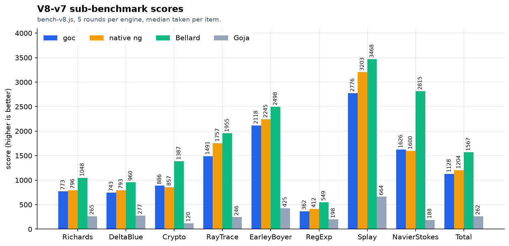

`bench-v8` 的 `combined.js` 来自 QuickJS 2026-06-04 的 extras 包（`quickjs-extras-2026-06-04.tar.xz` 里的 `tests/bench-v8`，主源码包不含这个目录）。`"use strict"` 仍是第一句，下一句是 `console` 兜底：goc 的 qjscli 没有 `console`，而 `run_harness.js` 用 `console.log`。每个子项取 5 轮中位数，所以子项之间不一定能算回总分。

| 子项 | goc-ng | goc-bellard | native ng | native Bellard | Goja | goc-ng/ng | goc-bellard/Bellard |
|---|---:|---:|---:|---:|---:|---:|---:|
| Richards | 1034 | 1124 | 1088 | 1349 | 364 | 0.95 | 0.83 |
| DeltaBlue | 1022 | 1083 | 1096 | 1268 | 374 | 0.93 | 0.85 |
| Crypto | 987 | 1284 | 1049 | 1420 | 173 | 0.94 | 0.90 |
| RayTrace | 2423 | 2627 | 2776 | 2948 | 385 | 0.87 | 0.89 |
| EarleyBoyer | 2922 | 3059 | 3213 | 3574 | 653 | 0.91 | 0.86 |
| RegExp | 493 | 622 | 548 | 659 | 322 | 0.90 | 0.94 |
| Splay | 4307 | 4860 | 4889 | 5528 | 789 | 0.88 | 0.88 |
| NavierStokes | 1962 | 2646 | 1959 | 2702 | 267 | 1.00 | 0.98 |
| **总分** | **1534** | **1781** | **1662** | **1988** | **377** | **0.923** | **0.896** |

goc-ng 和 native ng 最接近的是 NavierStokes（1.00）和 Richards（0.95），差得最多的是 RayTrace（0.87）和 Splay（0.88）。goc-bellard 对 gcc 版 Bellard 最接近的是 NavierStokes（0.98）和 RegExp（0.94），差得最多的是 Richards（0.83）和 DeltaBlue（0.85）。

各轮总分：

| 引擎 | 各轮总分 | 中位数 | 最小–最大 | 单轮墙钟中位数 |
|---|---|---:|---:|---:|
| goc-ng | 1534 / 1533 / 1515 / 1555 / 1539 | 1534 | 1515–1555 | 34.1 s |
| goc-bellard | 1762 / 1760 / 1798 / 1787 / 1781 | 1781 | 1760–1798 | 30.1 s |
| native ng | 1674 / 1636 / 1694 / 1632 / 1662 | 1662 | 1632–1694 | 33.3 s |
| native Bellard | 1988 / 2010 / 1971 / 1969 / 2036 | 1988 | 1969–2036 | 29.5 s |
| Goja | 371 / 377 / 377 / 382 / 378 | 377 | 371–382 | 88.0 s |

### 微调用

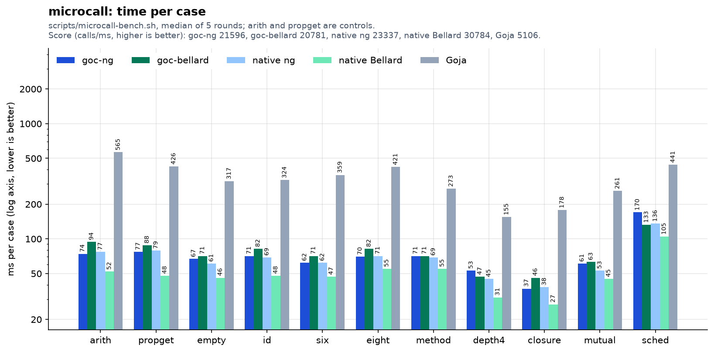

`scripts/microcall-bench.sh`，五个引擎都跑（goc-bellard 通过 `GOC_BELLARD_QJS` 加入，Bellard 用 `--stack-size 16M`，Goja 用 `gojacli`）。每个用例的 ms 取 5 轮中位数，越低越快；score 是调用类用例的 calls/ms 几何平均，越高越快，括号里是最小到最大。`arith` 和 `propget` 是对照组，不计入 score。

| 用例 | goc-ng ms | goc-bellard ms | native ng ms | native Bellard ms | Goja ms | goc-ng/ng | goc-bellard/Bellard |
|---|---:|---:|---:|---:|---:|---:|---:|
| arith | 47 | 52 | 45 | 39 | 420 | 1.04 | 1.33 |
| propget | 62 | 56 | 65 | 53 | 337 | 0.95 | 1.06 |
| empty | 55 | 54 | 48 | 50 | 234 | 1.15 | 1.08 |
| id | 61 | 57 | 52 | 51 | 247 | 1.17 | 1.12 |
| six | 47 | 44 | 47 | 43 | 259 | 1.00 | 1.02 |
| eight | 53 | 53 | 65 | 51 | 315 | 0.82 | 1.04 |
| method | 64 | 59 | 57 | 49 | 192 | 1.12 | 1.20 |
| depth4 | 39 | 44 | 31 | 32 | 128 | 1.26 | 1.38 |
| closure | 31 | 32 | 29 | 28 | 139 | 1.07 | 1.14 |
| mutual | 44 | 46 | 44 | 42 | 192 | 1.00 | 1.10 |
| sched | 115 | 122 | 124 | 98 | 331 | 0.93 | 1.24 |
| **score（calls/ms，越高越快）** | **27907**（27312–27957） | **27772**（26782–27867） | **29096**（28471–29549） | **31277**（31221–31998） | **6828**（6620–6882） | **0.96** | **0.89** |

goc-ng 的调用速度是 native ng 的 0.96 倍。时间比最大的是 `depth4`（1.26）、`id`（1.17）和 `empty`（1.15）；`eight` 是 0.82，`sched` 是 0.93，`mutual` 是 1.00。goc-bellard 对 gcc 版 Bellard 是 0.89 倍。它的对照组 `arith` 是 1.33，调用用例里 `depth4` 是 1.38、`sched` 是 1.24，其余大多在 1.02 到 1.20。gcc 版 Bellard 的 score 是 native ng 的 1.07 倍，Goja 是 0.23 倍；Goja 的 `arith` 是 native ng 的 9.3 倍，差距不只在调用上。

## test262

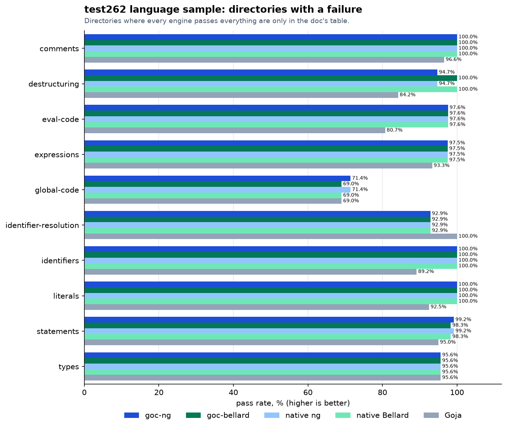

tc39/test262 `7ab7faf` 的 `test/language`，由 `scripts/test262-sample.py` 抽样。每项一个新进程，`assert.js` + `sta.js`，直接 `eval`。跳过 `import` / `export` / `module-code`，以及 `module` / `async` / `raw` / `CanBlock`，还有 Atomics、SharedArrayBuffer、agent。每目录均匀抽取最多 80 个正例和 40 个反例。合格池 13898 正例 + 4252 反例，实跑 1526。不是官方全量 harness，也没有每项新 realm。

goc-ng 与 native ng 都是 1502/1526，goc-bellard 与 native Bellard 都是 1501/1526，Goja 是 1453/1526。goc-bellard 与 native Bellard 失败的文件逐个相同。

| 目录 | 合格正例 | 合格反例 | 实跑 | goc-ng | goc-bellard | native ng | native Bellard | Goja |
|---|---:|---:|---:|---:|---:|---:|---:|---:|
| arguments-object | 200 | 1 | 81 | 81/81 | 81/81 | 81/81 | 81/81 | 81/81 |
| asi | 67 | 35 | 102 | 102/102 | 102/102 | 102/102 | 102/102 | 102/102 |
| block-scope | 43 | 102 | 83 | 83/83 | 83/83 | 83/83 | 83/83 | 83/83 |
| comments | 21 | 8 | 29 | 29/29 | 29/29 | 29/29 | 29/29 | 28/29 |
| computed-property-names | 48 | 0 | 48 | 48/48 | 48/48 | 48/48 | 48/48 | 48/48 |
| destructuring | 19 | 0 | 19 | 18/19 | 19/19 | 18/19 | 19/19 | 16/19 |
| directive-prologue | 51 | 6 | 57 | 57/57 | 57/57 | 57/57 | 57/57 | 57/57 |
| eval-code | 292 | 3 | 83 | 81/83 | 81/83 | 81/83 | 81/83 | 67/83 |
| expressions | 6903 | 2015 | 120 | 117/120 | 117/120 | 117/120 | 117/120 | 112/120 |
| function-code | 217 | 0 | 80 | 80/80 | 80/80 | 80/80 | 80/80 | 80/80 |
| future-reserved-words | 29 | 26 | 55 | 55/55 | 55/55 | 55/55 | 55/55 | 55/55 |
| global-code | 27 | 15 | 42 | 30/42 | 29/42 | 30/42 | 29/42 | 29/42 |
| identifier-resolution | 12 | 2 | 14 | 13/14 | 13/14 | 13/14 | 13/14 | 14/14 |
| identifiers | 152 | 116 | 120 | 120/120 | 120/120 | 120/120 | 120/120 | 107/120 |
| keywords | 0 | 25 | 25 | 25/25 | 25/25 | 25/25 | 25/25 | 25/25 |
| line-terminators | 17 | 24 | 41 | 41/41 | 41/41 | 41/41 | 41/41 | 41/41 |
| literals | 215 | 321 | 120 | 120/120 | 120/120 | 120/120 | 120/120 | 111/120 |
| punctuators | 1 | 10 | 11 | 11/11 | 11/11 | 11/11 | 11/11 | 11/11 |
| reserved-words | 14 | 12 | 26 | 26/26 | 26/26 | 26/26 | 26/26 | 26/26 |
| rest-parameters | 10 | 1 | 11 | 11/11 | 11/11 | 11/11 | 11/11 | 11/11 |
| source-text | 1 | 0 | 1 | 1/1 | 1/1 | 1/1 | 1/1 | 1/1 |
| statementList | 80 | 0 | 80 | 80/80 | 80/80 | 80/80 | 80/80 | 80/80 |
| statements | 5316 | 1513 | 120 | 119/120 | 118/120 | 119/120 | 118/120 | 114/120 |
| types | 102 | 11 | 91 | 87/91 | 87/91 | 87/91 | 87/91 | 87/91 |
| white-space | 61 | 6 | 67 | 67/67 | 67/67 | 67/67 | 67/67 | 67/67 |

goc-ng 与 native ng 的失败路径相同，goc-bellard 与 native Bellard 的失败路径相同。共同缺口是旧式全局 `var` 属性、少量该抛未抛的早期错误、3 个 `$262.createRealm`、2 个模块片段、1 个 decorator。Bellard 的两个构建比 ng 多过一个 destructuring 求值顺序测试，另失败 `decl-lex-restricted-global` 和 `using/static-init-await-binding-valid`。Goja 多出来的主要是 async generator、class fields、regexp `v` flag。

失败清单：

| 引擎 | 路径 | 结果 |
|---|---|---|
| goc-ng | destructuring/binding/keyed-destructuring-property-reference-target-evaluation-order-with-bindings.js | FAIL undefined: Test262Error: Actual [binding::source, binding::sourceKey, sourceKey, get source, binding::defaultValue, binding::varTarget] |
| goc-ng | eval-code/indirect/lex-env-heritage.js | FAIL ReferenceError: ReferenceError: x is not defined |
| goc-ng | eval-code/indirect/var-env-global-lex-non-strict.js | FAIL undefined: Test262Error: Expected SameValue(«undefined», «undefined») to be false |
| goc-ng | expressions/class/private-setter-brand-check-multiple-evaluations-of-class-realm-function-ctor.js | FAIL Error: Error: $262.createRealm |
| goc-ng | expressions/dynamic-import/assignment-expression/module-code-other_FIXTURE.js | FAIL SyntaxError: SyntaxError: unsupported keyword: export |
| goc-ng | expressions/dynamic-import/syntax/valid/nested-else-import-defer-script-code-valid.js | FAIL SyntaxError: SyntaxError: meta expected |
| goc-ng | global-code/S10.4.1_A1_T1.js | FAIL undefined: Test262Error: #2: variable x has property attribute DontDelete |
| goc-ng | global-code/decl-func.js | FAIL undefined: Test262Error: brandNew descriptor should not be configurable |
| goc-ng | global-code/decl-var.js | FAIL undefined: Test262Error: brandNew descriptor should not be configurable |
| goc-ng | global-code/script-decl-func.js | FAIL undefined: Test262Error: brandNew descriptor should not be configurable |
| goc-ng | global-code/script-decl-lex-deletion.js | FAIL ReferenceError: ReferenceError: test262let is not defined |
| goc-ng | global-code/script-decl-lex-lex.js | FAIL undefined: Test262Error: `let` binding Expected a SyntaxError to be thrown but no exception was thrown at all |
| goc-ng | global-code/script-decl-lex-restricted-global.js | FAIL undefined: Test262Error: Expected a SyntaxError to be thrown but no exception was thrown at all |
| goc-ng | global-code/script-decl-lex-var-declared-via-eval.js | FAIL undefined: Test262Error: Expected SameValue(«undefined», «1») to be true |
| goc-ng | global-code/script-decl-lex-var.js | FAIL undefined: Test262Error: variable Expected a SyntaxError to be thrown but no exception was thrown at all |
| goc-ng | global-code/script-decl-lex.js | FAIL ReferenceError: ReferenceError: test262let is not defined |
| goc-ng | global-code/script-decl-var-collision.js | FAIL undefined: Test262Error: `var` on `let` binding Expected a SyntaxError to be thrown but no exception was thrown at all |
| goc-ng | global-code/script-decl-var.js | FAIL undefined: Test262Error: brandNew descriptor should not be configurable |
| goc-ng | identifier-resolution/assign-to-global-undefined.js | FAIL expected ReferenceError |
| goc-ng | statements/class/decorator/syntax/valid/decorator-parenthesized-expr-identifier-reference.js | FAIL SyntaxError: SyntaxError: unexpected token in expression: '@' |
| goc-ng | types/reference/S8.7.1_A2.js | FAIL undefined: Test262Error: #1: y = 1; (delete y) === false. Actual: true |
| goc-ng | types/reference/S8.7_A5_T1.js | FAIL undefined: Test262Error: #3: obj = new Object(); var __ref = obj; delete __ref === false. Actual: true |
| goc-ng | types/reference/get-value-prop-base-primitive-realm.js | FAIL Error: Error: $262.createRealm |
| goc-ng | types/reference/put-value-prop-base-primitive-realm.js | FAIL Error: Error: $262.createRealm |
| goc-bellard | eval-code/indirect/lex-env-heritage.js | FAIL ReferenceError: ReferenceError: 'x' is not defined |
| goc-bellard | eval-code/indirect/var-env-global-lex-non-strict.js | FAIL undefined: Test262Error: Expected SameValue(«undefined», «undefined») to be false |
| goc-bellard | expressions/class/private-setter-brand-check-multiple-evaluations-of-class-realm-function-ctor.js | FAIL Error: Error: $262.createRealm |
| goc-bellard | expressions/dynamic-import/assignment-expression/module-code-other_FIXTURE.js | FAIL SyntaxError: SyntaxError: unsupported keyword: export |
| goc-bellard | expressions/dynamic-import/syntax/valid/nested-else-import-defer-script-code-valid.js | FAIL SyntaxError: SyntaxError: meta expected |
| goc-bellard | global-code/S10.4.1_A1_T1.js | FAIL undefined: Test262Error: #2: variable x has property attribute DontDelete |
| goc-bellard | global-code/decl-func.js | FAIL undefined: Test262Error: brandNew descriptor should not be configurable |
| goc-bellard | global-code/decl-lex-restricted-global.js | FAIL expected SyntaxError |
| goc-bellard | global-code/decl-var.js | FAIL undefined: Test262Error: brandNew descriptor should not be configurable |
| goc-bellard | global-code/script-decl-func.js | FAIL undefined: Test262Error: brandNew descriptor should not be configurable |
| goc-bellard | global-code/script-decl-lex-deletion.js | FAIL ReferenceError: ReferenceError: 'test262let' is not defined |
| goc-bellard | global-code/script-decl-lex-lex.js | FAIL undefined: Test262Error: `let` binding Expected a SyntaxError to be thrown but no exception was thrown at all |
| goc-bellard | global-code/script-decl-lex-restricted-global.js | FAIL undefined: Test262Error: Expected a SyntaxError to be thrown but no exception was thrown at all |
| goc-bellard | global-code/script-decl-lex-var-declared-via-eval.js | FAIL undefined: Test262Error: Expected SameValue(«undefined», «1») to be true |
| goc-bellard | global-code/script-decl-lex-var.js | FAIL undefined: Test262Error: variable Expected a SyntaxError to be thrown but no exception was thrown at all |
| goc-bellard | global-code/script-decl-lex.js | FAIL ReferenceError: ReferenceError: 'test262let' is not defined |
| goc-bellard | global-code/script-decl-var-collision.js | FAIL undefined: Test262Error: `var` on `let` binding Expected a SyntaxError to be thrown but no exception was thrown at all |
| goc-bellard | global-code/script-decl-var.js | FAIL undefined: Test262Error: brandNew descriptor should not be configurable |
| goc-bellard | identifier-resolution/assign-to-global-undefined.js | FAIL expected ReferenceError |
| goc-bellard | statements/class/decorator/syntax/valid/decorator-parenthesized-expr-identifier-reference.js | FAIL SyntaxError: SyntaxError: unexpected token in expression: '@' |
| goc-bellard | statements/using/static-init-await-binding-valid.js | FAIL SyntaxError: SyntaxError: expecting ';' |
| goc-bellard | types/reference/S8.7.1_A2.js | FAIL undefined: Test262Error: #1: y = 1; (delete y) === false. Actual: true |
| goc-bellard | types/reference/S8.7_A5_T1.js | FAIL undefined: Test262Error: #3: obj = new Object(); var __ref = obj; delete __ref === false. Actual: true |
| goc-bellard | types/reference/get-value-prop-base-primitive-realm.js | FAIL Error: Error: $262.createRealm |
| goc-bellard | types/reference/put-value-prop-base-primitive-realm.js | FAIL Error: Error: $262.createRealm |
| native ng | destructuring/binding/keyed-destructuring-property-reference-target-evaluation-order-with-bindings.js | FAIL undefined: Test262Error: Actual [binding::source, binding::sourceKey, sourceKey, get source, binding::defaultValue, binding::varTarget] |
| native ng | eval-code/indirect/lex-env-heritage.js | FAIL ReferenceError: ReferenceError: x is not defined |
| native ng | eval-code/indirect/var-env-global-lex-non-strict.js | FAIL undefined: Test262Error: Expected SameValue(«undefined», «undefined») to be false |
| native ng | expressions/class/private-setter-brand-check-multiple-evaluations-of-class-realm-function-ctor.js | FAIL Error: Error: $262.createRealm |
| native ng | expressions/dynamic-import/assignment-expression/module-code-other_FIXTURE.js | FAIL SyntaxError: SyntaxError: unsupported keyword: export |
| native ng | expressions/dynamic-import/syntax/valid/nested-else-import-defer-script-code-valid.js | FAIL SyntaxError: SyntaxError: meta expected |
| native ng | global-code/S10.4.1_A1_T1.js | FAIL undefined: Test262Error: #2: variable x has property attribute DontDelete |
| native ng | global-code/decl-func.js | FAIL undefined: Test262Error: brandNew descriptor should not be configurable |
| native ng | global-code/decl-var.js | FAIL undefined: Test262Error: brandNew descriptor should not be configurable |
| native ng | global-code/script-decl-func.js | FAIL undefined: Test262Error: brandNew descriptor should not be configurable |
| native ng | global-code/script-decl-lex-deletion.js | FAIL ReferenceError: ReferenceError: test262let is not defined |
| native ng | global-code/script-decl-lex-lex.js | FAIL undefined: Test262Error: `let` binding Expected a SyntaxError to be thrown but no exception was thrown at all |
| native ng | global-code/script-decl-lex-restricted-global.js | FAIL undefined: Test262Error: Expected a SyntaxError to be thrown but no exception was thrown at all |
| native ng | global-code/script-decl-lex-var-declared-via-eval.js | FAIL undefined: Test262Error: Expected SameValue(«undefined», «1») to be true |
| native ng | global-code/script-decl-lex-var.js | FAIL undefined: Test262Error: variable Expected a SyntaxError to be thrown but no exception was thrown at all |
| native ng | global-code/script-decl-lex.js | FAIL ReferenceError: ReferenceError: test262let is not defined |
| native ng | global-code/script-decl-var-collision.js | FAIL undefined: Test262Error: `var` on `let` binding Expected a SyntaxError to be thrown but no exception was thrown at all |
| native ng | global-code/script-decl-var.js | FAIL undefined: Test262Error: brandNew descriptor should not be configurable |
| native ng | identifier-resolution/assign-to-global-undefined.js | FAIL expected ReferenceError |
| native ng | statements/class/decorator/syntax/valid/decorator-parenthesized-expr-identifier-reference.js | FAIL SyntaxError: SyntaxError: unexpected token in expression: '@' |
| native ng | types/reference/S8.7.1_A2.js | FAIL undefined: Test262Error: #1: y = 1; (delete y) === false. Actual: true |
| native ng | types/reference/S8.7_A5_T1.js | FAIL undefined: Test262Error: #3: obj = new Object(); var __ref = obj; delete __ref === false. Actual: true |
| native ng | types/reference/get-value-prop-base-primitive-realm.js | FAIL Error: Error: $262.createRealm |
| native ng | types/reference/put-value-prop-base-primitive-realm.js | FAIL Error: Error: $262.createRealm |
| native Bellard | eval-code/indirect/lex-env-heritage.js | FAIL ReferenceError: ReferenceError: 'x' is not defined |
| native Bellard | eval-code/indirect/var-env-global-lex-non-strict.js | FAIL undefined: Test262Error: Expected SameValue(«undefined», «undefined») to be false |
| native Bellard | expressions/class/private-setter-brand-check-multiple-evaluations-of-class-realm-function-ctor.js | FAIL Error: Error: $262.createRealm |
| native Bellard | expressions/dynamic-import/assignment-expression/module-code-other_FIXTURE.js | FAIL SyntaxError: SyntaxError: unsupported keyword: export |
| native Bellard | expressions/dynamic-import/syntax/valid/nested-else-import-defer-script-code-valid.js | FAIL SyntaxError: SyntaxError: meta expected |
| native Bellard | global-code/S10.4.1_A1_T1.js | FAIL undefined: Test262Error: #2: variable x has property attribute DontDelete |
| native Bellard | global-code/decl-func.js | FAIL undefined: Test262Error: brandNew descriptor should not be configurable |
| native Bellard | global-code/decl-lex-restricted-global.js | FAIL expected SyntaxError |
| native Bellard | global-code/decl-var.js | FAIL undefined: Test262Error: brandNew descriptor should not be configurable |
| native Bellard | global-code/script-decl-func.js | FAIL undefined: Test262Error: brandNew descriptor should not be configurable |
| native Bellard | global-code/script-decl-lex-deletion.js | FAIL ReferenceError: ReferenceError: 'test262let' is not defined |
| native Bellard | global-code/script-decl-lex-lex.js | FAIL undefined: Test262Error: `let` binding Expected a SyntaxError to be thrown but no exception was thrown at all |
| native Bellard | global-code/script-decl-lex-restricted-global.js | FAIL undefined: Test262Error: Expected a SyntaxError to be thrown but no exception was thrown at all |
| native Bellard | global-code/script-decl-lex-var-declared-via-eval.js | FAIL undefined: Test262Error: Expected SameValue(«undefined», «1») to be true |
| native Bellard | global-code/script-decl-lex-var.js | FAIL undefined: Test262Error: variable Expected a SyntaxError to be thrown but no exception was thrown at all |
| native Bellard | global-code/script-decl-lex.js | FAIL ReferenceError: ReferenceError: 'test262let' is not defined |
| native Bellard | global-code/script-decl-var-collision.js | FAIL undefined: Test262Error: `var` on `let` binding Expected a SyntaxError to be thrown but no exception was thrown at all |
| native Bellard | global-code/script-decl-var.js | FAIL undefined: Test262Error: brandNew descriptor should not be configurable |
| native Bellard | identifier-resolution/assign-to-global-undefined.js | FAIL expected ReferenceError |
| native Bellard | statements/class/decorator/syntax/valid/decorator-parenthesized-expr-identifier-reference.js | FAIL SyntaxError: SyntaxError: unexpected token in expression: '@' |
| native Bellard | statements/using/static-init-await-binding-valid.js | FAIL SyntaxError: SyntaxError: expecting ';' |
| native Bellard | types/reference/S8.7.1_A2.js | FAIL undefined: Test262Error: #1: y = 1; (delete y) === false. Actual: true |
| native Bellard | types/reference/S8.7_A5_T1.js | FAIL undefined: Test262Error: #3: obj = new Object(); var __ref = obj; delete __ref === false. Actual: true |
| native Bellard | types/reference/get-value-prop-base-primitive-realm.js | FAIL Error: Error: $262.createRealm |
| native Bellard | types/reference/put-value-prop-base-primitive-realm.js | FAIL Error: Error: $262.createRealm |
| Goja | comments/hashbang/function-constructor.js | FAIL SyntaxError: SyntaxError: SyntaxError: Async generators are not supported yet at <eval>:16:33 |
| Goja | destructuring/binding/syntax/destructuring-array-parameters-function-arguments-length.js | FAIL SyntaxError: SyntaxError: SyntaxError: Async generators are not supported yet at <eval>:34:19 |
| Goja | destructuring/binding/syntax/destructuring-object-parameters-function-arguments-length.js | FAIL SyntaxError: SyntaxError: SyntaxError: Async generators are not supported yet at <eval>:34:19 |
| Goja | destructuring/binding/typedarray-backed-by-resizable-buffer.js | FAIL TypeError: TypeError: Object has no member 'resize' |
| Goja | eval-code/direct/async-gen-func-decl-a-preceding-parameter-is-named-arguments-declare-arguments.js | FAIL SyntaxError: SyntaxError: SyntaxError: Async generators are not supported yet at <eval>:12:1 |
| Goja | eval-code/direct/async-gen-func-decl-fn-body-cntns-arguments-lex-bind-declare-arguments-and-assign.js | FAIL SyntaxError: SyntaxError: SyntaxError: Async generators are not supported yet at <eval>:12:1 |
| Goja | eval-code/direct/async-gen-func-decl-no-pre-existing-arguments-bindings-are-present-declare-arguments-and-assign.js | FAIL SyntaxError: SyntaxError: SyntaxError: Async generators are not supported yet at <eval>:12:1 |
| Goja | eval-code/direct/async-gen-func-expr-a-preceding-parameter-is-named-arguments-declare-arguments-and-assign.js | FAIL SyntaxError: SyntaxError: SyntaxError: Async generators are not supported yet at <eval>:12:9 |
| Goja | eval-code/direct/async-gen-func-expr-fn-body-cntns-arguments-func-decl-declare-arguments.js | FAIL SyntaxError: SyntaxError: SyntaxError: Async generators are not supported yet at <eval>:12:9 |
| Goja | eval-code/direct/async-gen-func-expr-fn-body-cntns-arguments-var-bind-declare-arguments.js | FAIL SyntaxError: SyntaxError: SyntaxError: Async generators are not supported yet at <eval>:12:9 |
| Goja | eval-code/direct/async-gen-meth-a-following-parameter-is-named-arguments-declare-arguments.js | FAIL SyntaxError: SyntaxError: SyntaxError: <eval>: Line 12:18 Unexpected token * (and 9 more errors) |
| Goja | eval-code/direct/async-gen-meth-fn-body-cntns-arguments-func-decl-declare-arguments.js | FAIL SyntaxError: SyntaxError: SyntaxError: <eval>: Line 12:18 Unexpected token * (and 12 more errors) |
| Goja | eval-code/direct/async-gen-meth-fn-body-cntns-arguments-var-bind-declare-arguments-and-assign.js | FAIL SyntaxError: SyntaxError: SyntaxError: <eval>: Line 12:18 Unexpected token * (and 16 more errors) |
| Goja | eval-code/direct/async-gen-named-func-expr-a-following-parameter-is-named-arguments-declare-arguments-and-assign.js | FAIL SyntaxError: SyntaxError: SyntaxError: Async generators are not supported yet at <eval>:12:9 |
| Goja | eval-code/direct/async-gen-named-func-expr-fn-body-cntns-arguments-func-decl-declare-arguments-and-assign.js | FAIL SyntaxError: SyntaxError: SyntaxError: Async generators are not supported yet at <eval>:12:9 |
| Goja | eval-code/direct/async-gen-named-func-expr-fn-body-cntns-arguments-lex-bind-declare-arguments.js | FAIL SyntaxError: SyntaxError: SyntaxError: Async generators are not supported yet at <eval>:12:9 |
| Goja | eval-code/direct/async-gen-named-func-expr-no-pre-existing-arguments-bindings-are-present-declare-arguments.js | FAIL SyntaxError: SyntaxError: SyntaxError: Async generators are not supported yet at <eval>:12:9 |
| Goja | eval-code/direct/var-env-global-lex-non-strict.js | FAIL expected SyntaxError |
| Goja | eval-code/indirect/lex-env-heritage.js | FAIL ReferenceError: ReferenceError: x is not defined |
| Goja | eval-code/indirect/var-env-global-lex-non-strict.js | FAIL undefined: Test262Error: Expected SameValue(«undefined», «undefined») to be false |
| Goja | expressions/async-generator/dstr/dflt-ary-ptrn-elision-step-err.js | FAIL SyntaxError: SyntaxError: SyntaxError: Async generators are not supported yet at <eval>:43:9 |
| Goja | expressions/async-generator/named-dflt-params-ref-self.js | FAIL SyntaxError: SyntaxError: SyntaxError: Async generators are not supported yet at <eval>:35:5 |
| Goja | expressions/class/dstr/async-gen-meth-obj-ptrn-prop-id-init-unresolvable.js | FAIL SyntaxError: SyntaxError: SyntaxError: Async generators are not supported yet at <eval>:62:3 |
| Goja | expressions/class/private-setter-brand-check-multiple-evaluations-of-class-realm-function-ctor.js | FAIL Error: Error: $262.createRealm |
| Goja | expressions/dynamic-import/assignment-expression/module-code-other_FIXTURE.js | FAIL SyntaxError: SyntaxError: SyntaxError: <eval>: Line 6:1 Unexpected reserved word (and 2 more errors) |
| Goja | expressions/dynamic-import/syntax/valid/nested-async-arrow-function-await-nested-imports.js | FAIL SyntaxError: SyntaxError: SyntaxError: <eval>: Line 26:9 Unexpected reserved word (and 2 more errors) |
| Goja | expressions/dynamic-import/syntax/valid/nested-else-import-defer-script-code-valid.js | FAIL SyntaxError: SyntaxError: SyntaxError: <eval>: Line 28:3 Unexpected reserved word (and 1 more errors) |
| Goja | expressions/object/dstr/async-gen-meth-obj-init-undefined.js | FAIL SyntaxError: SyntaxError: SyntaxError: <eval>: Line 32:10 Unexpected token * (and 4 more errors) |
| Goja | global-code/S10.4.1_A1_T1.js | FAIL undefined: Test262Error: #2: variable x has property attribute DontDelete |
| Goja | global-code/decl-func.js | FAIL undefined: Test262Error: brandNew descriptor should not be configurable |
| Goja | global-code/decl-lex-restricted-global.js | FAIL expected SyntaxError |
| Goja | global-code/decl-var.js | FAIL undefined: Test262Error: brandNew descriptor should not be configurable |
| Goja | global-code/script-decl-func.js | FAIL undefined: Test262Error: brandNew descriptor should not be configurable |
| Goja | global-code/script-decl-lex-deletion.js | FAIL ReferenceError: ReferenceError: test262let is not defined |
| Goja | global-code/script-decl-lex-lex.js | FAIL undefined: Test262Error: `let` binding Expected a SyntaxError to be thrown but no exception was thrown at all |
| Goja | global-code/script-decl-lex-restricted-global.js | FAIL undefined: Test262Error: Expected a SyntaxError to be thrown but no exception was thrown at all |
| Goja | global-code/script-decl-lex-var-declared-via-eval.js | FAIL undefined: Test262Error: Expected SameValue(«undefined», «1») to be true |
| Goja | global-code/script-decl-lex-var.js | FAIL undefined: Test262Error: variable Expected a SyntaxError to be thrown but no exception was thrown at all |
| Goja | global-code/script-decl-lex.js | FAIL ReferenceError: ReferenceError: test262let is not defined |
| Goja | global-code/script-decl-var-collision.js | FAIL undefined: Test262Error: `var` on `let` binding Expected a SyntaxError to be thrown but no exception was thrown at all |
| Goja | global-code/script-decl-var.js | FAIL undefined: Test262Error: brandNew descriptor should not be configurable |
| Goja | identifiers/part-unicode-15.1.0-class-escaped.js | FAIL SyntaxError: SyntaxError: SyntaxError: <eval>: Line 19:22 Unexpected token ILLEGAL (and 1 more errors) |
| Goja | identifiers/part-unicode-15.1.0-class.js | FAIL SyntaxError: SyntaxError: SyntaxError: <eval>: Line 16:11 Unexpected token ILLEGAL (and 4 more errors) |
| Goja | identifiers/part-unicode-15.1.0.js | FAIL SyntaxError: SyntaxError: SyntaxError: <eval>: Line 14:12 Unexpected token ILLEGAL (and 3 more errors) |
| Goja | identifiers/part-unicode-16.0.0-class.js | FAIL SyntaxError: SyntaxError: SyntaxError: <eval>: Line 16:5 Unexpected token ILLEGAL (and 133 more errors) |
| Goja | identifiers/part-unicode-16.0.0.js | FAIL SyntaxError: SyntaxError: SyntaxError: <eval>: Line 14:6 Unexpected token ILLEGAL (and 132 more errors) |
| Goja | identifiers/part-unicode-17.0.0-class.js | FAIL SyntaxError: SyntaxError: SyntaxError: <eval>: Line 16:5 Unexpected token ILLEGAL (and 54 more errors) |
| Goja | identifiers/part-unicode-17.0.0.js | FAIL SyntaxError: SyntaxError: SyntaxError: <eval>: Line 14:6 Unexpected token ILLEGAL (and 53 more errors) |
| Goja | identifiers/start-unicode-15.1.0-class.js | FAIL SyntaxError: SyntaxError: SyntaxError: <eval>: Line 16:4 Unexpected token ILLEGAL (and 1865 more errors) |
| Goja | identifiers/start-unicode-15.1.0-escaped.js | FAIL SyntaxError: SyntaxError: SyntaxError: <eval>: Line 16:5 Unexpected token ILLEGAL (and 1242 more errors) |
| Goja | identifiers/start-unicode-16.0.0-class-escaped.js | FAIL SyntaxError: SyntaxError: SyntaxError: <eval>: Line 19:9 Unexpected token ILLEGAL (and 9 more errors) |
| Goja | identifiers/start-unicode-16.0.0-escaped.js | FAIL SyntaxError: SyntaxError: SyntaxError: <eval>: Line 16:5 Unexpected token ILLEGAL (and 8602 more errors) |
| Goja | identifiers/start-unicode-17.0.0-class-escaped.js | FAIL SyntaxError: SyntaxError: SyntaxError: <eval>: Line 19:9 Unexpected token ILLEGAL (and 9 more errors) |
| Goja | identifiers/start-unicode-17.0.0-escaped.js | FAIL SyntaxError: SyntaxError: SyntaxError: <eval>: Line 16:5 Unexpected token ILLEGAL (and 9292 more errors) |
| Goja | literals/regexp/S7.8.5_A1.4_T2.js | FAIL undefined: Test262Error: Code unit: d800 Expected SameValue(«"\\\\\\ud800"», «"\\\ud800"») to be true |
| Goja | literals/regexp/S7.8.5_A2.1_T2.js | FAIL undefined: Test262Error: Code unit: d800 Expected SameValue(«"nnnn\\ud800"», «"nnnn\ud800"») to be true |
| Goja | literals/regexp/invalid-range-lookbehind.js | FAIL expected SyntaxError got String: Test262: This statement should not be evaluated. |
| Goja | literals/regexp/u-case-mapping.js | FAIL undefined: Test262Error: Case mapping is not applied in the absence of the `u` flag Expected SameValue(«true», «false») to be true |
| Goja | literals/regexp/u-invalid-range-lookahead.js | FAIL expected SyntaxError got String: Test262: This statement should not be evaluated. |
| Goja | literals/string/S7.8.4_A4.3_T2.js | FAIL expected SyntaxError got String: Test262: This statement should not be evaluated. |
| Goja | literals/string/legacy-non-octal-escape-sequence-2-strict-explicit-pragma.js | FAIL expected SyntaxError got String: Test262: This statement should not be evaluated. |
| Goja | literals/string/legacy-non-octal-escape-sequence-9-strict-explicit-pragma.js | FAIL expected SyntaxError got String: Test262: This statement should not be evaluated. |
| Goja | literals/string/legacy-octal-escape-sequence.js | FAIL undefined: Test262Error: \400 Expected SameValue(«"Ā"», «" 0"») to be true |
| Goja | statements/class/decorator/syntax/valid/decorator-parenthesized-expr-identifier-reference.js | FAIL SyntaxError: SyntaxError: SyntaxError: <eval>: Line 54:1 Unexpected token ILLEGAL (and 7 more errors) |
| Goja | statements/class/dstr/async-gen-meth-dflt-ary-ptrn-elem-id-iter-val-err.js | FAIL SyntaxError: SyntaxError: SyntaxError: Async generators are not supported yet at <eval>:74:3 |
| Goja | statements/class/dstr/async-gen-meth-static-dflt-obj-ptrn-prop-id-init-throws.js | FAIL SyntaxError: SyntaxError: SyntaxError: Async generators are not supported yet at <eval>:57:10 |
| Goja | statements/for-await-of/let-block-with-newline.js | FAIL SyntaxError: SyntaxError: SyntaxError: <eval>: Line 17:7 Unexpected token await (and 10 more errors) |
| Goja | statements/let/global-closure-set-before-initialization.js | FAIL undefined: Test262Error: Expected a ReferenceError to be thrown but no exception was thrown at all |
| Goja | statements/using/static-init-await-binding-valid.js | FAIL SyntaxError: SyntaxError: SyntaxError: <eval>: Line 17:20 Unexpected token await (and 5 more errors) |
| Goja | types/reference/S8.7.1_A2.js | FAIL undefined: Test262Error: #1: y = 1; (delete y) === false. Actual: true |
| Goja | types/reference/S8.7_A5_T1.js | FAIL undefined: Test262Error: #3: obj = new Object(); var __ref = obj; delete __ref === false. Actual: true |
| Goja | types/reference/get-value-prop-base-primitive-realm.js | FAIL Error: Error: $262.createRealm |
| Goja | types/reference/put-value-prop-base-primitive-realm.js | FAIL Error: Error: $262.createRealm |

## QuickJS 官方测试

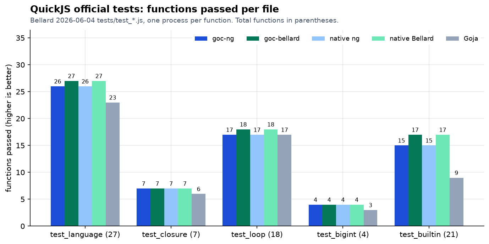

Bellard 2026-06-04 的 `tests/test_language.js`、`test_closure.js`、`test_loop.js`、`test_bigint.js`、`test_builtin.js`，由 `scripts/qjs-official-tests.py` 拆成每个函数一个进程。`test_builtin.js` 加了 `--std`（gojacli 没有这个参数，不加），QuickJS 四家因此能用到 `std` / `os`。goc-ng 与 native ng 都是 73/77，差的四个函数相同；goc-bellard 与 native Bellard 都是 77/77。失败信息前面多了 qjscli 的 `qjscli:runtime: <t>:` 前缀。Goja 是 58/77，其中 `test_weak_map_cycles` 报 `std is not defined`。

| 文件 | n | goc-ng | goc-bellard | native ng | native Bellard | Goja |
|---|---:|---:|---:|---:|---:|---:|
| test_language.js | 27 | 26 | 27 | 26 | 27 | 23 |
| test_closure.js | 7 | 7 | 7 | 7 | 7 | 6 |
| test_loop.js | 18 | 17 | 18 | 17 | 18 | 17 |
| test_bigint.js | 4 | 4 | 4 | 4 | 4 | 3 |
| test_builtin.js | 21 | 19 | 21 | 19 | 21 | 9 |

逐函数。`pass` 以外的格子是失败信息。

| 文件 | 函数 | goc-ng | goc-bellard | native ng | native Bellard | Goja |
|---|---|---|---|---|---|---|
| test_language | test_op1 | pass | pass | pass | pass | pass |
| test_language | test_cvt | pass | pass | pass | pass | pass |
| test_language | test_eq | pass | pass | pass | pass | pass |
| test_language | test_inc_dec | pass | pass | pass | pass | pass |
| test_language | test_op2 | pass | pass | pass | pass | pass |
| test_language | test_constructor | pass | pass | pass | pass | FAIL Error: assertion failed: got \|Value is not a constructor\|, expected \|G i |
| test_language | test_delete | pass | pass | pass | pass | pass |
| test_language | test_prototype | pass | pass | pass | pass | pass |
| test_language | test_arguments | pass | pass | pass | pass | pass |
| test_language | test_class | pass | pass | pass | pass | FAIL SyntaxError: SyntaxError: <t>: Line 91:15 Unexpected token = (and 3 more er |
| test_language | test_template | pass | pass | pass | pass | pass |
| test_language | test_template_skip | pass | pass | pass | pass | pass |
| test_language | test_object_literal | pass | pass | pass | pass | pass |
| test_language | test_regexp_skip | pass | pass | pass | pass | pass |
| test_language | test_labels | pass | pass | pass | pass | pass |
| test_language | test_labels2 | pass | pass | pass | pass | pass |
| test_language | test_destructuring | pass | pass | pass | pass | pass |
| test_language | test_spread | pass | pass | pass | pass | pass |
| test_language | test_function_length | pass | pass | pass | pass | pass |
| test_language | test_argument_scope | pass | pass | pass | pass | FAIL Error: assertion failed: got \|undefined\|, expected \|12\| at Error (nativ |
| test_language | test_function_expr_name | pass | pass | pass | pass | pass |
| test_language | test_parse_semicolon | pass | pass | pass | pass | pass |
| test_language | test_optional_chaining | pass | pass | pass | pass | FAIL Error: assertion failed: got \|{"b":{"c":2}}\|, expected \|{"b":{}}\| (opti |
| test_language | test_parse_arrow_function | pass | pass | pass | pass | pass |
| test_language | test_unicode_ident | FAIL qjscli:runtime: <t>: Error: assertion failed: got \|number\|, expected \|un | pass | FAIL Error: assertion failed: got \|number\|, expected \|undefined\| | pass | pass |
| test_language | test_global_var_opt | pass | pass | pass | pass | pass |
| test_language | test_number_literals | pass | pass | pass | pass | pass |
| test_closure | test_closure1 | pass | pass | pass | pass | pass |
| test_closure | test_closure2 | pass | pass | pass | pass | pass |
| test_closure | test_closure3 | pass | pass | pass | pass | pass |
| test_closure | test_arrow_function | pass | pass | pass | pass | FAIL Error: assertion failed: got \|4\|, expected \|2\| at Error (native) |
| test_closure | test_with | pass | pass | pass | pass | pass |
| test_closure | test_eval_closure | pass | pass | pass | pass | pass |
| test_closure | test_eval_const | pass | pass | pass | pass | pass |
| test_loop | test_while | pass | pass | pass | pass | pass |
| test_loop | test_while_break | pass | pass | pass | pass | pass |
| test_loop | test_do_while | pass | pass | pass | pass | pass |
| test_loop | test_for | pass | pass | pass | pass | pass |
| test_loop | test_for_break | pass | pass | pass | pass | pass |
| test_loop | test_switch1 | pass | pass | pass | pass | pass |
| test_loop | test_switch2 | pass | pass | pass | pass | pass |
| test_loop | test_for_in | pass | pass | pass | pass | FAIL SyntaxError: SyntaxError: <t>: Line 90:17 for-in loop variable declaration  |
| test_loop | test_for_in2 | pass | pass | pass | pass | pass |
| test_loop | test_for_in_proxy | FAIL qjscli:runtime: <t>: Error: assertion failed: got \|false\|, expected \|tru | pass | FAIL Error: assertion failed: got \|false\|, expected \|true\| | pass | pass |
| test_loop | test_try_catch1 | pass | pass | pass | pass | pass |
| test_loop | test_try_catch2 | pass | pass | pass | pass | pass |
| test_loop | test_try_catch3 | pass | pass | pass | pass | pass |
| test_loop | test_try_catch4 | pass | pass | pass | pass | pass |
| test_loop | test_try_catch5 | pass | pass | pass | pass | pass |
| test_loop | test_try_catch6 | pass | pass | pass | pass | pass |
| test_loop | test_try_catch7 | pass | pass | pass | pass | pass |
| test_loop | test_try_catch8 | pass | pass | pass | pass | pass |
| test_bigint | test_bigint1 | pass | pass | pass | pass | pass |
| test_bigint | test_bigint2 | pass | pass | pass | pass | pass |
| test_bigint | test_bigint3 | pass | pass | pass | pass | FAIL Error: assertion failed: got \|-1\|, expected \|18446744073709552000\| at E |
| test_bigint | test_pi | pass | pass | pass | pass | pass |
| test_builtin | test | pass | pass | pass | pass | pass |
| test_builtin | test_function | pass | pass | pass | pass | pass |
| test_builtin | test_enum | pass | pass | pass | pass | pass |
| test_builtin | test_array | pass | pass | pass | pass | pass |
| test_builtin | test_string | pass | pass | pass | pass | FAIL panic: unexpected unicode length while parsing '\u{10ffff}' |
| test_builtin | test_math | pass | pass | pass | pass | FAIL TypeError: Object has no member 'sumPrecise' at test_math (<t>:68:27(137)) |
| test_builtin | test_number | pass | pass | pass | pass | pass |
| test_builtin | test_eval | pass | pass | pass | pass | FAIL TypeError: Cannot read property 'length' of undefined at <eval>:1:11(2) |
| test_builtin | test_typed_array | pass | pass | pass | pass | FAIL ReferenceError: Float16Array is not defined at test_typed_array (<t>:139:13 |
| test_builtin | test_json | FAIL qjscli:runtime: <t>: Error: unexpected line or column number. error=Bad esc | pass | FAIL Error: unexpected line or column number. error=Bad escaped character in JSO | pass | FAIL Error: unexpected line or column number. error=invalid character 'x' in str |
| test_builtin | test_date | pass | pass | pass | pass | FAIL Error: assertion failed: got number:\|29256\|, expected number:\|29312\| (o |
| test_builtin | test_regexp | pass | pass | pass | pass | FAIL SyntaxError: SyntaxError: Invalid flags supplied to RegExp constructor 'gvi |
| test_builtin | test_symbol | pass | pass | pass | pass | pass |
| test_builtin | test_map | pass | pass | pass | pass | pass |
| test_builtin | test_weak_map | pass | pass | pass | pass | FAIL TypeError: Value is not an object: x1 at set (native) |
| test_builtin | test_weak_map_cycles | pass | pass | pass | pass | FAIL ReferenceError: std is not defined at test_weak_map_cycles (<t>:24:5(15)) |
| test_builtin | test_weak_ref | pass | pass | pass | pass | FAIL ReferenceError: WeakRef is not defined at test_weak_ref (<t>:61:18(18)) |
| test_builtin | test_finalization_registry | pass | pass | pass | pass | FAIL ReferenceError: FinalizationRegistry is not defined at test_finalization_re |
| test_builtin | test_generator | pass | pass | pass | pass | pass |
| test_builtin | test_rope | pass | pass | pass | pass | pass |
| test_builtin | test_line_column_numbers | FAIL qjscli:runtime: <t>: Error: unexpected line or column number. error=hello.g | pass | FAIL Error: unexpected line or column number. error=hello.got \|    at <eval> (< | pass | FAIL Error: unexpected line or column number. error=SyntaxError: <eval>: Line 2: |

## SunSpider 1.0.2

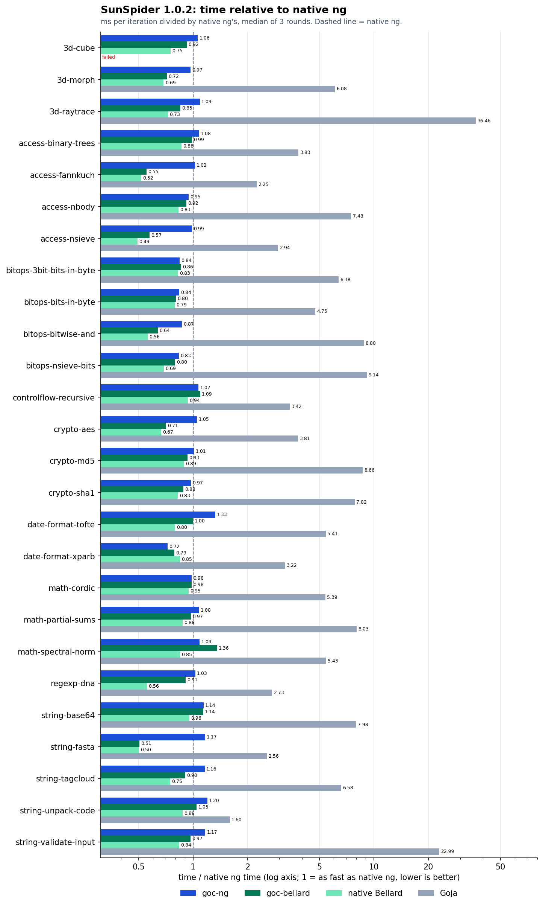

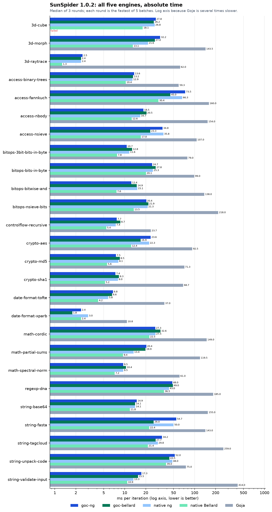

第一张图是每项耗时除以 native ng 的耗时（对数轴，虚线是 native ng），第二张是五家的绝对耗时（对数轴）。两张图都包含 Goja。

WebKit `sunspider-1.0.2`，由 `scripts/sunspider-wrap.py` 包装：每个文件包进一个函数，`document.write` 打了桩。先连续调用 150 ms 定下次数 n，再跑 5 批、每批 n 次，取最快一批的平均单次耗时，用 `Date.now` 计时。ms/次，越低越快，每项取 3 轮中位数。

Goja 的 `3d-cube` 仍然失败（向量和与期望值差在最后几位），所以五家的几何平均是 25 项，不含 Goja 的四个 QuickJS 构建的几何平均是 26 项。两个 goc 构建在全部 26 项上都通过。

| 测试 | goc-ng | goc-bellard | native ng | native Bellard | Goja | goc-ng/ng | goc-bellard/Bellard |
|---|---:|---:|---:|---:|---:|---:|---:|
| 3d-cube | 21.12 | 18.33 | 19.88 | 14.91 | 失败 | 1.06 | 1.23 |
| 3d-morph | 15.70 | 11.62 | 16.20 | 11.14 | 98.50 | 0.97 | 1.04 |
| 3d-raytrace | 1.18 | 0.92 | 1.08 | 0.79 | 39.50 | 1.09 | 1.17 |
| access-binary-trees | 10.71 | 9.81 | 9.93 | 8.59 | 38.00 | 1.08 | 1.14 |
| access-fannkuch | 56.33 | 30.40 | 55.00 | 28.50 | 123.50 | 1.02 | 1.07 |
| access-nbody | 13.17 | 12.75 | 13.91 | 11.54 | 104.00 | 0.95 | 1.10 |
| access-nsieve | 26.83 | 15.60 | 27.17 | 13.42 | 80.00 | 0.99 | 1.16 |
| bitops-3bit-bits-in-byte | 7.40 | 7.55 | 8.78 | 7.25 | 56.00 | 0.84 | 1.04 |
| bitops-bits-in-byte | 13.25 | 12.67 | 15.80 | 12.50 | 75.00 | 0.84 | 1.01 |
| bitops-bitwise-and | 8.67 | 6.38 | 10.00 | 5.62 | 88.00 | 0.87 | 1.14 |
| bitops-nsieve-bits | 13.58 | 13.00 | 16.30 | 11.21 | 149.00 | 0.83 | 1.16 |
| controlflow-recursive | 6.04 | 6.16 | 5.63 | 5.28 | 19.25 | 1.07 | 1.17 |
| crypto-aes | 18.22 | 12.31 | 17.33 | 11.54 | 66.00 | 1.05 | 1.07 |
| crypto-md5 | 6.16 | 5.67 | 6.08 | 5.43 | 52.67 | 1.01 | 1.04 |
| crypto-sha1 | 6.04 | 5.48 | 6.20 | 5.14 | 48.50 | 0.97 | 1.07 |
| date-format-tofte | 4.17 | 3.14 | 3.14 | 2.50 | 17.00 | 1.33 | 1.26 |
| date-format-xparb | 1.08 | 1.18 | 1.50 | 1.27 | 4.83 | 0.72 | 0.93 |
| math-cordic | 18.11 | 18.11 | 18.44 | 17.44 | 99.50 | 0.98 | 1.04 |
| math-partial-sums | 9.88 | 8.94 | 9.18 | 8.05 | 73.67 | 1.08 | 1.11 |
| math-spectral-norm | 8.21 | 10.27 | 7.55 | 6.39 | 41.00 | 1.09 | 1.61 |
| regexp-dna | 22.67 | 20.00 | 22.00 | 12.25 | 60.00 | 1.03 | 1.63 |
| string-base64 | 12.83 | 12.75 | 11.21 | 10.71 | 89.50 | 1.14 | 1.19 |
| string-fasta | 41.75 | 18.11 | 35.80 | 18.00 | 91.50 | 1.17 | 1.01 |
| string-tagcloud | 24.67 | 19.25 | 21.29 | 15.90 | 140.00 | 1.16 | 1.21 |
| string-unpack-code | 40.50 | 35.40 | 33.80 | 29.60 | 54.00 | 1.20 | 1.20 |
| string-validate-input | 10.71 | 8.88 | 9.18 | 7.70 | 211.00 | 1.17 | 1.15 |
| **几何平均 25 项（五家都通过）** | **11.18** | **9.39** | **10.99** | **8.24** | **61.49** | **1.02** | **1.14** |
| **几何平均 26 项（四个 QuickJS 构建都通过，不含 Goja）** | **11.45** | **9.63** | **11.24** | **8.43** | — | **1.02** | **1.14** |

goc-ng 比 native ng 快的几项里，`date-format-xparb` 是 0.72，`bitops-nsieve-bits` 是 0.83，`bitops-bits-in-byte` 和 `bitops-3bit-bits-in-byte` 都是 0.84。慢得最多的是 `date-format-tofte`（1.33）、`string-unpack-code`（1.20）、`string-validate-input` 和 `string-fasta`（都是 1.17）。`3d-morph` 是 0.97，`math-partial-sums` 是 1.08。goc-bellard 对 gcc 版 Bellard 慢得最多的是 `regexp-dna`（1.63）和 `math-spectral-norm`（1.61），然后是 `date-format-tofte`（1.26）和 `string-tagcloud`（1.21）；`3d-morph` 是 1.04，`math-partial-sums` 是 1.11。这些比值没有再用 profile 拆开。

各轮的几何平均（同一批 25 项）：

| 引擎 | 各轮几何平均（25 项） |
|---|---|
| goc-ng | 11.23 / 11.31 / 11.12 |
| goc-bellard | 9.46 / 9.36 / 9.36 |
| native ng | 11.12 / 11.01 / 11.00 |
| native Bellard | 8.36 / 8.22 / 8.23 |
| Goja | 61.43 / 61.51 / 61.29 |

## microbench

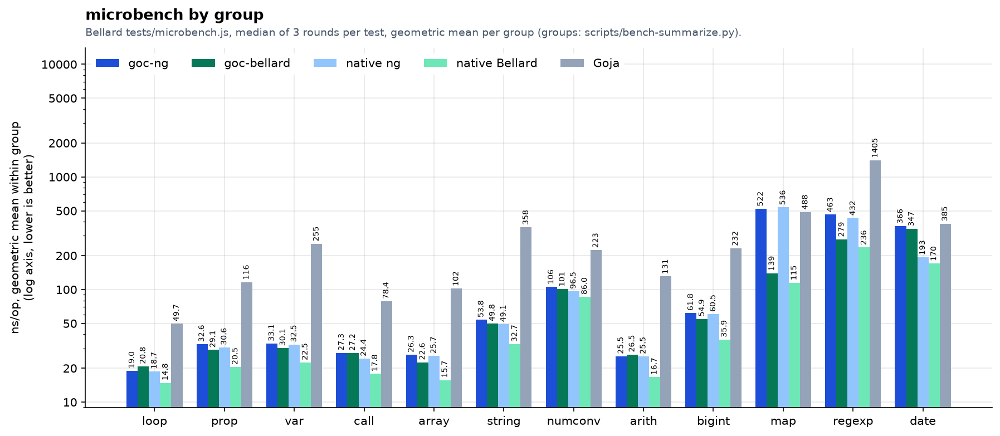

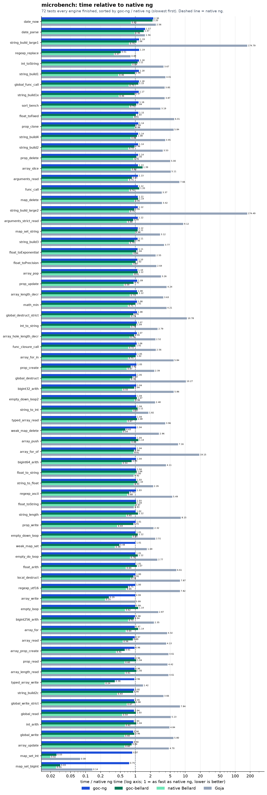

第二张图是每项耗时除以 native ng 的耗时，goc-ng、goc-bellard、native Bellard、Goja 四家并排（对数轴，虚线是 native ng），按 goc-ng 的比值从慢到快排。

Bellard 树的 `tests/microbench.js`，前面加了一行 `console` 兜底（goc 的 qjscli 没有 `console` 全局）。TIME 列，ns/op，越低越快，每项取 3 轮中位数。没有参考文件，所以 SCORE 列是空的。

- 五家都用 `performance.now` 计时。goc-bellard 的 `performance.now` 由 qjscli 宿主提供，Goja 的由 `scripts/gojacli` 提供。
- Goja 把 `Date.prototype.toGMTString` 指到 `toUTCString` 才能跑完（`gojacli --micro`），否则会停在 `date_parse`。

|  | goc-ng | goc-bellard | native ng | native Bellard | Goja | goc-ng/ng | goc-bellard/Bellard |
|---|---:|---:|---:|---:|---:|---:|---:|
| TIME 总和（中位数） | 11695 | 4502 | 10535 | 4010 | 24742 | 1.11 | 1.12 |
| 几何平均 72 项 | 46.7 | 35.5 | 42.9 | 31.4 | 152.1 | 1.09 | 1.13 |

TIME 总和被 `map_set_int` 和 `map_set_bigint` 这两项主导：native ng 和 goc-ng 在这两项上都要 3 到 4 µs，两个 Bellard 构建只要 0.1 µs 左右。所以总和不宜直接比，几何平均更能反映整体。

分组是按测试名前缀划的，每项只属于一组，规则在 `scripts/bench-summarize.py` 的 `MICRO_GROUPS` 里。组内是几何平均。

| 组 | 项数 | goc-ng | goc-bellard | native ng | native Bellard | Goja | goc-ng/ng | goc-bellard/Bellard |
|---|---:|---:|---:|---:|---:|---:|---:|---:|
| loop | 4 | 13.6 | 14.2 | 13.9 | 12.6 | 45.8 | 0.98 | 1.13 |
| prop | 6 | 27.1 | 24.6 | 25.8 | 19.0 | 97.3 | 1.05 | 1.30 |
| var | 8 | 28.3 | 23.6 | 26.3 | 21.8 | 187.5 | 1.08 | 1.08 |
| call | 3 | 24.1 | 23.1 | 20.2 | 20.6 | 71.5 | 1.19 | 1.12 |
| array | 16 | 23.2 | 18.7 | 21.7 | 16.6 | 84.1 | 1.07 | 1.13 |
| string | 11 | 44.7 | 33.3 | 41.7 | 30.9 | 237.7 | 1.07 | 1.08 |
| numconv | 7 | 91.7 | 84.4 | 78.9 | 77.1 | 168.9 | 1.16 | 1.09 |
| arith | 3 | 22.2 | 19.9 | 23.0 | 19.0 | 112.8 | 0.96 | 1.05 |
| bigint | 3 | 57.1 | 41.0 | 54.5 | 37.5 | 182.2 | 1.05 | 1.09 |
| map | 6 | 451.8 | 126.6 | 401.2 | 110.3 | 380.0 | 1.13 | 1.15 |
| regexp | 3 | 412.7 | 246.8 | 336.6 | 198.7 | 964.6 | 1.23 | 1.24 |
| date | 2 | 173.8 | 164.8 | 136.2 | 128.3 | 282.9 | 1.28 | 1.28 |

goc-ng 各组对 native ng 在 0.96 到 1.28 之间：`arith` 是 0.96，`loop` 是 0.98，偏慢的是 `date`（1.28）、`regexp`（1.23）、`call`（1.19）和 `numconv`（1.16）。goc-bellard 对 gcc 版 Bellard 各组在 1.05 到 1.30 之间，最高的是 `prop`（1.30）、`date`（1.28）和 `regexp`（1.24）；`string` 组是 1.08。

最慢的几项（按 goc-ng / native ng 排），同时列出 goc-bellard/Bellard、Bellard/ng 和 Goja/ng：

| 测试 | goc-ng/ng | goc-bellard/Bellard | Bellard/ng | Goja/ng |
|---|---:|---:|---:|---:|
| date_now | 1.53 | 1.67 | 0.86 | 2.74 |
| int_toString | 1.31 | 1.21 | 1.00 | 3.15 |
| sort_bench | 1.30 | 1.37 | 0.92 | 3.53 |
| regexp_utf16 | 1.26 | 1.28 | 0.74 | 6.53 |
| array_slice | 1.23 | 1.22 | 1.18 | 5.08 |
| func_call | 1.23 | 1.12 | 1.09 | 3.77 |
| regexp_replace | 1.22 | 1.21 | 0.38 | 0.80 |
| prop_clone | 1.21 | 1.07 | 1.00 | 5.37 |

按 goc-bellard / native Bellard 排的最慢几项：

| 测试 | goc-ng/ng | goc-bellard/Bellard | Bellard/ng | Goja/ng |
|---|---:|---:|---:|---:|
| prop_write | 0.99 | 2.11 | 0.45 | 2.74 |
| date_now | 1.53 | 1.67 | 0.86 | 2.74 |
| prop_update | 1.02 | 1.50 | 0.66 | 4.63 |
| sort_bench | 1.30 | 1.37 | 0.92 | 3.53 |
| array_hole_length_decr | 1.19 | 1.33 | 0.80 | 2.82 |
| regexp_utf16 | 1.26 | 1.28 | 0.74 | 6.53 |
| typed_array_read | 1.03 | 1.27 | 0.99 | 4.12 |
| regexp_ascii | 1.20 | 1.24 | 0.73 | 4.52 |

两个 goc 构建共同偏慢的单项是 `date_now`（goc-ng 70.4 ns 对 native ng 46.0 ns，1.53 倍；goc-bellard 66.2 ns 对 gcc 版 39.7 ns，1.67 倍）。`date_parse` 已经接近原生（1.06 和 0.99）。goc-ng 其余偏慢的是 `int_toString`（1.31）、`sort_bench`（1.30）和 `regexp_utf16`（1.26）；最快的几项是 `empty_do_loop`（0.89）、`string_length` 和 `array_update`（都是 0.90）。goc-bellard 最慢的是 `prop_write`（13.7 ns 对 6.5 ns，2.11 倍）、`date_now`、`prop_update`（1.50）和 `sort_bench`（1.37）。`string_build1`、`string_build1x`、`string_build2c` 对 gcc 版是 1.02、1.02 和 1.01。这些单项没有再用 profile 拆开。

全部 TIME。

| 测试 | 组 | goc-ng | goc-bellard | native ng | native Bellard | Goja | goc-ng/ng | goc-bellard/Bellard |
|---|---|---:|---:|---:|---:|---:|---:|---:|
| arguments_read | var | 149.83 | 116.60 | 133.89 | 107.83 | 801.44 | 1.12 | 1.08 |
| arguments_strict_read | var | 119.73 | 91.88 | 105.70 | 83.62 | 764.70 | 1.13 | 1.10 |
| array_for | array | 15.84 | 17.06 | 16.49 | 15.36 | 79.56 | 0.96 | 1.11 |
| array_for_in | array | 53.29 | 41.58 | 46.05 | 39.81 | 259.66 | 1.16 | 1.04 |
| array_for_of | array | 19.56 | 17.76 | 18.55 | 18.01 | 272.50 | 1.05 | 0.99 |
| array_hole_length_decr | array | 52.69 | 46.89 | 44.11 | 35.27 | 124.41 | 1.19 | 1.33 |
| array_length_decr | array | 38.24 | 40.14 | 33.51 | 34.14 | 136.89 | 1.14 | 1.18 |
| array_length_read | array | 10.13 | 9.95 | 10.65 | 9.54 | 48.39 | 0.95 | 1.04 |
| array_pop | array | 66.05 | 68.22 | 58.60 | 60.11 | 159.99 | 1.13 | 1.13 |
| array_prop_create | array | 31.00 | 14.95 | 31.02 | 13.99 | 121.01 | 1.00 | 1.07 |
| array_push | array | 32.23 | 33.88 | 30.41 | 29.83 | 179.19 | 1.06 | 1.14 |
| array_read | array | 10.24 | 9.35 | 10.14 | 8.63 | 44.27 | 1.01 | 1.08 |
| array_slice | array | 14.37 | 16.86 | 11.66 | 13.80 | 59.20 | 1.23 | 1.22 |
| array_update | array | 13.58 | 9.71 | 15.14 | 9.84 | 60.84 | 0.90 | 0.99 |
| array_write | array | 27.24 | 7.04 | 26.33 | 7.04 | 27.56 | 1.03 | 1.00 |
| bigint256_arith | bigint | 97.88 | 76.28 | 87.75 | 77.15 | 193.26 | 1.12 | 0.99 |
| bigint32_arith | bigint | 36.75 | 26.39 | 36.97 | 22.51 | 176.55 | 0.99 | 1.17 |
| bigint64_arith | bigint | 51.62 | 34.35 | 49.85 | 30.41 | 177.23 | 1.04 | 1.13 |
| date_now | date | 70.43 | 66.17 | 46.00 | 39.67 | 125.93 | 1.53 | 1.67 |
| date_parse | date | 428.87 | 410.55 | 403.46 | 414.73 | 635.55 | 1.06 | 0.99 |
| empty_do_loop | loop | 12.25 | 13.76 | 13.80 | 12.87 | 47.23 | 0.89 | 1.07 |
| empty_down_loop | loop | 13.37 | 14.32 | 14.00 | 12.92 | 42.36 | 0.95 | 1.11 |
| empty_down_loop2 | loop | 16.25 | 17.50 | 16.01 | 15.76 | 51.15 | 1.01 | 1.11 |
| empty_loop | loop | 12.75 | 11.70 | 11.97 | 9.50 | 43.03 | 1.07 | 1.23 |
| float_arith | arith | 22.32 | 18.76 | 23.42 | 18.26 | 143.16 | 0.95 | 1.03 |
| float_toExponential | numconv | 103.04 | 96.53 | 87.91 | 82.79 | 192.91 | 1.17 | 1.17 |
| float_toFixed | numconv | 90.44 | 82.77 | 78.85 | 74.53 | 419.64 | 1.15 | 1.11 |
| float_toPrecision | numconv | 99.39 | 91.92 | 87.81 | 84.10 | 208.97 | 1.13 | 1.09 |
| float_toString | numconv | 186.92 | 180.50 | 166.95 | 171.88 | 166.08 | 1.12 | 1.05 |
| float_to_string | numconv | 174.53 | 165.20 | 155.04 | 159.17 | 154.79 | 1.13 | 1.04 |
| func_call | call | 22.39 | 22.36 | 18.22 | 19.93 | 68.60 | 1.23 | 1.12 |
| func_closure_call | call | 23.85 | 23.55 | 20.39 | 20.97 | 69.77 | 1.17 | 1.12 |
| global_destruct | var | 36.44 | 31.07 | 31.30 | 29.05 | 268.29 | 1.16 | 1.07 |
| global_destruct_strict | var | 36.60 | 31.15 | 31.40 | 29.08 | 291.08 | 1.17 | 1.07 |
| global_func_call | call | 26.05 | 23.26 | 22.26 | 21.05 | 76.39 | 1.17 | 1.10 |
| global_read | var | 8.81 | 7.16 | 9.16 | 7.06 | 43.15 | 0.96 | 1.01 |
| global_write | var | 8.45 | 7.55 | 8.92 | 6.67 | 59.19 | 0.95 | 1.13 |
| global_write_strict | var | 8.82 | 7.59 | 8.85 | 6.75 | 81.15 | 1.00 | 1.12 |
| int_arith | arith | 15.85 | 14.39 | 17.30 | 14.26 | 87.56 | 0.92 | 1.01 |
| int_toString | numconv | 49.98 | 46.26 | 38.20 | 38.29 | 120.21 | 1.31 | 1.21 |
| int_to_string | numconv | 36.05 | 30.02 | 31.56 | 29.92 | 75.16 | 1.14 | 1.00 |
| local_destruct | var | 26.48 | 23.00 | 22.47 | 21.37 | 153.82 | 1.18 | 1.08 |
| map_delete | map | 181.22 | 184.57 | 153.71 | 152.12 | 475.96 | 1.18 | 1.21 |
| map_set_bigint | map | 3222.01 | 127.20 | 2807.38 | 111.37 | 448.93 | 1.15 | 1.14 |
| map_set_int | map | 2625.11 | 94.89 | 2603.69 | 86.11 | 271.48 | 1.01 | 1.10 |
| map_set_string | map | 183.74 | 176.99 | 151.72 | 156.45 | 442.08 | 1.21 | 1.13 |
| math_min | arith | 30.78 | 29.17 | 30.00 | 26.46 | 114.46 | 1.03 | 1.10 |
| prop_clone | prop | 45.91 | 40.54 | 37.86 | 38.03 | 203.39 | 1.21 | 1.07 |
| prop_create | prop | 55.95 | 42.95 | 51.19 | 35.65 | 106.20 | 1.09 | 1.20 |
| prop_delete | prop | 72.54 | 66.23 | 65.25 | 61.71 | 285.15 | 1.11 | 1.07 |
| prop_read | prop | 9.84 | 9.34 | 10.74 | 8.59 | 50.00 | 0.92 | 1.09 |
| prop_update | prop | 15.40 | 14.94 | 15.16 | 9.96 | 70.23 | 1.02 | 1.50 |
| prop_write | prop | 14.17 | 13.65 | 14.31 | 6.47 | 39.27 | 0.99 | 2.11 |
| regexp_ascii | regexp | 210.63 | 158.22 | 176.13 | 127.95 | 796.71 | 1.20 | 1.24 |
| regexp_replace | regexp | 1469.16 | 560.02 | 1199.47 | 461.26 | 956.77 | 1.22 | 1.21 |
| regexp_utf16 | regexp | 227.07 | 169.57 | 180.45 | 132.88 | 1177.51 | 1.26 | 1.28 |
| sort_bench | array | 16.84 | 16.34 | 12.96 | 11.95 | 45.76 | 1.30 | 1.37 |
| string_build1 | string | 41.68 | 19.02 | 37.90 | 18.58 | 105.25 | 1.10 | 1.02 |
| string_build1x | string | 40.90 | 18.89 | 37.21 | 18.58 | 111.02 | 1.10 | 1.02 |
| string_build2 | string | 44.53 | 39.69 | 40.87 | 33.95 | 110.74 | 1.09 | 1.17 |
| string_build2c | string | 48.25 | 22.16 | 49.23 | 21.86 | 199.26 | 0.98 | 1.01 |
| string_build3 | string | 43.32 | 35.36 | 39.41 | 32.65 | 110.51 | 1.10 | 1.08 |
| string_build4 | string | 44.25 | 43.33 | 41.30 | 35.94 | 118.23 | 1.07 | 1.21 |
| string_build_large1 | string | 57.44 | 46.93 | 48.80 | 38.29 | 4906.94 | 1.18 | 1.23 |
| string_build_large2 | string | 52.31 | 40.66 | 46.30 | 39.83 | 5040.00 | 1.13 | 1.02 |
| string_length | string | 11.07 | 10.88 | 12.36 | 10.47 | 88.65 | 0.90 | 1.04 |
| string_to_float | string | 89.08 | 86.09 | 82.29 | 83.72 | 156.86 | 1.08 | 1.03 |
| string_to_int | string | 68.13 | 64.36 | 61.91 | 60.64 | 118.25 | 1.10 | 1.06 |
| typed_array_read | array | 11.43 | 13.98 | 11.08 | 11.02 | 45.65 | 1.03 | 1.27 |
| typed_array_write | array | 29.28 | 11.60 | 28.95 | 10.11 | 42.21 | 1.01 | 1.15 |
| weak_map_delete | map | 250.92 | 157.89 | 224.10 | 141.04 | 592.53 | 1.12 | 1.12 |
| weak_map_set | map | 120.32 | 66.11 | 109.15 | 55.81 | 198.02 | 1.10 | 1.18 |

## 内存占用

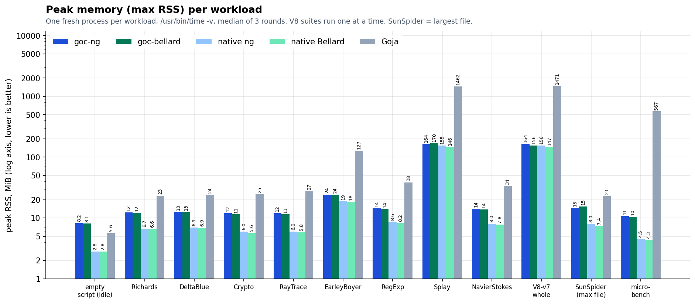

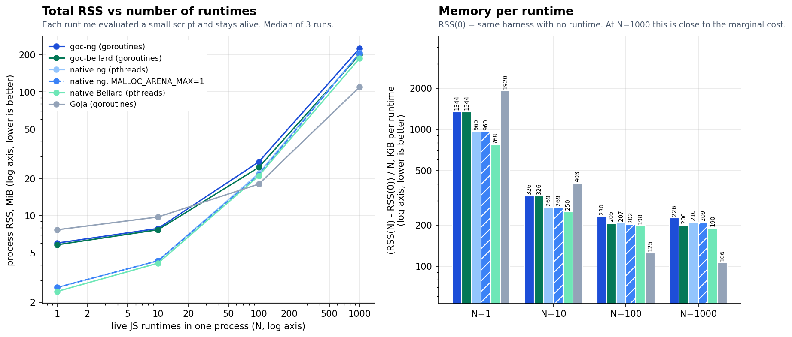

这一节在 2026-10-09 约 00:19–01:02（CST）测量，由 `scripts/bench-mem.sh` 一次跑完，紧接在计时套件和 clang 参考之后。单位 MiB 和 KiB 都按 1024 进位，越低越好。

测量分两部分：

- 峰值 RSS：每个负载都在一个新进程里运行，用 `/usr/bin/time -v` 读 `Maximum resident set size`。命令行和计时套件相同（goc-ng 和 goc-bellard 用 `qjscli --stack-size 16384 --script`，native ng 加 `-C`），也用 `taskset -c 3` 固定在同一个核上。每个引擎跑 3 轮，轮与轮之间轮换引擎顺序，表里是中位数。仓库里没有 `alloc.js` 和 `mapset.js`，这两项没有测。
- 多实例：一个进程里建 N 个 JS runtime，每个都跑完一小段脚本（[`tests/qjscli/instance.js`](../tests/qjscli/instance.js)）后保持存活，然后读进程的 `VmRSS`。N 取 0、1、10、100、1000，每个点跑 3 次取中位数。这部分没有绑核，理由见本节末尾的注意事项。

### 空载与各负载的峰值

空脚本是一个空文件，它的峰值就是引擎进程本身的空载占用。V8-v7 的 8 个子项各跑一个进程：文件还是 `bench-v8.js`，只是在 `Run()` 前把 `BenchmarkSuite.suites` 过滤成一个，所以其他子项的代码仍会被解析，但不会运行。SunSpider 每个文件本来就是一个进程，这里取 26 个文件里的最大值，每个文件的数字列在后面。

| 负载 | goc-ng | goc-bellard | native ng | native Bellard | Goja | goc-ng/ng | goc-bellard/Bellard | Bellard/ng | Goja/ng |
|---|---:|---:|---:|---:|---:|---:|---:|---:|---:|
| 空脚本（空载） | 8.2 | 8.1 | 2.8 | 2.8 | 5.6 | 2.93 | 2.87 | 1.00 | 2.00 |
| V8 Richards | 12.4 | 12.2 | 6.7 | 6.6 | 23.1 | 1.85 | 1.86 | 0.98 | 3.45 |
| V8 DeltaBlue | 12.6 | 12.6 | 6.9 | 6.9 | 24.0 | 1.81 | 1.82 | 0.99 | 3.46 |
| V8 Crypto | 12.0 | 11.4 | 6.0 | 5.6 | 24.6 | 2.00 | 2.03 | 0.94 | 4.10 |
| V8 RayTrace | 12.0 | 11.4 | 6.0 | 5.8 | 27.5 | 2.00 | 1.97 | 0.97 | 4.58 |
| V8 EarleyBoyer | 24.2 | 24.0 | 18.8 | 18.5 | 127.4 | 1.28 | 1.30 | 0.98 | 6.76 |
| V8 RegExp | 14.4 | 14.1 | 8.6 | 8.2 | 38.1 | 1.67 | 1.70 | 0.96 | 4.42 |
| V8 Splay | 164.2 | 170.1 | 154.9 | 146.2 | 1462.2 | 1.06 | 1.16 | 0.94 | 9.44 |
| V8 NavierStokes | 14.2 | 13.9 | 8.0 | 7.8 | 33.6 | 1.78 | 1.77 | 0.98 | 4.20 |
| V8-v7 整套 | 164.4 | 155.8 | 155.6 | 146.9 | 1470.7 | 1.06 | 1.06 | 0.94 | 9.45 |
| SunSpider（26 个文件中的最大值） | 14.6 | 15.4 | 8.0 | 7.4 | 23.0 | 1.82 | 2.08 | 0.92 | 2.86 |
| microbench | 10.7 | 10.5 | 4.5 | 4.3 | 567.3 | 2.38 | 2.43 | 0.96 | 126.06 |

Goja 的 SunSpider `3d-cube` 失败（与计时部分相同），它的 SunSpider 最大值只统计另外 25 个文件。

两个 goc 构建比各自的原生构建多出的部分，在多数负载上接近一个常数。空载时 goc-ng 是 8.2 MiB、goc-bellard 是 8.1 MiB，两份原生构建都是 2.8 MiB，差 5.3 到 5.4 MiB。小负载上的差距在 5 到 6 MiB，所以比值接近 2 倍。整套 V8 上 goc-ng 是 164.4 对 native ng 的 155.6（多 8.8 MiB，1.06 倍），goc-bellard 是 155.8 对 native Bellard 的 146.9（多 8.9 MiB，1.06 倍）。goc-ng 的 Splay 也是多 9.3 MiB（164.2 对 154.9）。goc-bellard 的 Splay 是例外：170.1 对 146.2，多 23.9 MiB，而它的整套 V8 只多 8.9 MiB。QuickJS 对象本身在 goc 的 shim 堆里并没有按比例变大，多出来的主要是进程级固定开销；Splay 这一项没有单独拆。固定开销的来源仍是推测，没有逐项验证：Go 运行时本身；qjscli 比 native qjs 大（这次的文件：goc-ng 4.49 MiB、代码段 3.40 MiB，goc-bellard 4.41 MiB、代码段 3.33 MiB，native ng 1.22 MiB、代码段 1.10 MiB；native Bellard 的文件是 4.78 MiB，代码段 0.98 MiB），载入的代码页更多；qjscli 启动时 `forceGrow(40)` 把主 goroutine 的栈预先撑到 1 MiB 以上。一个旁证是，下面的多实例探针（同一套 goc 目标文件，但不调用 `forceGrow`，也不装 CLI 的宿主对象）在 N=0 时是 4.7 和 4.5 MiB。

native Bellard 比 native ng 略低，多数负载低 2% 到 7%，Splay 和整套 V8 大约低 6%。goc-bellard 的整套 V8 比 goc-ng 低 5%（155.8 对 164.4 MiB）。Splay 和 SunSpider 最大值是例外：Splay 是 170.1 对 164.2 MiB，SunSpider 最大值是 15.4 对 14.6 MiB。

Goja 的峰值高得多：Splay 是 1462 MiB（约 1.43 GiB），是 native ng 的 9.4 倍；整套 V8 是 1471 MiB，是 9.5 倍；microbench 是 567 MiB，达 126 倍。可能的原因是 Go 的垃圾回收在默认 `GOGC=100` 下允许堆长到上次存活量的两倍左右，再加上 Goja 的对象和字符串表示比 QuickJS 占空间，microbench 里 `string_build_large*` 这两项的耗时大约是 native ng 的 100 倍。这些都是推测，没有做堆剖析。

SunSpider 各文件的峰值（MiB）：

| 测试 | goc-ng | goc-bellard | native ng | native Bellard | Goja |
|---|---:|---:|---:|---:|---:|
| 3d-cube | 9.2 | 8.8 | 3.6 | 3.6 | 失败 |
| 3d-morph | 11.1 | 10.7 | 4.1 | 3.9 | 15.1 |
| 3d-raytrace | 9.4 | 9.0 | 3.6 | 3.4 | 16.9 |
| access-binary-trees | 8.8 | 8.6 | 3.2 | 3.0 | 12.6 |
| access-fannkuch | 8.6 | 8.2 | 3.0 | 2.8 | 7.7 |
| access-nbody | 8.6 | 8.6 | 3.2 | 3.0 | 12.4 |
| access-nsieve | 13.9 | 13.5 | 6.4 | 6.2 | 17.8 |
| bitops-3bit-bits-in-byte | 8.4 | 8.2 | 3.0 | 2.8 | 12.6 |
| bitops-bits-in-byte | 8.4 | 8.2 | 3.0 | 2.8 | 12.2 |
| bitops-bitwise-and | 8.4 | 8.2 | 3.0 | 2.8 | 12.0 |
| bitops-nsieve-bits | 8.8 | 8.4 | 3.2 | 3.0 | 13.1 |
| controlflow-recursive | 8.6 | 8.4 | 3.4 | 3.2 | 7.7 |
| crypto-aes | 9.0 | 8.8 | 3.4 | 3.4 | 13.5 |
| crypto-md5 | 9.0 | 8.6 | 3.4 | 3.2 | 13.2 |
| crypto-sha1 | 8.6 | 8.6 | 3.2 | 3.0 | 13.1 |
| date-format-tofte | 9.0 | 8.8 | 3.4 | 3.2 | 13.0 |
| date-format-xparb | 9.0 | 8.8 | 3.4 | 3.2 | 13.1 |
| math-cordic | 8.6 | 8.4 | 3.0 | 2.8 | 12.4 |
| math-partial-sums | 9.0 | 8.8 | 3.4 | 3.2 | 14.2 |
| math-spectral-norm | 8.4 | 8.2 | 3.0 | 2.8 | 12.2 |
| regexp-dna | 11.1 | 11.4 | 5.2 | 5.8 | 13.7 |
| string-base64 | 8.8 | 8.6 | 3.2 | 3.0 | 14.8 |
| string-fasta | 8.6 | 8.4 | 3.0 | 2.8 | 16.8 |
| string-tagcloud | 14.6 | 15.4 | 7.0 | 6.4 | 23.0 |
| string-unpack-code | 14.2 | 13.7 | 8.0 | 7.4 | 19.4 |
| string-validate-input | 9.4 | 10.1 | 3.8 | 3.6 | 14.1 |

### 多实例

这是 goc 使用场景里最关心的一项：一个 Go 进程里同时存活很多个 JS runtime 时，每多一个要多少内存。

- goc-ng：`build/qjs/qjsmem`，它就是 qjscli 这个包加上构建标签 `qjsmem` 编出来的（代码在 [`tests/qjscli/mem_instances.go`](../tests/qjscli/mem_instances.go)），和 qjscli 走同一条 `scripts/qjs-cli-build.sh` 流程、链接同一批 goc 目标文件。`qjsmem --mem-instances N` 启动 N 个 goroutine，每个 goroutine 各自 `JS_NewRuntime` + `JS_NewContext`，求值脚本后阻塞在一个 channel 上。默认的 qjscli 二进制里没有这段代码。
- goc-bellard：`build/qjs-bellard/qjsmem`，同一份 Go 代码，用 `QJS_FLAVOR=bellard QJSCLI_TAGS=qjsmem scripts/qjs-cli-build.sh` 构建，链接的是 goc 编译的 Bellard 目标文件，输出里的引擎名是 `goc-bellard`。
- native ng 和 native Bellard：[`tests/qjsmem/threads.c`](../tests/qjsmem/threads.c)，分别链接 ng 的 `libqjs.a`（和 native qjs 同一次 CMake Release 构建）和 Bellard 上游 Makefile 编出的 `.obj/*.o`。每个 runtime 一个 pthread，线程栈设为 1 MiB（`QJSMEM_STACK_KB`），`JS_SetMaxStackSize` 设为线程栈的一半。线程栈只是预留，RSS 只算实际碰过的页。
- Goja：[`scripts/gojamem`](../scripts/gojamem/main.go)，每个 runtime 一个 goroutine，各持有一个 `goja.Runtime`。
- 五家都是一个接一个地建 runtime：上一个求值完、进入阻塞之后才建下一个。goc 这样做是必须的，因为 goc 的 libc shim 堆没有锁，注释里写明同一时刻只能有一个 goroutine 在 QuickJS 里；另外几家为了可比也用同样的顺序。
- native ng 另跑了一组 `MALLOC_ARENA_MAX=1`，用来看 glibc 每线程 malloc arena 的影响。

进程 RSS（MiB）和每个 runtime 的边际内存：

| 引擎 | N=0 | N=1 | N=10 | N=100 | N=1000 | 每个 runtime（N=1→1000 斜率） | 最小二乘斜率 |
|---|---:|---:|---:|---:|---:|---:|---:|
| goc-ng（goroutine） | 4.7 | 6.0 | 7.9 | 27.2 | 225.0 | **224 KiB** | 225 KiB |
| goc-bellard（goroutine） | 4.5 | 5.8 | 7.7 | 24.6 | 199.9 | **199 KiB** | 199 KiB |
| native ng（pthread） | 1.7 | 2.6 | 4.3 | 21.9 | 206.8 | **209 KiB** | 210 KiB |
| native ng，`MALLOC_ARENA_MAX=1` | 1.7 | 2.6 | 4.3 | 21.4 | 205.9 | **208 KiB** | 209 KiB |
| native Bellard（pthread） | 1.7 | 2.4 | 4.1 | 21.0 | 186.9 | **189 KiB** | 189 KiB |
| Goja（goroutine） | 5.8 | 7.7 | 9.8 | 18.0 | 109.7 | **105 KiB** | 104 KiB |

斜率一列是 (RSS(1000) − RSS(1)) / 999；最小二乘斜率用 N=1、10、100、1000 四个点拟合，两者一致，说明在这个范围内是线性增长。斜率比：goc-ng/ng 1.07，goc-bellard/Bellard 1.05。

按 (RSS(N) − RSS(0)) / N 计算的每个 runtime 平均占用（KiB）。N 小的时候，第一个 runtime 要摊掉代码页、原子表等一次性开销，所以数字偏大：

| 引擎 | N=1 | N=10 | N=100 | N=1000 |
|---|---:|---:|---:|---:|
| goc-ng（goroutine） | 1344 | 326 | 230 | 226 |
| goc-bellard（goroutine） | 1344 | 326 | 205 | 200 |
| native ng（pthread） | 960 | 269 | 207 | 210 |
| native ng，`MALLOC_ARENA_MAX=1` | 960 | 269 | 202 | 209 |
| native Bellard（pthread） | 768 | 250 | 198 | 190 |
| Goja（goroutine） | 1920 | 403 | 125 | 106 |

每多一个 runtime，goc-ng 要 224 KiB，是 native ng（209 KiB）的 1.07 倍；goc-bellard 要 199 KiB，是 native Bellard（189 KiB）的 1.05 倍。Goja 要 105 KiB，是五家里最少的；可能是因为 Goja 的内建对象是按需创建的，一段不碰多少内建对象的小脚本用不到它们，这一点没有验证。注意这只是空闲 runtime 的常驻成本，Goja 在真正运行负载时峰值最高（见上一小节）。

`MALLOC_ARENA_MAX=1` 对 native ng 几乎没有影响（208 对 209 KiB）。推测是因为每个线程分到的 arena 只碰到了自己真正用过的页，所以在这个规模下 arena 的额外开销可以忽略；这一点没有单独验证。

主动回收之后再读一次 RSS：goc 和 Goja 调 `runtime.GC()` 加 `debug.FreeOSMemory()`，C 探针调 `malloc_trim(0)`：

| 引擎 | 回收方式 | N=0 | N=1 | N=10 | N=100 | N=1000 | 斜率 |
|---|---|---:|---:|---:|---:|---:|---:|
| goc-ng（goroutine） | `runtime.GC()` + `debug.FreeOSMemory()` | 5.1 | 6.4 | 8.2 | 26.3 | 213.7 | 212 KiB |
| goc-bellard（goroutine） | `runtime.GC()` + `debug.FreeOSMemory()` | 4.9 | 6.2 | 7.9 | 23.8 | 189.2 | 188 KiB |
| native ng（pthread） | `malloc_trim(0)` | 1.7 | 2.6 | 4.3 | 21.9 | 206.8 | 209 KiB |
| native ng，`MALLOC_ARENA_MAX=1` | `malloc_trim(0)` | 1.7 | 2.6 | 4.3 | 21.4 | 205.9 | 208 KiB |
| native Bellard（pthread） | `malloc_trim(0)` | 1.7 | 2.4 | 4.1 | 21.0 | 186.9 | 189 KiB |
| Goja（goroutine） | `runtime.GC()` + `debug.FreeOSMemory()` | 6.2 | 8.1 | 9.4 | 16.1 | 90.5 | 84 KiB |

goc-ng 的斜率从 224 降到 212 KiB，goc-bellard 从 199 降到 188 KiB，下降的部分来自 goroutine 栈被 GC 收缩（见下表）。回收后 goc-ng 与 native ng 基本持平（212 对 209 KiB），goc-bellard 略低于 native Bellard（188 对 189 KiB）。Goja 从 105 降到 84 KiB，是 Go 堆里的垃圾被回收了。

#### goc 的内存去了哪里

goc 探针在所有 runtime 都进入阻塞后读 `runtime.MemStats`。“平均每个 goroutine 栈”是 (StackInuse(N) − StackInuse(0)) / N。goc-ng：

| N | RSS MiB | HeapSys MiB | HeapInuse MiB | StackSys MiB | StackInuse MiB | 平均每个 goroutine 栈 KiB | GC 后每个 goroutine 栈 KiB |
|---:|---:|---:|---:|---:|---:|---:|---:|
| 0 | 4.7 | 3.7 | 0.5 | 0.31 | 0.31 | — | — |
| 1 | 6.0 | 3.7 | 0.6 | 0.34 | 0.34 | 32.0 | -32.0 |
| 10 | 7.9 | 3.4 | 0.7 | 0.62 | 0.62 | 32.0 | 9.6 |
| 100 | 27.2 | 4.6 | 0.8 | 3.44 | 3.44 | 32.0 | 10.6 |
| 1000 | 225.0 | 4.4 | 1.6 | 31.56 | 31.56 | 32.0 | 8.8 |

goc-bellard：

| N | RSS MiB | HeapSys MiB | HeapInuse MiB | StackSys MiB | StackInuse MiB | 平均每个 goroutine 栈 KiB | GC 后每个 goroutine 栈 KiB |
|---:|---:|---:|---:|---:|---:|---:|---:|
| 0 | 4.5 | 3.7 | 0.5 | 0.31 | 0.31 | — | — |
| 1 | 5.8 | 3.7 | 0.6 | 0.34 | 0.34 | 32.0 | 32.0 |
| 10 | 7.7 | 3.4 | 0.7 | 0.62 | 0.62 | 32.0 | 12.8 |
| 100 | 24.6 | 4.6 | 0.8 | 3.44 | 3.44 | 32.0 | 10.9 |
| 1000 | 199.9 | 4.4 | 1.7 | 31.56 | 31.56 | 32.0 | 8.8 |

N=1000 时，goc-ng 进程 RSS 是 225.0 MiB，其中 goroutine 栈 31.6 MiB，Go 堆 4.4 MiB。剩下约 189 MiB 不归 Go 运行时管（再扣掉 Go 运行时其他零碎的元数据还会少一点），它们是 QuickJS 的 runtime、context 和对象，放在 goc 的 libc shim 堆里（64 MiB 的静态 arena，用满后改用 mmap 分配的 slab）。折合每个 runtime 约 189 KiB，和 native ng 每个 runtime 的 209 KiB（其中含 glibc malloc 的开销和线程栈碰过的页）处在同一量级。goc-bellard 的 goroutine 栈和 Go 堆与 goc-ng 相同（31.6 MiB 和 4.4 MiB），RSS 是 199.9 MiB，剩下约 164 MiB，折合每个 runtime 约 164 KiB。比 goc-ng 少的约 25 KiB，和 native 两家之间的 20 KiB 同一量级。

每个 goroutine 的栈在求值后是 32 KiB。goroutine 的初始栈很小（Go 的最小栈是 2 KiB，Go 1.19 起初始大小还会按平均栈用量自适应），QuickJS 的解析器和解释器的 C 帧直接跑在 goroutine 栈上，栈就按倍数长到了 32 KiB；求值结束后栈不会立即缩回去，要等下一次 GC 扫描时才收缩。GC 之后 N=1000 平均降到 8.8 KiB（N=1 和 N=10 的 GC 后数字受栈缓存复用影响，不可靠，goc-ng 在 N=1 时算出 −32 KiB）。goc 比原生多出的边际大约是 15 KiB（goc-ng 224 对 ng 209）和 10 KiB（goc-bellard 199 对 Bellard 189），主要就是这 32 KiB 的 goroutine 栈，减去原生线程栈实际碰过的页。这个解释和上面的数字对得上，但没有逐页核对。

Goja 的同一组数字作对照。它的内存主要在 Go 堆上（N=1000 时 HeapInuse 78.7 MiB），每个 goroutine 的栈大约 7 KiB：

| N | RSS MiB | HeapSys MiB | HeapInuse MiB | StackSys MiB | StackInuse MiB | 平均每个 goroutine 栈 KiB | GC 后每个 goroutine 栈 KiB |
|---:|---:|---:|---:|---:|---:|---:|---:|
| 0 | 5.8 | 3.7 | 1.1 | 0.28 | 0.28 | — | — |
| 1 | 7.7 | 3.7 | 1.3 | 0.31 | 0.31 | 32.0 | 96.0 |
| 10 | 9.8 | 7.6 | 3.1 | 0.44 | 0.44 | 16.0 | 41.6 |
| 100 | 18.0 | 13.9 | 10.3 | 2.09 | 2.09 | 18.6 | 14.1 |
| 1000 | 109.7 | 104.8 | 78.7 | 7.16 | 7.16 | 7.0 | 5.2 |

### 注意事项

- RSS 包括进程映射的可执行文件和共享库里被碰过的页。goc 和 Goja 的二进制比 native qjs 大，这部分算在它们头上。
- goc 和 Goja 的 RSS 里含 Go 运行时本身，以及 GC 留出的余量。这里 `GOGC` 和 `GOMEMLIMIT` 都保持默认（`GOGC=100`，没有内存上限），没有测别的取值。调低 `GOGC` 通常能压低 Goja 的峰值，但会多花 GC 时间。
- 峰值 RSS 那部分绑了核，所以 goc 和 Goja 进程里的 `GOMAXPROCS` 是 1。多实例那部分没有绑核（这台机器 24 个逻辑 CPU，`GOMAXPROCS` 跟着是 24），因为它测的是常驻内存而不是速度，而且 glibc 的 arena 上限和 Go 的每个 P 的缓存都跟 CPU 数有关，绑到一个核上反而不像真实部署。
- C 探针的 native 数字里含 glibc malloc 的 arena 开销和每个线程的栈、TLS。线程栈预留 1 MiB，但只有碰过的页算进 RSS。
- 多实例探针里的 runtime 是依次建立的，没有测多个 runtime 同时运行时的内存，也没有测每个 runtime 跑较大负载后的占用。
- goc 的 shim 堆目前没有锁，所以本节的 goc 探针只能依次在各自的 goroutine 上建 runtime 和求值。要让多个 goroutine 真正并行地运行各自的 runtime，shim 堆需要改成线程安全的（或者加锁），这可能会改变上面的数字。
- 本节原始数据：`data/raw/mem-rss-*.txt`、`data/raw/mem-inst-r*.txt` 和 `data/raw/env-mem.txt`，重跑用 `scripts/bench-mem.sh`。

## Bellard QuickJS 移植

goc-bellard 是用同一套 goc 流水线编译 Fabrice Bellard 的 QuickJS 2026-06-04（和 native Bellard 同一个发布包 `quickjs-2026-06-04.tar.xz`）。构建方式和 goc-ng 平行：`QJS_FLAVOR=bellard scripts/qjs-cli-build.sh`，源码树在 `third_party/quickjs-bellard`（不入库，取法见 `third_party/README.md`），输出在 `build/qjs-bellard/`，CLI 是 `build/qjs-bellard/qjscli`。不设 `QJS_FLAVOR` 时一切和原来一样，仍然构建 goc-ng 到 `build/qjs/`。两者共用同一个 libc shim、uptr 运行时、同一组 goc 环境变量（`GOC_DEFAULT_PTR_COLOR=cptr`、morestack、stackmap 等）、同样的 O3 + `-DNDEBUG`，也共用 Go 侧的 `tests/qjscli`。这次跑分的构建还设置了当时的 `GOC_CRESERVE=8192`；现在每个 Go 调 C 的 thunk 帧按该函数的栈参数计算，编译器不再读这个变量。

改了什么：

- 源码补丁 `scripts/qjs-gstack-bellard.patch`，由 `scripts/qjs-build.sh` 自动打上，全部在 `#ifdef GOC_QJS_GSTACK` 里，所以原生构建不受影响：
  - `js_check_stack_overflow`：和 ng 的补丁相同，按当前 `g.stack.hi` 量栈深，因为 goroutine 栈会被整体搬走。
  - `libregexp.c` 的 `lre_exec_backtrack`：和 ng 的补丁逐块相同（Bellard 和 ng 这部分代码几乎一样），回溯栈里存的指针按 uptr 解码，循环计数器不再塞进 `capture[]`。
  - `JS_AtomGetStrRT`：纯 ASCII 原子的快速路径原本直接返回原子在堆上的字节，否则返回调用者栈上的 `buf`。同一个返回值有时是栈指针、有时是堆指针，goc 的指针着色检查不接受这种混合返回（返回值槽里的指针不是从某个栈上的形参借来的）。补丁改成把 ASCII 名字也拷进 `buf` 再返回。代价是超过 63 字节的名字在用到它的错误信息里会被截断，Bellard 对非 ASCII 名字本来就这样截断。这个函数只用于错误信息、调试输出和内建构造函数的短名字。
- 编译参数：Bellard 多一个 `cutils.c`；定义 `CONFIG_VERSION`；**不加** `-DJS_NAN_BOXING=0`。ng 用 `#if JS_NAN_BOXING`，Bellard 用 `#ifdef JS_NAN_BOXING`，定义成 0 反而会打开 NaN boxing，JSValue 变成 8 字节，和 Go 侧的 16 字节结构对不上（第一次构建就因此在启动时崩溃）。x86-64 上 Bellard 默认就是 16 字节的 `struct JSValue`。
- `tests/qjs/_qjs_bellard_api.c`（只在 Bellard 构建里）：Go 侧用 `go:linkname` 调的 `JS_FreeValue` 在 Bellard 里是头文件里的 `static inline`，这里导出成真正的函数（连同 `JS_FreeValueRT`、`JS_DupValue`）；另外模拟 ng 的 `JS_AddRuntimeFinalizer`：`quickjs.c` 编译时把自己的 `JS_FreeRuntime` 改名，这个文件提供公开的 `JS_FreeRuntime`，先按 ng 的顺序（后注册先调用）跑终结器，再释放 runtime。和 ng 的区别是终结器在 runtime 最后一次 GC 之前而不是之后运行；CLI 注册的终结器只释放自己的 C 记账结构，不受影响。
- `tests/qjs/_qjs_bellard_compat.h`：CLI 宿主（`tests/qjs/_qjs_cli_*.c`）是照 ng 的 API 写的，这个头文件把用到的 ng API 映射到 Bellard 的公开 API 上，例如 `JS_NewClassID(rt, &id)` → `JS_NewClassID(&id)`、`JS_IsBigInt(v)` → `JS_IsBigInt(ctx, v)`、`JS_SetOpaque` 的返回值、`JS_ThrowPlainError`、`JS_NewArrayFrom`、`JS_GetLength`、`JS_NewUint8Array*`、`JS_IsArrayBuffer`、SharedArrayBuffer 表（`JSSABTab`）。宿主源文件本身只改了 include 和几处 `#ifdef`，ng 构建看到的预处理结果不变。
- libc shim：Bellard 的 BigInt 用 `unsigned __int128` 做除法，LLVM 会生成 `__udivti3` 调用，goobj 里没有 libgcc，所以 shim 里加了一个 `__udivti3`（除数不超过 64 位时一条 `divq`，否则移位相减），只在 Bellard 构建里编译。用一批随机生成的大整数做乘除、取模和 `toString`，输出和 native Bellard 逐字节一致。除此之外 Bellard 不需要新的 libc 函数。
- `performance.now()`：ng 在引擎里定义 `globalThis.performance`，Bellard 是在 quickjs-libc 的 `js_std_add_helpers` 里加的，goc 的 CLI 宿主不用 quickjs-libc，所以 Bellard 构建的宿主（`tests/qjs/_qjs_cli_host.c`，`#ifdef GOC_QJS_BELLARD`）自己补了一个，语义和 Bellard 相同（CLOCK_MONOTONIC，毫秒，浮点）。
- 冒烟测试 `tests/qjs`：Bellard 没有 `JS_GetVersion` 和 `JS_SetPromiseHook`，探针里给了一个返回版本串的 `JS_GetVersion`，并以 `QJS_PROMISE=0` 跳过 promise hook 那一项；300 次栈增长扫描照常全部通过。

限制：

- CLI 宿主缺少 ng 独有的几项：`import ... with { type: "bytes" }` 得到的 Uint8Array 不是只读的（Bellard 没有 immutable ArrayBuffer）；`qjs:bjson` 没有 `WRITE_OBJ_STRIP_DEBUG` / `WRITE_OBJ_STRIP_SOURCE`；`qjs.getStringKind` 恒为 -1。ng 的 CLI 测试集（`scripts/qjs-cli-tests.sh`，这次是 116/116）是针对 ng 的，没有在 goc-bellard 上跑。
- 本页所有 goc 命令都带 `--stack-size 16384`。
- goc 的 shim 堆没有锁，goc-bellard 和 goc-ng 一样，同一时刻只能有一个 goroutine 在 QuickJS 里。

## 原始文件

| 文件 | 内容 |
|------|------|
| [data/all.json](benchmark/data/all.json) | 汇总后的全部数字（`scripts/bench-summarize.py` 生成），`bellard_clang_ref` 是 clang 版 Bellard 参考时段的汇总 |
| [data/raw/env.txt](benchmark/data/raw/env.txt) | 计时套件时段的时间（CST，2026-10-08 23:19）、五个二进制和 sha256、轮数 |
| [data/raw/host.txt](benchmark/data/raw/host.txt) | 这台机器的 uname、CPU、nproc、gcc、clang、Go 和 goc commit |
| [data/raw/env-mem.txt](benchmark/data/raw/env-mem.txt) | 内存测量时段，含探针二进制的 sha256 |
| [data/raw/v8-\<引擎\>-r\<轮\>.txt](benchmark/data/raw/) | V8-v7 每轮原文，末行是墙钟；引擎是 `goc-ng`、`goc-bellard`、`ng`、`bellard`、`goja` |
| [data/raw/ss-\<引擎\>-r\<轮\>.txt](benchmark/data/raw/) | SunSpider 每轮每项的 ms/次 和 n |
| [data/raw/micro-\<引擎\>-r\<轮\>.txt](benchmark/data/raw/) | microbench 每轮原文 |
| [data/raw/microcall-r\<轮\>.txt](benchmark/data/raw/) | 微调用每轮原文，五个引擎（`=== goc ===` 是 goc-ng，`=== native ===` 是 native ng） |
| [data/raw/mem-rss-\<引擎\>-r\<轮\>.txt](benchmark/data/raw/) | 峰值 RSS，每行是 `负载 最大RSS(KiB) 墙钟(s) 退出码` |
| [data/raw/mem-inst-r\<轮\>.txt](benchmark/data/raw/) | 多实例，每行一个 `MEMINST` JSON（引擎、N、RSS，goc 和 Goja 另有 `runtime.MemStats`） |
| [data/raw/test262-results.json](benchmark/data/raw/test262-results.json) | test262 抽样逐文件结果 |
| [data/raw/qjs-tests-results.json](benchmark/data/raw/qjs-tests-results.json) | 官方测试逐函数结果 |
| [data/raw/bellard-clang/](benchmark/data/raw/bellard-clang/) | clang 版 Bellard 参考时段：`env.txt`，以及 `bellard-clang`、`bellard`、`goc-bellard` 三家的 V8 / SunSpider / microbench 原文 |

图都在 [`docs/benchmark/charts/`](benchmark/charts/)，每张图有同名的 `.png` 和 `.svg`，本页嵌 PNG，`report.html` 嵌 SVG。图由 `scripts/bench-charts.py` 从 `all.json` 生成，图中文字是英文，五个引擎（goc-ng、goc-bellard、native ng、native Bellard、Goja）在每张性能图里都有。
