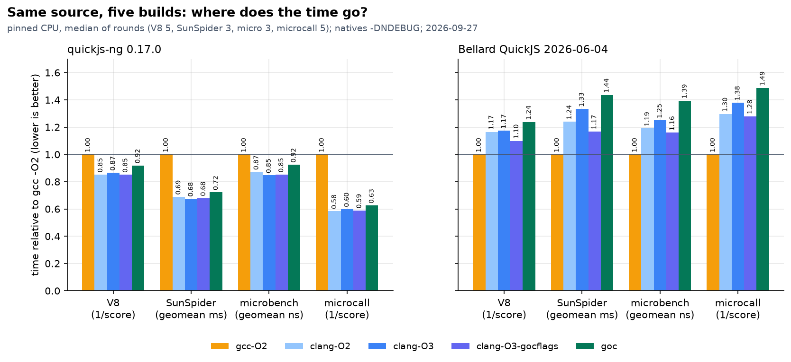
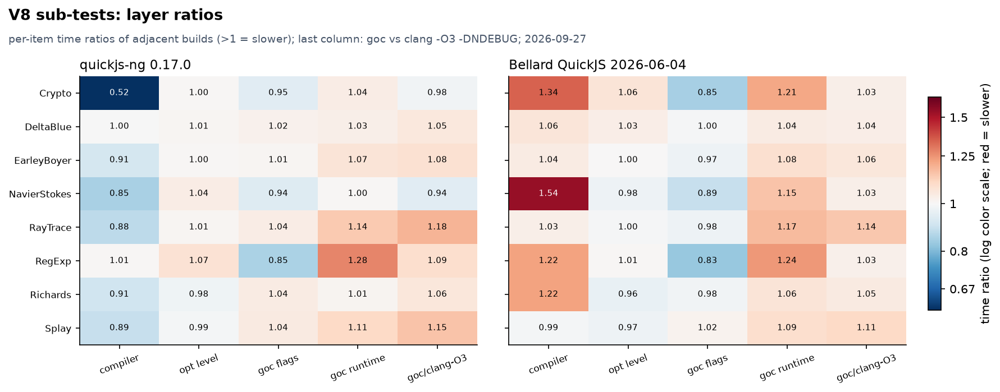
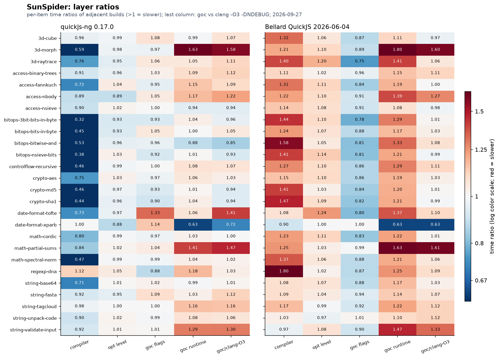
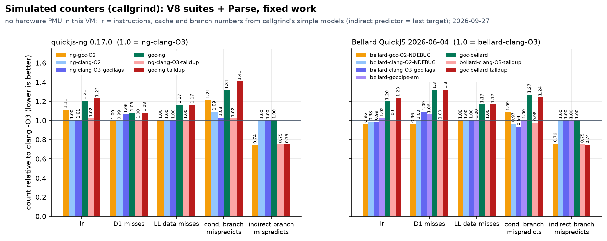
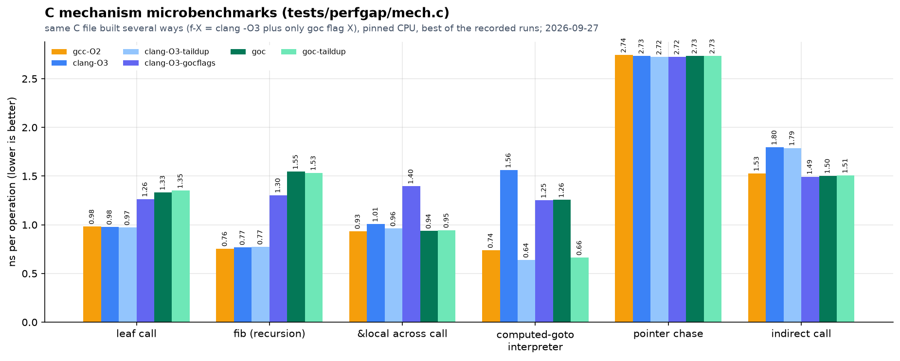
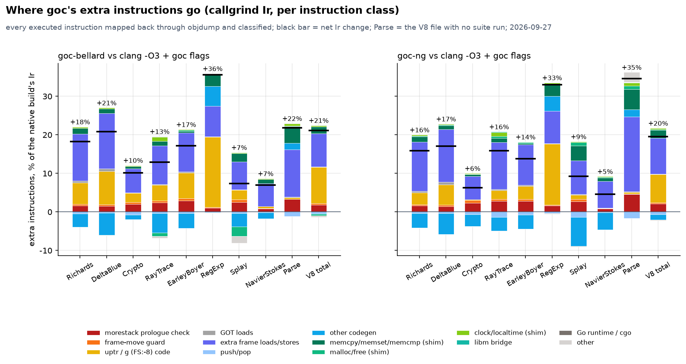
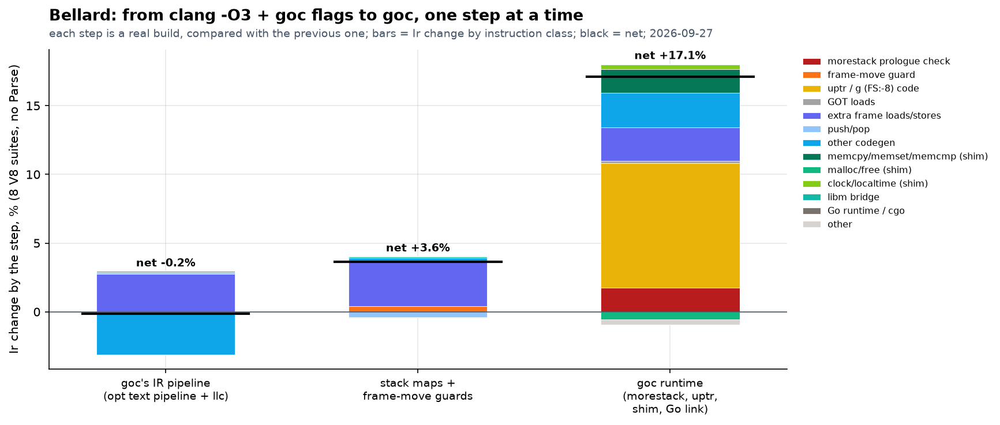
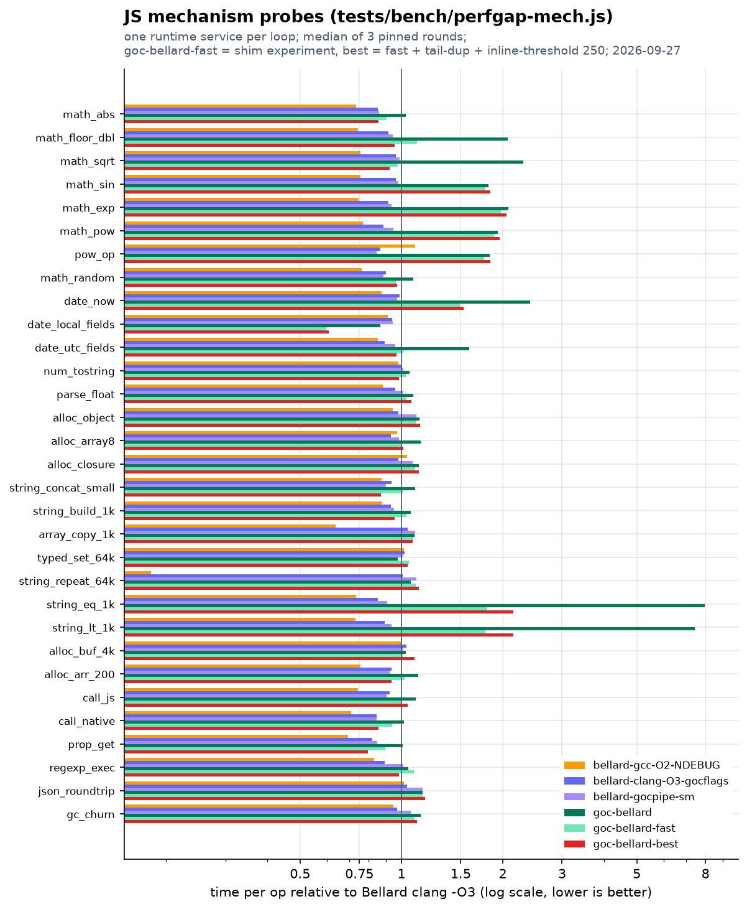

# goc 与原生 QuickJS 的性能差距：逐层拆解

本页回答两个问题：

1. 同样是 QuickJS，**Bellard gcc 版、Bellard clang 版、ng clang 版（以及 ng gcc 版）、goc-ng、goc-bellard** 这几种构建，速度差在哪里，各差多少；
2. goc 编出来的两个版本比原生慢的**每一个**地方，机制是什么、量出来占多少、能不能修。

跑分总表在 [benchmark.md](benchmark.md)；本页是它的“为什么”。所有数据、脚本和原始输出都在仓库里（见文末“原始文件”）。图中文字是英文，正文是中文。

读法：每条结论后面标了 **【实测】** 或 **【推测】**。【实测】是有对照构建、计数器或 A/B 计时直接支撑的；【推测】是根据汇编或源码推出来、还没做单独实验验证的。

---

## 0. 结论先看

测量时段：北京时间 2026-09-27，同一台 8 vCPU 虚拟机，计时一律 `taskset -c 3` 绑核、多家交替轮换（方法同 `scripts/bench-all.sh`）。除特别注明外，下表数字来自“开关实验”时段（`data/toggles/`，19:53–23:01，28 个构建同一时段交替跑），这是最新、覆盖最全的一次。

| 指标 | Bellard gcc -O2 | Bellard clang -O3 | goc-bellard | ng clang -O2（native ng） | ng clang -O3 | goc-ng |
|---|---:|---:|---:|---:|---:|---:|
| V8-v7 总分（越高越快） | **1538** | 1321 | 1238 | 1193 | 1179 | 1115 |
| SunSpider 几何平均 ms | **10.78** | 14.52 | 15.87 | 16.16 | 15.93 | 16.80 |
| microbench 几何平均 ns | **32.8** | 41.0 | 45.4 | 52.1 | 50.8 | 55.1 |
| microcall（calls/ms） | **30818** | 22453 | 21118 | 23315 | 22809 | 21399 |

ng 的 gcc 版只在主时段（`data/`，16:18–17:41）测过：V8 1020、SunSpider 23.08 ms、microbench 60.1 ns、microcall 13599——**ng 用 gcc 编反而比用 clang 慢**（V8 总分低 15%，SunSpider 慢 45%），和 Bellard 正好相反。

一句话版本：

- **goc-bellard 对 Bellard gcc 版的差距（V8 0.80 倍）可以拆成两个相乘的因子：编译器 0.86 × goc 自身 0.94。** 编译器那一块几乎全部来自 gcc 对解释器分发跳转做的“尾复制”（第 3 节）；clang 加上同样的尾复制后 V8 从 1321 升到 1469，和 gcc 的 1538 只差 4.5%。【实测】
- **扣掉编译器之后，两个 goc 版本相对同编译器的原生构建慢得差不多**：V8 goc-bellard/clang-O3 = 1.067、goc-ng/clang-O3 = 1.057（时间比）；SunSpider 1.093 与 1.055；microbench 1.106 与 1.085。【实测】
- **同样的编译参数下，goc 多执行约 20% 的指令**（callgrind，V8 8 个子项 + 解析：goc-bellard 1.212 倍、goc-ng 1.196 倍）。这 21 个百分点里：uptr / g（`FS:-8`）相关代码约 9.4 个点、栈帧读写（溢出/重载、GC 根槽）约 8.6 个点、morestack 栈检查约 1.8 个点、memcpy/memcmp 等 shim 约 1.8 个点、帧移动守卫约 0.4 个点（第 4 节）。【实测】
- **SunSpider/microbench 上的大头是几个“运行时服务”**：`Math.sin/exp/pow/floor/sqrt` 走 Go→cgo→glibc 每次多约 50 ns，`Date.now()` 走裸系统调用每次多约 90 ns，字符串比较的 `memcmp` 是逐字节循环（1 KiB 比较慢 8 倍）。这几项在 JS 探针里被单独量出来，也用补丁验证过（第 5 节）。【实测】
- **为什么 Bellard 的差距比 ng 大**：① 原生 Bellard 参照是 gcc 编的，而 gcc 恰好在 Bellard 的解释器上特别占便宜，ng 的原生参照是 clang；② goc 的固定开销（每次 libm 调用、每次取时间多出来的几十纳秒）是绝对值，Bellard 本身更快，同样的纳秒占比就更大；③ goc 的某些编译参数反而让 Bellard 的 clang 构建变快（gocflags 构建 V8 快 6%），ng 没有这个效果，于是“goc 运行时”那一层在 Bellard 上显得更大（第 7 节）。【实测为主，③ 的原因见第 6 节】

优化清单在第 8 节，排第一的是“给 goc 的 llc 打开分发块尾复制”：实测 goc-bellard V8 +7.8%、SunSpider −15%，goc-ng SunSpider −7%，不改语义，只是后端参数。

---

## 1. 参与比较的构建

所有构建都来自同一台机器上的同两份源码：quickjs-ng 0.17.0（`/workspace/perf-study/native`）和 Bellard QuickJS 2026-06-04（`/workspace/perf-study/bellard/quickjs-2026-06-04.tar.xz`）。原生构建由 [`scripts/perfgap-build-natives.sh`](../scripts/perfgap-build-natives.sh) 生成，goc 变体用 `QJS_OUT_DIR=... scripts/qjs-cli-build.sh` 加实验开关生成（见第 9 节）。

### 1.1 原生构建

| 名字 | 编译器与参数 | 备注 |
|---|---|---|
| `bellard-gcc-O2` | gcc 14 `-O2`（上游 Makefile 默认，带 assert） | benchmark.md 里的 native Bellard |
| `bellard-gcc-O2-NDEBUG` | gcc `-O2 -DNDEBUG` | 本页 Bellard 的 gcc 参照 |
| `bellard-clang-O2` / `-O2-NDEBUG` | clang-19 `-O2`（`CONFIG_CLANG=y`），有/无 assert | |
| `bellard-clang-O3` | clang-19 `-O3 -DNDEBUG` | goc 用 O3，这是和 goc 同级的参照 |
| `ng-gcc-O2` | gcc `-O2 -DNDEBUG`（CMake Release） | 只在主时段测过 |
| `ng-clang-O2` | clang-19 `-O2 -DNDEBUG` | benchmark.md 里的 native ng |
| `ng-clang-O3` | clang-19 `-O3 -DNDEBUG` | |

Bellard 的上游 CFLAGS 一直带 `-funsigned-char -fwrapv`，ng 的 CMake 带 `-funsigned-char`；goc 两者都不加（`-fwrapv` 在 goc 里另有，见下）。

### 1.2 “带 goc 参数的原生构建”（gocflags）

goc 为了让 C 代码能跑在 goroutine 栈上，给 clang/llc 加了一组限制性参数。把这组参数原样加到 clang `-O3 -DNDEBUG` 上，就得到 `*-clang-O3-gocflags`（脚本里叫 `gocfull`）：

| 参数 | goc 为什么需要它 |
|---|---|
| `-fwrapv -fno-strict-aliasing` | 前端语义约定（有符号溢出回绕、不做类型别名假设） |
| `-fno-omit-frame-pointer -mno-omit-leaf-frame-pointer` | 每个函数都保留 `rbp` 帧指针；goc 的帧地址修正和 Go 的栈回溯都依赖它 |
| `-fno-optimize-sibling-calls` | 不做尾调用：尾调用会让当前帧消失，Go 的 pcsp 表描述不了 |
| `-mno-red-zone` | 不用 SP 以下 128 字节的“红区”：Go 的信号处理和异步抢占会写到 SP 以下 |
| `-fno-stack-protector -fno-asynchronous-unwind-tables` | 没有 canary、没有 unwind 表 |
| `-mstack-alignment=8`（goc 里是 `override-stack-alignment=8` + `no-realign-stack`） | Go 的 ABI 只保证 8 字节栈对齐 |
| `-mllvm -no-stack-slot-sharing` | 每个溢出槽只装一个值，stackmap 的槽位含义不会随 PC 变 |
| `-mllvm -enable-shrink-wrap=false` | 序言必须在函数入口，morestack 检查要最先执行 |
| `-mllvm -no-x86-call-frame-opt` | 不用 push 传参：Go 的 pcsp 表描述不了函数中途的 SP 变化 |
| `-mllvm -enable-tail-merge=false` | 不合并相同的尾部代码（合并会让两个 safepoint 共用一个返回地址，stackmap 会错，见 benchmark.md“性能优化前后”） |

gocflags 构建**只有参数、没有 goc 运行时**：没有 morestack 检查、没有 uptr 编码、没有 stackmap、用的是 glibc。它和 goc 构建的差就是“goc 运行时”那一层。

### 1.3 “goc 的流水线原生编译”（gocpipe）

goc 的优化流水线和普通 `clang -O3` 并不完全一样：前端用 `-disable-llvm-passes` 出未优化的 IR，再用 `opt` 跑一条**文本形式**的 `default<O3>` 流水线（去掉 `argpromotion` 和 `globalopt` 两个 pass，它们会改函数签名/全局布局，和 goc 的元数据冲突），最后 `llc` 带上表里的参数出汇编，并把 `movaps` 换成 `movups`（ALIGNFIX）。[`scripts/perfgap-gocpipe-cc.sh`](../scripts/perfgap-gocpipe-cc.sh) 把这条流水线包成一个“编译器”，直接编原生 Bellard：

| 名字 | 内容 |
|---|---|
| `bellard-gocpipe` | goc 的 opt 文本流水线 + goc 的 llc 参数，其余是普通原生程序（glibc、无 goc 运行时） |
| `bellard-gocpipe-sm` | 再加上 goc 的 `goc-stackmap` / `goc-reanchor` pass 和 `goc-llc`（stackmap 放置 + 帧地址修正 `GocFrameAddrFix`）：也就是 stackmap 和“帧移动守卫”的代码都生成了，只是栈永远不会真的搬 |
| `*-inl250` | 同上，加 `-inline-threshold=250`（见 6.3） |

这样从 gocflags 到 goc 可以一步一步走：gocflags → gocpipe（流水线差异）→ gocpipe-sm（stackmap 与守卫）→ goc-bellard（morestack、uptr、shim、Go 链接）。

### 1.4 goc 构建与实验变体

| 名字 | 内容 |
|---|---|
| `goc-bellard` | 默认构建 `build/qjs-bellard/qjscli`（commit 8973a12，O3 + `-DNDEBUG`） |
| `goc-ng` | 默认构建 `build/qjs/qjscli` |
| `*-taildup` | `GOC_LLC_EXTRA="-tail-dup-pred-size=1000 -tail-dup-succ-size=1000"`（原生构建用 `-mllvm` 传同样的参数），见第 3 节 |
| `*-fast` | 打上 [`experiments/shim-fast.patch`](perf-gap/experiments/shim-fast.patch)：`memcmp` 每步 8 字节、`clock_gettime` 走 Go 的 vDSO 时钟、`sqrt/floor/ceil/trunc/round` 用 C 实现（不再绕道 Go），见第 5 节 |
| `*-inl250` | `GOC_OPT_EXTRA=-inline-threshold=250` |
| `*-best` | fast + taildup + inl250 三者同时 |

这些开关（`GOC_OPT_EXTRA`、`GOC_LLC_EXTRA`、`QJS_OUT_DIR`，以及 bench-all.sh 的 `ENGINE_MAP`、`MICROCALL_PER_ENGINE`）都是本次新加的、默认为空的实验旋钮，**默认构建的命令行和产物都不变**（第 9.3 节）。

---

## 2. 结果矩阵

### 2.1 四个套件



上图（主时段）把每份源码的五种构建都除以它自己的 gcc -O2 版：左边 ng，gcc 最慢、clang 快 13%～42%；右边 Bellard，gcc 最快，clang 慢 17%～38%，goc 再慢一截。

开关实验时段的完整表（`data/toggles/tables.md`）：

| 构建 | V8 | SunSpider ms | micro ns | microcall |
|---|---:|---:|---:|---:|
| bellard-gcc-O2-NDEBUG | 1538 | 10.78 | 32.8 | 30818 |
| bellard-clang-O2-NDEBUG | 1332 | 13.69 | 39.2 | 23791 |
| bellard-clang-O2-taildup | 1450 | 11.55 | 34.4 | 25183 |
| bellard-clang-O3 | 1321 | 14.52 | 41.0 | 22453 |
| bellard-clang-O3-taildup | 1469 | 11.33 | 35.0 | 26388 |
| bellard-clang-O3-gocflags | 1400 | 13.03 | 38.2 | 24604 |
| bellard-clang-O3-gocflags-taildup | 1443 | 11.56 | 35.0 | 26727 |
| bellard-gocpipe | 1397 | 13.12 | 38.2 | 25829 |
| bellard-gocpipe-sm | 1343 | 13.35 | 39.0 | 24237 |
| bellard-gocpipe-inl250 | 1391 | 13.00 | 37.8 | 24100 |
| goc-bellard | 1238 | 15.87 | 45.4 | 21118 |
| goc-bellard-taildup | 1335 | 13.45 | 40.6 | 23643 |
| goc-bellard-fast | 1280 | 14.24 | 41.8 | 23293 |
| goc-bellard-fast-taildup | 1389 | 12.69 | 39.5 | 24246 |
| goc-bellard-inl250 | 1278 | 14.62 | 42.2 | 22379 |
| goc-bellard-best | 1350 | 13.15 | 39.2 | 23429 |
| ng-clang-O2 | 1193 | 16.16 | 52.1 | 23315 |
| ng-clang-O3 | 1179 | 15.93 | 50.8 | 22809 |
| ng-clang-O3-taildup | 1196 | 14.13 | 47.5 | 24034 |
| ng-clang-O3-gocflags | 1184 | 15.49 | 51.7 | 22804 |
| goc-ng | 1115 | 16.80 | 55.1 | 21399 |
| goc-ng-taildup | 1124 | 15.61 | 52.4 | 22755 |
| goc-ng-fast | 1124 | 16.81 | 55.1 | 21260 |
| goc-ng-inl250 | 1122 | 16.65 | 55.1 | 21372 |
| goc-ng-best | 1123 | 15.53 | 51.7 | 22013 |

噪声：这台机器由多个任务共用，同一时段 V8 总分的轮间波动约 ±2%～3%（例如 goc-bellard 五轮 1226–1254）。1%～2% 的差别不要当真。

### 2.2 V8 子项与 SunSpider 逐项





每格是相邻两个构建的时间比（>1 表示后者慢）：compiler = clang-O2/gcc-O2，opt level = clang-O3/clang-O2，goc flags = gocflags/clang-O3，goc runtime = goc/gocflags，最后一列 goc/clang-O3。

几个一眼能看出的规律：

- Bellard 的 compiler 列整片发红（Crypto 1.34、NavierStokes 1.54、SunSpider 的 bitops/crypto 1.4～1.6），ng 的 compiler 列整片发蓝（Crypto 0.52，bitops 0.32～0.53）。**“gcc 好还是 clang 好”取决于源码，不是编译器本身的高低**；第 3 节解释 Bellard 这边的原因。
- goc runtime 列里最红的几项，两份源码是一样的：SunSpider 的 `3d-morph`（1.63 / 1.80）、`math-partial-sums`（1.41 / 1.63）、`string-validate-input`（1.29 / 1.47），V8 的 RegExp（1.28 / 1.24）和 RayTrace（1.14 / 1.17）。前三项是 libm 和字符串比较（第 5 节），后两项是 uptr 检查和 GC 根槽（第 4 节）。
- `date-format-xparb` 上 goc 反而快 37%：goc 的 `localtime` 走 Go 的 `time` 包，比 glibc 的 `localtime_r` 便宜（探针 `date_local_fields` 同样快 14%～40%）。【实测】

### 2.3 microbench 与 microcall

microbench 72 项的逐项比值在 `data/tables.md` / `data/toggles/tables.md`。goc/clang-O3 超过 1.3 的只有这几项：

| 项 | goc-bellard / clang-O3 | goc-ng / clang-O3 | 机制 |
|---|---:|---:|---|
| `date_now` | 2.48 | 2.28 | `clock_gettime` 是裸 syscall（5.2） |
| `date_parse` | 1.69 | 1.59 | 同上 + 字符串处理（【推测】） |
| `string_build1` / `1x` / `2c` | 1.86 / 1.88 / 1.82 | 1.25 / 1.21 / 0.95 | **只在 Bellard 上**，原因未查明（5.5） |
| `string_build_large1` | 1.34 | 1.18 | memcpy/realloc 路径（【推测】） |
| `sort_bench` | 1.32 | 1.19 | 比较回调走 JS 调用路径 + uptr（【推测】） |

microcall（10 种 JS 调用形状，`tests/bench/microcall.js`）上，goc/clang-O3 是 1.063（Bellard）和 1.066（ng），属于调用路径上的固定开销：morestack 检查、帧移动守卫和 `JS_CallInternal` 更大的栈帧（第 4 节）。

### 2.4 模拟计数器



这台虚拟机没有硬件 PMU（`perf stat` 的 cycles/instructions 都是 `<not supported>`），所以计数器来自 callgrind 的模拟：Ir 是执行的指令数，D1/LL 是它的简单缓存模型，分支预测是它的简单模型（间接跳转只记“上一次的目标”）。输入是固定工作量的 V8（每个子项固定迭代次数，外加一个只解析不运行的 `Parse`），见 `scripts/perfgap-callgrind.sh`。

| 构建 | Ir | 条件分支误预测 | 间接跳转误预测 | D1 读缺失 |
|---|---:|---:|---:|---:|
| bellard-gcc-O2-NDEBUG | 15.81G | 57.9M | **232M** | 19.8M |
| bellard-clang-O3 | 16.41G | 53.2M | **306M** | 21.9M |
| bellard-clang-O3-taildup | 16.34G | 52.1M | **230M** | 21.9M |
| bellard-clang-O3-gocflags | 16.22G | 49.8M | 306M | 23.1M |
| bellard-gocpipe-sm | 16.80G | 53.4M | 306M | 22.8M |
| goc-bellard | 19.69G | 67.6M | 306M | 29.1M |
| goc-bellard-taildup | 20.26G | 66.1M | 228M | 29.3M |
| ng-gcc-O2 | 20.33G | 65.8M | 241M | 23.6M |
| ng-clang-O3 | 18.26G | 54.1M | 325M | 25.6M |
| ng-clang-O3-taildup | 18.62G | 55.2M | 244M | 25.7M |
| ng-clang-O3-gocflags | 18.39G | 55.7M | 324M | 26.7M |
| goc-ng | 22.04G | 71.1M | 326M | 27.7M |

两件事：

1. gcc 与 clang 在 Bellard 上的 Ir 只差 4%，但间接跳转误预测差 32%；clang 打开尾复制后误预测降到和 gcc 一样（230M 对 232M）。第 3 节展开。
2. goc 比 gocflags 多 21% 的指令（Bellard）和 20%（ng），D1 缺失多 26% / 4%，间接误预测不变。goc 的开销是“多执行的指令”，不是缓存或分支预测。第 4 节展开。

---
## 3. gcc 为什么在 Bellard 上快这么多：解释器分发的“尾复制”

### 3.1 先解释几个词

- **解释器循环**：QuickJS 执行字节码的核心是 `JS_CallInternal` 里的一个大循环，每条字节码（opcode）对应一段处理代码（handler）。执行完一个 handler，要读下一个 opcode、跳到它的 handler，这一步叫**分发（dispatch）**。
- **computed goto**：QuickJS 用 GCC 扩展 `goto *dispatch_table[opcode]` 分发，编译出来是一条**间接跳转** `jmp *(%表基址,%opcode,8)`——跳转目标在运行时才从表里读出来。
- **分支预测**：CPU 在真正算出跳转目标之前就要猜下一条指令在哪。猜错一次要清空流水线，代价约 15～20 个周期。间接跳转的预测器按“这条跳转指令的地址 + 最近的跳转历史”来猜。
- **尾复制（tail duplication）**：编译器把一个被很多地方跳进来的公共基本块（这里就是“读 opcode + `jmp *`”这几条指令）**复制到每一个前驱的末尾**。复制之后，每个 handler 末尾都有自己的一条 `jmp *`，预测器就能按“从哪个 handler 跳出来”分别记忆，比如“`OP_push_i32` 后面通常是 `OP_add`”。

### 3.2 汇编里看得到的差别

clang -O3 编出的 Bellard `JS_CallInternal`，所有 handler 最后都跳回同一个分发块，整个函数只有 5 条 `jmp *`（其余 4 条是 `switch` 跳转表）：

```asm
; bellard-clang-O3: 唯一的 opcode 分发块，约 250 个 handler 共用
28ec0:  inc    %r13                 ; pc++
28ec3:  movzbl (%r15),%ebx          ; 读 opcode
28ec7:  jmp    *(%r12,%rbx,8)       ; 查表跳转
```

gcc -O2 编出的同一个函数有 **210 条** `jmp *`，每个 handler 末尾各有一份：

```asm
; bellard-gcc-O2: 某个 handler 的末尾，自带分发
22383:  add    $0x10,%rbx
22387:  mov    %rax,-0x10(%rbx)
2238b:  movzbl -0x1(%r12),%eax      ; 读下一个 opcode
22391:  mov    %rax,%r10
22394:  mov    (%r14,%rax,8),%rax
22398:  jmp    *%rax                ; 这一份只属于这个 handler
```

| 二进制（`JS_CallInternal`） | `jmp *` 条数 |
|---|---:|
| Bellard gcc -O2 | 210 |
| Bellard clang -O3 / gocflags / gocpipe / goc-bellard | 5 |
| Bellard clang -O3 + 尾复制参数 | 262 |
| goc-bellard + 尾复制参数 | 260 |
| ng gcc -O2 | 225 |
| ng clang -O3 / goc-ng | 5 |
| ng clang -O3 + 尾复制参数 | 279 |

LLVM 其实也会做尾复制，但默认只在前驱和后继都不超过 16 个时才复制（`-tail-dup-pred-size=16`、`-tail-dup-succ-size=16`）；`JS_CallInternal` 的分发块有约 250 个前驱，超出上限，于是保留一个共享块。把两个上限调到 1000，clang 就和 gcc 一样逐个复制了。【实测】

### 3.3 量出来的效果

callgrind 的间接跳转误预测（V8 + Parse，固定工作量）：gcc 232M，clang 306M，clang+尾复制 230M。Ir 基本不变（16.41G → 16.34G）。【实测】

C 微基准 `tests/perfgap/mech.c` 的 `interp`（31 个 handler 的 computed-goto 小解释器，形状仿 `JS_CallInternal`）把这件事单独拎出来：

| 构建 | ns/op |
|---|---:|
| gcc -O2 | 0.74 |
| clang -O3 | 1.56 |
| clang -O3 + 尾复制 | **0.64** |
| clang -O3 + goc 参数 | 1.25 |
| goc | 1.26 |
| goc + 尾复制 | **0.66** |

同一段代码，只差分发块复不复制，速度差 2.4 倍。【实测】



整机计时（开关时段，时间比，<1 表示变快）：

| 源码 | 构建 | V8 | SunSpider | micro | microcall |
|---|---|---:|---:|---:|---:|
| Bellard | clang-O3 → +尾复制 | 0.899（1321→1469） | 0.780 | 0.854 | 0.851 |
| Bellard | goc-bellard → +尾复制 | 0.927（1238→1335） | 0.848 | 0.894 | 0.893 |
| ng | clang-O3 → +尾复制 | 0.986（1179→1196） | 0.887 | 0.935 | 0.949 |
| ng | goc-ng → +尾复制 | 0.992（1115→1124） | 0.929 | 0.951 | 0.940 |

加上尾复制后，Bellard clang -O3 和 gcc 的差距从 V8 14% / SunSpider 35% 缩到 4.5% / 5%。**gcc 与 clang 在 Bellard 上的差距，大部分就是这一条。**【实测】剩下的 5% 左右里，`JS_CallInternal` 的栈帧 gcc 只有 520 字节、clang 872 字节（第 4.6 节），microcall 上 clang+尾复制仍比 gcc 慢 14%，可能和更大的帧与更多的序言/尾声工作有关。【推测】

### 3.4 为什么尾复制对 ng 的 V8 几乎没用

ng 的 SunSpider 和 microbench 也快了 6%～11%，但 V8 只快 1%～1.5%。能量到的差别是：

- Bellard 尾复制后 Ir 略降（−0.4%），ng 尾复制后 Ir **增加 2%**（18.26G → 18.62G），goc-ng +2.0%。【实测】
- ng 的每份分发副本更长。clang 在 ng 里每复制一份，都要重新 `lea` 一次分发表地址、再多搬一两个寄存器：

```asm
; ng-clang-O3-taildup: 一份分发副本
38136:  movzbl (%r11),%r14d
3813a:  inc    %r11
3813d:  mov    %r15,%r10
38140:  mov    %r14d,%edx
38143:  lea    0xfb7f6(%rip),%rax   ; 每份都重新取表地址
3814a:  jmp    *(%rax,%r14,8)
```

所以在 ng 上，省下的误预测（325M → 244M，和 Bellard 降得一样多）被多出来的指令吃掉了一部分。至于为什么 V8 上抵消得最彻底、SunSpider 上没有，可能是 V8 的时间更多花在对象、属性和 GC 这些分发之外的代码上（ng 的 V8 Ir 比 Bellard 多 11%）。【推测】

这也解释了为什么“goc-bellard 对 Bellard gcc”的差距比“goc-ng 对 native ng”大：Bellard 的原生参照（gcc）享受了尾复制，ng 的原生参照（clang）没有，而 goc 用的 LLVM 默认也没有（第 7 节）。

---

## 4. goc 自身的开销：同样参数下多出的 20% 指令

这一节只比较 **goc 与 gocflags**：两者源码一样、优化级别一样、编译参数一样，差别只在 goc 的运行时机制。

### 4.1 需要的几个概念

- **寄存器与栈帧**：x86-64 有 16 个通用寄存器。函数用不完寄存器的值，放在自己的**栈帧**里（一块以 `rbp` 为基址的内存，汇编里写作 `-0x40(%rbp)`）。把寄存器里的值存到栈帧叫**溢出（spill）**，再读回来叫**重载（reload）**。
- **goroutine 栈会搬家**：Go 的每个 goroutine 一开始只有几 KiB 的栈，不够时运行时分配一块两倍大的新栈，把旧栈**整个拷过去**（morestack → copystack）。拷完之后，栈上所有对象的地址都变了。
- **g 和 TLS**：Go 运行时里每个 goroutine 有一个描述结构 `g`。amd64 上当前 `g` 的地址放在线程局部存储里，读法是 `mov %fs:-8,%reg`（`FS` 段寄存器指向线程局部区）。`g+0` 是栈底 `stack.lo`，`g+8` 是栈顶 `stack.hi`，`g+0x10` 是 `stackguard0`。
- **safepoint**：可能发生“栈搬家”的点。goc 里栈只会在函数调用内部搬家，所以每个调用点都是 safepoint。
- **stackmap**：告诉运行时“在这个 safepoint，栈帧的哪些槽里放着指向栈的指针”，搬家时运行时按表逐个改写。
- **sptr / uptr**：goc 给指针分“颜色”。`sptr` 指向本 goroutine 栈；它只能待在寄存器或栈槽里。要把一个可能指向栈的指针写进堆/全局（非栈内存），goc 把它编码成 `uptr`：指向栈的写成“相对 `stack.hi` 的偏移、最高位置 1”，指向别处的原样保存。读回来时再解码。这样栈搬家后堆里的值不用改（详见 [glossary.md](glossary.md)）。
- **Ir**：callgrind 统计的“执行的指令条数”。

### 4.2 总账



`scripts/perfgap-cg-classify.py` 把 callgrind 记下的每一条执行过的指令地址用 objdump 映射回二进制，按指令形状分类（分类规则写在脚本开头），再和 gocflags 构建逐类相减。下表是 V8 8 个子项 + Parse 的合计，单位是**原生构建总 Ir 的百分点**（`data/ir-decomposition.json`）：

| 类别 | 是什么 | goc-bellard | goc-ng |
|---|---|---:|---:|
| 总 Ir 比 | | **1.212** | **1.196** |
| uptr / g 代码（tls） | `FS:-8` 读 g、读 `stack.lo/hi`、uptr 编码/解码的范围判断；JS 栈溢出检查里的 `goc_stack_hi()` | +9.39 | +7.29 |
| 栈帧读写（framemem） | 其余带 `(%rbp)`/`(%rsp)` 操作数的指令：溢出/重载、GC 根槽、局部变量 | +8.58 | +9.22 |
| morestack 栈检查（stackcheck） | 每个函数入口的 4 条指令 | +1.80 | +2.08 |
| memcpy/memset/memcmp（memstr） | goc 的 libc shim 代替 glibc | +1.75 | +2.07 |
| 帧移动守卫（guard） | 调用前后的 `mov/cmp %rbp,-N(%rbp)` | +0.39 | +0.37 |
| 时间（time） | `clock_gettime`、`localtime` | +0.36 | +0.30 |
| GOT 读（got） | 通过 goc 的 GOT 取全局地址 | +0.17 | +0.15 |
| push/pop | 保存被调用者保存寄存器 | −0.31 | −0.67 |
| 其余指令 + call | 普通计算 | −0.27 | −1.41 |
| malloc/free（alloc） | goc 的分配器 vs glibc | −0.39 | +0.23 |
| 其他 | ld.so、Go 运行时等 | −0.3 | −0.1 |

按子项看（goc-bellard，同单位）：

| 子项 | Ir 比 | tls | framemem | stackcheck | memstr |
|---|---:|---:|---:|---:|---:|
| Richards | 1.182 | +5.5 | +12.3 | +1.6 | +1.5 |
| DeltaBlue | 1.208 | +8.6 | +14.3 | +1.5 | +1.2 |
| Crypto | 1.102 | +2.4 | +6.2 | +2.0 | +0.6 |
| RayTrace | 1.129 | +4.0 | +10.0 | +2.4 | +1.1 |
| EarleyBoyer | 1.172 | +6.6 | +10.1 | +3.0 | +0.3 |
| RegExp | **1.356** | **+18.2** | +8.0 | +1.1 | +2.8 |
| Splay | 1.074 | +2.5 | +7.2 | +2.5 | +2.2 |
| NavierStokes | 1.069 | +0.5 | +5.9 | +0.9 | +1.1 |
| Parse | 1.218 | +0.4 | +12.3 | +3.3 | +4.4 |

**注意：Ir 多 21% 不等于慢 21%。** 同样是 V8，goc-bellard 比 gocflags 慢的时间是 13%（开关时段 1400 → 1238），goc-ng 比 gocflags 慢 6%。多出来的指令大多是 L1 命中的栈读写和预测得准的比较分支，CPU 可以和别的指令并行执行，所以 Ir 高估了时间代价。按类别直接折算时间没有依据；下面各节给出的是 Ir 份额，时间上的收益以第 8 节的实测 A/B 为准。

### 4.3 一步一步：从 gocflags 走到 goc-bellard



| 步骤 | Ir 变化 | 主要来自 | V8 时间比 | SunSpider | micro |
|---|---:|---|---:|---:|---:|
| gocflags → gocpipe（goc 的 opt 文本流水线 + llc） | −0.2% | 帧读写 +2.8、其余 −3.1，互相抵消 | 1.002 | 1.007 | 1.000 |
| gocpipe → gocpipe-sm（stackmap + 帧移动守卫） | +3.6% | 帧读写 +3.3（GC 根槽）、守卫 +0.4 | 1.040 | 1.018 | 1.021 |
| gocpipe-sm → goc-bellard（morestack、uptr、shim、Go 链接） | +17.1% | tls +9.1、帧读写 +2.4、栈检查 +1.7、memstr +1.7 | 1.085 | 1.189 | 1.164 |

【实测】所以 goc 的开销里，“流水线本身”几乎为零，stackmap/守卫约占 4%，其余都在最后一步：uptr 检查、栈检查和 shim。

### 4.4 uptr / g 代码（Ir +9.4 个点，最大的一项）

**机制。** goc 在编译期推断每个指针的颜色。如果一个指针**可能**指向栈（编译器证明不了它不指向栈），而它又要被写进非栈内存，goc 就在这次写入前插入一段编码：读 `g`，看这个值是否落在 `[stack.lo, stack.hi)` 里，在就改写成偏移。反过来从非栈内存读出一个 `uptr`，要看最高位，是 1 就加上 `stack.hi`。

`JS_CallInternal` 入口附近的一段（goc-bellard），把一个指针写进堆之前的编码检查：

```asm
; 编码：%rax 是要写出去的指针，先判断它是不是指向当前 goroutine 栈
4e179e:  mov    %fs:0xfffffffffffffff8,%rcx   ; 读 g
4e17a7:  mov    (%rcx),%rdx                   ; g->stack.lo
4e17aa:  mov    %fs:0xfffffffffffffff8,%rcx   ; 再读一次 g（volatile，不能合并）
4e17b3:  mov    0x8(%rcx),%rcx                ; g->stack.hi
4e17b7:  dec    %rdx
4e17ba:  cmp    %rax,%rdx                     ; ptr <= lo-1 ?
4e17bd:  setae  %dl
4e17c0:  cmp    %rax,%rcx                     ; ptr >= hi ?
4e17c3:  setbe  %sil
4e17c7:  or     %dl,%sil
4e17ca:  jne    4e1820                        ; 不在栈上：原样存
         ...                                  ; 在栈上：减去 hi，存偏移
; 解码：从堆里读出的值最高位为 1，表示“相对 stack.hi 的偏移”
4e17e0:  mov    %fs:0xfffffffffffffff8,%rax   ; 读 g
4e17e9:  add    0x8(%rax),%r15                ; ptr = stored + g->stack.hi
```

原生构建里，这些地方只有一条 `mov`。

**为什么这么贵。** ① 每次编码要读两次 `FS:-8`：goc 把 `g` 的读取做成 volatile（architecture.md：“hot uptr helpers are inlined to a volatile FS:-8 load”），编译器既不能把同一函数里的多次读取合并，也不能提到循环外；② 范围判断要两次比较加一次分支；③ 这段代码出现在很多“其实永远不会指向栈”的写入上，因为编译器证明不了。【实测：分类与计数】【“绝大多数写入其实不指向栈”是推测，没有逐点统计】

**热点在哪。** RegExp 子项最重（Ir +18.2 个点）。`scripts/perfgap-cg-bycount.py` 按执行次数把 goc-bellard 与 gocflags 的 `lre_exec` 基本块一一配对（`data/regexp-lre-exec-bycount.txt`）：最热的一个块执行了 2442 万次，goc 版 48 条指令，原生 22 条；多出来的 26 条里 23 条是两段 uptr 编码。这个块是正则回溯时往回溯栈里压一条记录（`pc`、当前字符指针、栈深度）：

```asm
; goc-bellard, lre_exec 回溯栈压栈（每条记录要存两个指针，各做一次编码检查）
5c9ae9:  mov    %fs:0xfffffffffffffff8,%rax
5c9af2:  mov    (%rax),%rcx
5c9af5:  mov    %fs:0xfffffffffffffff8,%rax
5c9afe:  mov    0x8(%rax),%rax
5c9b02:  dec    %rcx
5c9b05:  cmp    %rbx,%rcx
5c9b08:  setae  %cl
5c9b0b:  cmp    %rbx,%rax
5c9b0e:  setbe  %dl
5c9b11:  or     %cl,%dl
5c9b13:  jne    5c9b1e
5c9b1e:  mov    %rbx,(%r12)            ; stack[0] = pc
         ...                          ; 第二个指针再来一遍同样的 11 条
5cb0d7:  mov    %rcx,0x8(%r12)         ; stack[1] = cptr
; 原生（gocflags）同一个块：
df016:   mov    %r12,(%r15)
df019:   mov    %r8,0x8(%r15)
```

回溯栈本身是 `alloca` 出来的，goc 把 `alloca` 降成 `goc_dynalloc`（堆上的 `cptr`），所以往里存指针都要走编码。`pc` 指向字节码、`cptr` 指向输入字符串，实际上都在堆上。【实测】

tls 类还包括 JS 栈溢出检查：两个 goc 版本都打了 `qjs-gstack*.patch`，`js_check_stack_overflow` 改成每次用 `goc_stack_hi()` 读当前 `g->stack.hi` 再算深度（栈会搬家，不能用创建 runtime 时记下的绝对地址），每次 JS 调用都要执行。Bellard 的 tls 比 ng 多约 2 个点，逐子项看主要多在 DeltaBlue、Richards、EarleyBoyer 这几个调用密集的子项，具体是哪几处写入没有逐点拆开。【分类实测；来源拆分未做】

### 4.5 栈帧读写（Ir +8.6～9.2 个点）

`scripts/perfgap-cg-framemem.py` 按指令种类和位置把这一块再拆一次（`data/framemem.json`，goc-bellard 对 gocflags）：读 +4.7、写 +3.7、读改写 +0.3；按位置看，调用前后 4 条指令以内的只占 0.8，其余 7.9 分散在函数体里。按函数看，`JS_CallInternal` +3.6、`lre_exec` +2.4、`next_token` +0.4，其余都很小。【实测】

`scripts/perfgap-cg-frameslots.py` 把汇编（带 `# 8-byte Spill`/`Reload` 注释的 llc 输出）与二进制逐条对齐，再按槽位用途分桶（`data/frameslots.json`，单位是 goc-bellard 总 Ir 的百分比）：

| 函数 | GC 根槽（root） | 溢出 | 重载 | 其他局部 |
|---|---:|---:|---:|---:|
| `JS_CallInternal` | 0.70 | 0.62 | 1.21 | 0.69 |
| `lre_exec` | **2.03** | 0.12 | 0.66 | 0.93 |
| `next_token` | 0.28 | | | 0.13 |
| `free_gc_object` | 0.18 | 0.03 | 0.02 | |

原生 gocflags 构建里 `lre_exec` 是：溢出 0.11、重载 1.06、局部 0.97，没有根槽。

**GC 根槽是什么。** 一个可能指向栈的指针如果要跨过 safepoint 活着，goc 要把它放在 stackmap 登记过的栈槽里，搬栈时运行时才能找到并改写它。goc 用 volatile 的存/取（`goc.spill.root`）实现：每次修改这个指针都要写回栈槽，每次用都要从栈槽读，编译器不能把它留在寄存器里。`lre_exec` 里最热的一条是：

```asm
5c934f:  mov    %rax,-0x40(%rbp)     ; 根槽写回，执行 1.18 亿次（RegExp 子项）
```

原生版本里这个值一直待在寄存器里。四个函数的根槽合计占 goc-bellard 总 Ir 的 3.2%，约等于原生 Ir 的 3.9 个点。【实测】

**溢出/重载为什么变多。** goc 每个函数少一个可用寄存器吗？没有：`r14` 在 goc 里仍可分配（`GOC_FIXED_G` 才保留它，默认关闭）。多出来的溢出主要来自：根槽强制驻留栈上、uptr 编码/解码的中间值占寄存器、帧移动守卫后要把栈地址从 `rbp` 重新算出来（`goc-reanchor`）。三者各占多少没有拆开。【推测】

### 4.6 栈帧尺寸

`JS_CallInternal` 序言里 `sub $N,%rsp` 的 N（不含 push 的被调用者保存寄存器）：

| 构建 | 帧大小（字节） |
|---|---:|
| Bellard gcc -O2 | 520 |
| Bellard clang -O3 | 872 |
| Bellard clang -O3 仅加 `-no-stack-slot-sharing` | 1384 |
| Bellard clang -O3 + 全部 goc 参数 | 1552 |
| bellard-gocpipe-sm | 1320 |
| **goc-bellard** | **1768** |
| ng clang -O2 / -O3 | 952 / 1016 |
| ng clang -O3 + 全部 goc 参数 | 1568 |
| **goc-ng** | **1512** |

【实测】帧变大的最大单项是 `-no-stack-slot-sharing`（872 → 1384）：LLVM 默认让生命期不重叠的溢出值共用一个栈槽，goc 为了让 stackmap 里每个槽的含义在整个函数里固定而关掉了它。帧大的直接后果是递归深度：同样 16 MiB 栈，goc-bellard 约 9200 层 JS 递归，gcc 版 Bellard 约 25000 层（benchmark.md）。对速度的影响是更多的 D1 缓存占用（goc-bellard D1 读缺失比 gocflags 多 26%）。【D1 缺失数实测；和帧大小的因果是推测】

### 4.7 morestack 栈检查（Ir +1.8～2.1 个点）

每个 goc 函数入口都有 4 条指令，判断栈够不够：

```asm
4e1500:  mov    %fs:0xfffffffffffffff8,%r11   ; 读 g
4e1509:  lea    -0x698(%rsp),%r10             ; 本函数需要的栈底
4e1511:  cmp    0x10(%r11),%r10               ; 和 g->stackguard0 比
4e1515:  jbe    4f8f3c                        ; 不够：去 morestack 扩栈后重来
4e151b:  push   %rbp                          ; 以下才是普通序言
```

这是 goroutine 栈的基本代价，Go 编译器生成的每个函数也有同样的检查。goc 的 QuickJS 构建设置了 `GOC_NO_NOSPLIT=1`，没有给小的叶子函数省掉它。【实测】

C 微基准（`mech.c`，ns/次调用）：

| | 叶子函数调用 | fib 递归 | 局部变量地址跨调用 | 间接调用 |
|---|---:|---:|---:|---:|
| clang -O3 | 0.98 | 0.77 | 1.01 | 1.80 |
| clang -O3 + goc 参数 | 1.26 | 1.30 | 1.40 | 1.49 |
| goc | 1.33 | 1.55 | 0.94 | 1.50 |

叶子调用和递归上，大部分额外代价已经出现在“clang + goc 参数”这一列（帧指针的 push/pop、不能尾调用），goc 的栈检查再加 0.07～0.25 ns。【实测】

### 4.8 帧移动守卫（Ir +0.4 个点）

一个栈地址（比如局部数组的地址）如果在调用之后还要用，而调用里栈可能搬家，goc 在调用前把 `rbp` 记下来，调用后比较；`rbp` 变了就说明搬过家，跳到修正代码把保存着的栈地址按差值平移：

```asm
4e1e7b:  mov    %rbp,-0x6e8(%rbp)        ; 调用前记下 rbp
4e1e82:  call   __JS_FreeValueRT
4e1e87:  cmp    %rbp,-0x6e8(%rbp)        ; 调用后比较
4e1e8e:  jne    4f5fd9                   ; 搬过家才跳（几乎从不发生）
...
4f5fd9:  mov    %rbp,%r11                ; 修正代码：delta = 新 rbp - 旧 rbp
4f5fdc:  sub    -0x6e8(%rbp),%r11
         ...                             ; 把落在旧帧范围内的保存值加上 delta
```

正常路径每个调用多 3 条指令，分支永远预测正确。【实测】

### 4.9 memcpy / memset / memcmp shim（Ir +1.8～2.1 个点）

goc 的程序不链接 glibc，`memcpy` 等由 `tests/qjs/_qjs_libc_shim.c` 提供：小尺寸用重叠的 8/4/2/1 字节读写，大尺寸用 `rep movsb/stosb`；glibc 用的是 AVX-512 版本。`memcmp` 是逐字节循环（第 5.3 节）。perf 采样里 RegExp 子项 `goc_memcpy` 多 8 ms（总 1122 ms）。【实测】

---

## 5. 运行时服务：每次调用多几十纳秒

goc 版本里，libc 的服务要么由 shim 用 C 实现，要么桥接到 Go。`tests/bench/perfgap-mech.js` 每个循环只压一种服务，三轮取中位数（`data/mech-js/`，ns/op）：

| 探针 | Bellard clang-O3 + goc 参数 | goc-bellard | goc-bellard-fast | ng clang-O3 + goc 参数 | goc-ng | goc-ng-fast |
|---|---:|---:|---:|---:|---:|---:|
| `Math.floor` | 44.0 | **99.4** | 53.5 | 51.6 | **108.8** | 61.9 |
| `Math.sqrt` | 40.9 | **97.7** | 41.3 | 43.1 | **101.9** | 48.0 |
| `Math.sin` | 59.5 | **111.8** | 109.0 | 62.5 | **116.3** | 122.2 |
| `Math.exp` | 45.0 | **102.5** | 97.3 | 52.4 | **104.7** | 111.0 |
| `Math.pow` | 47.6 | **104.2** | 101.6 | 55.8 | **109.5** | 111.0 |
| `Date.now()` | 68.0 | **166.0** | 102.6 | 77.3 | **175.7** | 119.1 |
| UTC 日期字段 | 78.4 | **139.8** | 88.9 | 85.6 | **141.2** | 99.1 |
| 本地日期字段 | 221.5 | 203.8 | 140.9 | 234.0 | 195.9 | 155.2 |
| 1 KiB 字符串 `===` | 39.2 | **365.5** | 82.7 | 42.4 | **446.8** | 119.5 |
| 1 KiB 字符串 `<` | 44.3 | **369.6** | 88.4 | 50.5 | **552.6** | 121.4 |
| 空循环（基线） | 22.6 | 27.7 | 23.4 | 25.3 | 26.6 | 27.0 |
| JS 函数调用 | 36.1 | 43.0 | 39.3 | 38.7 | 39.1 | 41.4 |
| 正则 exec | 251.9 | 296.3 | 308.7 | 367.6 | 494.9 | 503.1 |



### 5.1 libm：Go → cgo → glibc 的往返（每次 +50 ns）【实测】

默认构建里 `sqrt/floor/ceil/trunc/round/sin/exp/pow/...` 都经 `GOC_GO_MATH1/2` 宏桥接到 Go 的 `main.gocGoMath*`，再由 Go 通过 cgo 调 glibc（保证和原生结果逐位一致）。每次调用要切到系统栈、保存全部寄存器，约多 50 ns。

`-fast` 补丁把**结果由 IEEE 754 精确规定**的五个函数（`sqrt`、`floor`、`ceil`、`trunc`、`round`）改成 C 实现（`sqrtsd` 指令和 musl 的整数位运算写法），结果与 glibc 逐位相同；`Math.sqrt` 从 97.7 降到 41.3 ns，和原生一样。`sin/exp/pow` 这类超越函数不是逐位确定的（不同 libm 最后一位可能不同），补丁没动，仍是 100+ ns。

SunSpider 上：`access-nbody`（大量 `Math.sqrt`）goc-bellard 20.6 → 15.5 ms（原生 15.3）；`3d-morph`（大量 `Math.sin`）26.8 → 25.7 ms，基本没变（原生 15.5）；`math-partial-sums`（`pow/sin/cos`）20.0 → 18.6（原生 11.7）。剩下的差距就是超越函数的桥接。

### 5.2 `clock_gettime`：裸系统调用（每次 +90 ns）【实测】

shim 的 `goc_clock_gettime` 直接 `syscall`，不走 vDSO；这台虚拟机上一次系统调用约 100 ns。`-fast` 补丁把 `CLOCK_REALTIME/MONOTONIC` 转给 Go 的 `time.Now()` / `runtime.nanotime()`（走 vDSO），`Date.now()` 从 166 降到 103 ns（原生 68）。microbench 的 `date_now` 从 2.5 倍降到 1.6 倍。

### 5.3 `memcmp`：逐字节循环（1 KiB 慢 8 倍）【实测】

字符串相等和大小比较最后落到 `memcmp`，shim 里是一个字节一个字节比的循环。`-fast` 补丁改成每步比 8 字节（发现不同再用 `bswap` 定序），1 KiB 比较从 366 降到 83 ns；glibc 的向量化版本是 39 ns。SunSpider `string-validate-input` goc-bellard 15.8 → 12.6 ms（原生 10.8），goc-ng 17.3 → 14.9。

### 5.4 对 V8 几乎没有影响

V8 的 8 个子项几乎不调这些服务：`-fast` 构建的 callgrind Ir 和默认构建相差 0.2% 以内。开关时段里 goc-bellard-fast 的 V8 比 goc-bellard 高 3.4%（1280 对 1238），goc-ng-fast 只高 0.8%；既然指令数不变，Bellard 这 3% 更可能是代码布局变化（I1 缺失从 14.5M 降到 11.5M）加噪声，不应算作补丁的收益。【Ir 实测；解释是推测】

### 5.5 没查清的：Bellard 的 `string_build*`

microbench 里 `string_build1`、`string_build1x`、`string_build2c`（循环里 `s += "x"` 拼 1000 次）goc-bellard 是原生的 1.8～1.9 倍，goc-ng 同样的三项只有 1.0～1.25 倍，`-fast` 补丁也不管用（41.8 → 37.5 ns）。Bellard 2026-06-04 的 `JS_ConcatStringInPlace` 用 `js_malloc_usable_size()` 判断能不能原地追加，而它自带小块分配器，只有大块才会问底层的 `malloc_usable_size`；goc shim 的 `goc_malloc_usable_size` 返回的是**申请的尺寸**而不是块的实际容量（glibc 返回容量），如果这条路径被用到，原地追加就会一直失败、每次都整串重建。但 1000 字节的字符串是否走到大块路径没有核实。【推测，待验证】

（未完，后续章节撰写中）
